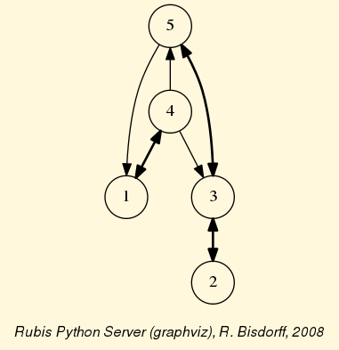
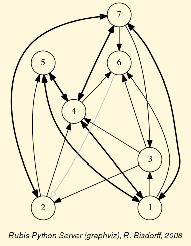
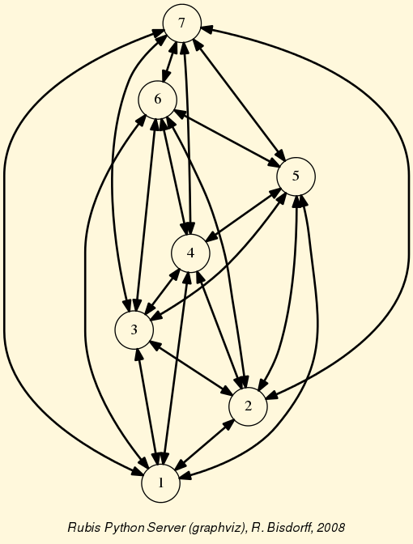
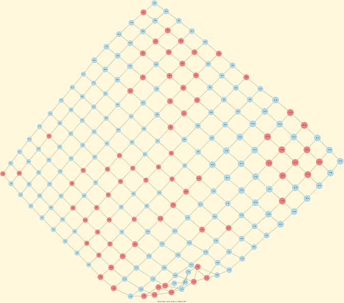
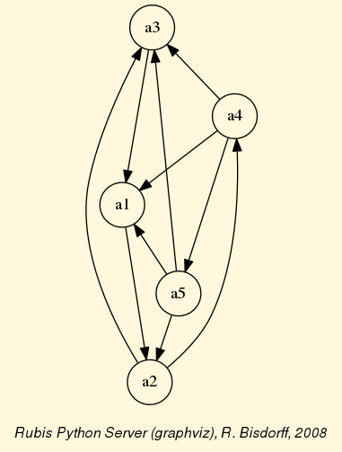
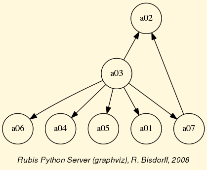

Tutorial of the Digraph3 resources
==================================
:Author: Raymond Bisdorff, University of Luxembourg FSTC/CSC
:Version: Revision: Python 3.4
:Copyright: R. Bisdorff 2014

.. _Tutorial-label:

Content
-------

* :ref:`Digraphs-Tutorial-label`
* :ref:`Digraph-Tools-label`
* :ref:`Graphs-Tutorial-label`
* :ref:`LinearVoting-label`
* :ref:`OutrankingDigraphs-Tutorial-label`

.. _Digraphs-Tutorial-label:

Working with the :code:`digraphs` module
----------------------------------------

Downloading of the Digraph3 resources
.....................................

Using the Digraph3 modules is easy. You only need to have installed on your system the `Python <https://www.python.org/doc/>`_ programming language installed of version 3+ (readily available under Linux and Mac OS). Notice that, from Version 3.3 on, Python implements very efficiently the decimal class in C. Now, Decimal objects are mainly used in the Digraph3 characteristic valuation functions, which makes the recent python version much faster (more than twice as fast) when extensive digraph operations are performed.

Two download options are given:

1. Either (easiest under Linux or Mac OS-X), by using a subversion client::

     ..$ svn co http://leopold-loewenheim.uni.lu/svn/repos/Digraph3

2. Or, with a browser access, download and extract the latest distribution tar.gz archive from this page::

     http://leopold-loewenheim.uni.lu/Digraph3/dist/

Purpose
.......

The basic idea of these Python3 modules is to make easy python interactive sessions or write short Python3 scripts for computing all kind of results from a bipolar valued digraph or graph. These include such features as maximal independent or irredundant choices, maximal dominant or absorbent choices, rankings, outrankins, linear ordering, etc. Most of the available computing resources are meant to illustrate the *Algorithmic Decision Theory* course given in the University of Luxembourg Master in Information and Computer Science (MICS). 

The Python development of these computing resources offers the advantage of an easy to write and maintain OOP source code as expected from a performing scripting language without loosing on efficiency in execution times compared to compiled languages such as C++ or Java.

Starting an interactive python3 session
.......................................

You may start an interactive Python3 session in the :code:`Digraph3` directory for exploring the classes and methods provided by the :code:`digraphs` module. To do so, enter the Python3 commands following the session prompts marked with >>>. The lines without the prompt are output from the Python interpreter::

	[\$HOME/Digraph3]\$ python
	Python 3.4.0 (default, Apr 11 2014, 13:05:11)
	[GCC 4.8.2] on linux
	Type "help", "copyright", "credits" or "license" for more information.
	>>> from digraphs import Digraph
	>>> dg = Digraph('test/testdigraph')
	>>> dg.save('tutorialdigraph')
	>>> ...

Structure of a ``Digraph`` object
.................................

All :code:`Digraph` object *dg* contains at least the following sub-objects: 

1. the digraph nodes called **actions** (decision actions): a list, set or dictionary of nodes with 'name' and 'shortname' attributes,
2. the digraph **valuationdomain** , a dictionary with three decimal entries: the minimum (-1.0, means certainly false), the median (0.0, means missing information) and the maximum characteristic value (+1.0, means certainly true),
3. the graph **relation** : a double dictionary indexed by an oriented pair of actions (nodes) and carrying a characteristic value in the range of the previous valuation domain,
4. its associated **gamma function** : a dictionary containing the direct successors, respectively predecessors of each action, automatically added by the object constructor,
5. its associated **notGamma function** : a dictionary containing the actions that are not direct successors respectively predecessors of each action, automatically added by the object constructor. See the reference manual of the :ref:`digraphs-label`.

Permanent storage of digraphs
.............................

The :code:`dg.save('tutorialDigraph')` command stores the digraph *dg* in a file named :code:`tutorialDigraph.py` with the following content::

       # automatically generated random irreflexive digraph
       actionset = ['1','2','3','4','5',]
       valuationdomain = {'min': -1,
                          'med': 0,
                          'max': 1}
       relation = {
       '1': {'1':-1,'2':-1,'3':-1,'4':1,'5':-1},
       '2': {'1':-1,'2':-1,'3':1,'4':-1,'5':-1},
       '3': {'1':-1,'2':1,'3':-1,'4':-1,'5':1},
       '4': {'1':1,'2':-1,'3':1,'4':-1,'5':1},
       '5': {'1':1,'2':-1,'3':1,'4':-1,'5':-1}
       }

Inspecting a ``Digraph`` object
...............................

We may reload a previously saved ``Digraph`` instance from the file named :code:`tutorialDigraph.py` with the ``Digraph`` class constructor and the :code:`Digraph.showAll()` method output reveals us that *dg* is a connected irreflexive digraph of order five evaluated in a valuation domain from -1 to 1.
        >>> dg = Digraph('tutorialDigraph')
       	>>> dg.showAll()
	*----- show details --------------*
	Digraph          : tutorialdigraph
	Actions          : ['1', '2', '3', '4', '5']
	Valuation domain : {'med': Decimal('0'), 
                            'max': Decimal('1'), 
                            'min': Decimal('-1')}
        * ---- Relation Table -----
          S   |  '1'	  '2'	  '3'	  '4'	  '5'	  
         -----|------------------------------------------------------------
          '1' |  -1.00	 -1.00	 -1.00	 +1.00	 -1.00	 
          '2' |  -1.00	 -1.00	 +1.00	 -1.00	 -1.00	 
          '3' |  -1.00	 +1.00	 -1.00	 -1.00	 +1.00	 
          '4' |  +1.00	 -1.00	 +1.00	 -1.00	 +1.00	 
          '5' |  +1.00	 -1.00	 +1.00	 -1.00	 -1.00	 
	*--- Connected Components ---*
	1: ['1', '2', '3', '4', '5']

The :code:`Digraph.exportGraphViz()` method generates in the current working directory a :code:`tutorial.dot` file and a :code:`tutorialdigraph.png` picture of the tutorial digraph *g*, if the `graphviz <http://graphviz.org/>`_ tools are installed on your system.:
	>>> dg.exportGraphViz('tutorialDigraph')
        *---- exporting a dot file do GraphViz tools ---------*
        Exporting to tutorialDigraph.dot
        dot -Grankdir=BT -Tpng tutorialDigraph.dot -o tutorialDigraph.png

Some simple methods are easily applicable to this instantiated Digraph object *dg* , like the following :code:`Digraph.showStatistics()` method:
	>>> dg.showStatistics()
	*----- general statistics -------------*
	for digraph             : <tutorialdigraph.py>
	order                   :  5 nodes
	size                    :  9 arcs
	# undetermined          :  0 arcs
	arc density             : 45.00
	# components            :  1
	                        :  [0, 1, 2, 3, 4]
	outdegrees distribution :  [0, 2, 2, 1, 0]
	indegrees distribution  :  [0, 2, 2, 1, 0]
	degrees distribution    :  [0, 4, 4, 2, 0]
	mean degree : 1.80
	                                  :  [0, 1, 2, 3, 4, 'inf']
	neighbourhood-depths distribution :  [0, 0, 2, 2, 1, 0]
	mean neighbourhood depth : 2.80
	digraph diameter :  4
	agglomeration distribution :
	1 : 50.00
	2 : 0.00
	3 : 16.67
	4 : 50.00
	5 : 50.00
	agglomeration coefficient : 33.33
	>>> ...

Special classes of digraphs
...........................

Some special classes of digraphs, like the :code:`CompleteDigraph`, the :code:`EmptyDigraph` or the oriented :code:`GridDigraph` class for instance, are readily available:
        >>> from digraphs import GridDigraph
	>>> grid = GridDigraph(n=5,m=5,hasMedianSplitOrientation=True)
	>>> grid.exportGraphViz('tutorialGrid')
	*---- exporting a dot file for GraphViz tools ---------*
	Exporting to tutorialGrid.dot
	dot -Grankdir=BT -Tpng TutorialGrid.dot -o tutorialGrid.png

.. image:: tutorialGrid.png
   :width: 200 px
   :align: center

For more information about its resources, see the technical documentation of the :ref:`digraphs-label` . 

Back to :ref:`Tutorial-label`

.. _Digraph-Tools-label:

Tools for manipulating ``Digraph`` objects
------------------------------------------

Inspecting a random digraph
...........................

We are starting this tutorial with generating a randomly [-1;1]-valued (*Normalized=True*) digraph of order 7, denoted *dg* and modelling a binary relation (*x S y*) defined on the set of nodes of *dg*. For this purpose, the ``digraphs`` module provides conveniently a specific ``RandomValuationDigraph`` constructor:
    >>> from digraphs import RandomValuationDigraph
    >>> dg = RandomValuationDigraph(order=7,Normalized=True)
    >>> dg.save('tutRandValDigraph')

With the ``save()`` method we may keep a backup version for future use of *dg* which will be stored in a file called *tutRandValDigraph.py* in the current working directory. The ``Digraph`` class now provides some generic methods for exploring a given ``Digraph`` object, like the ``showShort()``, ``showAll()``, ``showRelationTable()`` and the ``showNeighborhoods()`` methods:
    >>> dg.showShort()
    *----- show summary -------------*
    Digraph          : randomValuationDigraph
    *---- Actions ----*
    ['1', '2', '3', '4', '5', '6', '7']
    *---- Characteristic valuation domain ----*
    {'med': Decimal('0.0'), 'hasIntegerValuation': False, 
    'min': Decimal('-1.0'), 'max': Decimal('1.0')}
    *--- Connected Components ---*
    1: ['1', '2', '3', '4', '5', '6', '7']
    >>> dg.showRelationTable(ReflexiveTerms=False)
    * ---- Relation Table -----
    r(xSy) |  '1'    '2'   '3'  '4'   '5'    '6'  '7'	  
    -------|------------------------------------------------------------
    '1'    |   -   -0.48  0.70  0.86  0.30  0.38  0.44	 
    '2'    | -0.22   -   -0.38  0.50  0.80 -0.54  0.02	 
    '3'    | -0.42  0.08   -    0.70 -0.56  0.84 -1.00	 
    '4'    |  0.44 -0.40 -0.62   -    0.04  0.66  0.76	 
    '5'    |  0.32 -0.48 -0.46  0.64   -   -0.22 -0.52	 
    '6'    | -0.84  0.00 -0.40 -0.96 -0.18   -   -0.22	 
    '7'    |  0.88  0.72  0.82  0.52 -0.84  0.04  -	 
    >>> dg.showNeighborhoods()
    Neighborhoods osberved in digraph 'randomdomValuation' 
    Gamma     :
    '1': in => {'5', '7', '4'}, out => {'5', '7', '6', '3', '4'}
    '2': in => {'7', '3'}, out => {'5', '7', '4'}
    '3': in => {'7', '1'}, out => {'6', '2', '4'}
    '4': in => {'5', '7', '1', '2', '3'}, out => {'5', '7', '1', '6'}
    '5': in => {'1', '2', '4'}, out => {'1', '4'}
    '6': in => {'7', '1', '3', '4'}, out => set()
    '7': in => {'1', '2', '4'}, out => {'1', '2', '3', '4', '6'}
     Not Gamma :
    '1': in => {'6', '2', '3'}, out => {'2'}
    '2': in => {'5', '1', '4'}, out => {'1', '6', '3'}
    '3': in => {'5', '6', '2', '4'}, out => {'5', '7', '1'}
    '4': in => {'6'}, out => {'2', '3'}
    '5': in => {'7', '6', '3'}, out => {'7', '6', '2', '3'}
    '6': in => {'5', '2'}, out => {'5', '7', '1', '3', '4'}
    '7': in => {'5', '6', '3'}, out => {'5'}
    
.. warning::
    
    Notice that most Digraph class methods will ignore the reflexive couples by considering that the relation is indeterminate (the characteristic value *r(x S x)* for all action *x* is put to the median, i.e. indeterminate, value) in this case.

Graphviz drawings
.................

We may have an even better insight into the ``Digraph`` object *dg* by looking at a `graphviz <http://graphviz.org/>`_ [1]_ drawing:
    >>> dg.exportGraphViz('tutRandValDigraph')
    *---- exporting a dot file for GraphViz tools ---------*
    Exporting to tutRandValDigraph.dot
    dot -Grankdir=BT -Tpng tutRandValDigraph.dot -o tutRandValDigraph.png

Double links are drawn in bold black with an arrowhead at each end, whereas single asymmetric links are drawn in black with an arrowhead showing the direction of the link. Notice the undetermined relational situation (*r(6 S 2) = 0.00*) observed between nodes '6' and '2'. The corresponding link is marked in gray with an open arrowhead in the drawing. 

Asymmetric and symmetric parts
..............................

We may now extract both this symmetric as well as this asymmetric part of digraph *dg* with the help of two corresponding constructors:
    >>> from digraphs import AsymmetricPartialDigraph, SymmetricPartialDigraph
    >>> asymDg = AsymmetricPartialDigraph(dg)
    >>> asymDg.exportGraphViz()
    >>> symDG = SymmetricPartialDigraph(dg)
    >>> symDg.exportGraphViz()

.. image:: asymSymParts.png
   :width: 400 px
   :align: center

.. note::

    Notice that the partial objects *asymDg* and *symDg* put to the indeterminate characteristic value all not-asymmetric, respectively not-symmetric links between nodes. 

Here below, for illustration the source code of *relation* constructor of the ``AsymmetricPartialDigraph`` class::

	def _constructRelation(self):
	    actions = self.actions
	    Min = self.valuationdomain['min']
	    Max = self.valuationdomain['max']
	    Med = self.valuationdomain['med']
	    relationIn = self.relation
	    relationOut = {}
	    for a in actions:
		relationOut[a] = {}
		for b in actions:
		    if a != b:
			if relationIn[a][b] >= Med and relationIn[b][a] <= Med:
			    relationOut[a][b] = relationIn[a][b]
			elif relationIn[a][b] <= Med and relationIn[b][a] >= Med:
			    relationOut[a][b] = relationIn[a][b]
			else:
			    relationOut[a][b] = Med
		    else:
			relationOut[a][b] = Med
	    return relationOut

Digraph fusion by epistemic disjunction
.......................................

We may recover object *dg* from both partial objects *asymDg* and *symDg* with a **bipolar fusion** constructor, also called **epistemic disjunction**, available via the ``FusionDigraph`` class:
    >>> from digraphs import FusionDigraph
    >>> fusDg = FusionDigraph(asymDg,symDg)
    >>> fusDg.showRelationTable()
    * ---- Relation Table -----
    r(xSy) |  '1'    '2'   '3'  '4'   '5'    '6'  '7'	  
    -------|------------------------------------------------------------
    '1'    |  0.00 -0.48  0.70  0.86  0.30  0.38  0.44	 
    '2'    | -0.22  0.00 -0.38  0.50  0.80 -0.54  0.02	 
    '3'    | -0.42  0.08  0.00  0.70 -0.56  0.84 -1.00	 
    '4'    |  0.44 -0.40 -0.62  0.00  0.04  0.66  0.76	 
    '5'    |  0.32 -0.48 -0.46  0.64  0.00 -0.22 -0.52	 
    '6'    | -0.84  0.00 -0.40 -0.96 -0.18  0.00 -0.22	 
    '7'    |  0.88  0.72  0.82  0.52 -0.84  0.04  0.00	 

Dual, converse and codual digraphs
..................................

We may as readily compute the **dual**, the **converse** and the **codual** (dual and converse) of *dg*:
    >>> from digraphs import DualDigraph, ConverseDigraph, CoDualDigraph
    >>> ddg = DualDigraph(dg)
    >>> ddg.showRelationTable()
    -r(xSy) |  '1'    '2'   '3'  '4'   '5'    '6'  '7'	  
    --------|------------------------------------------
    '1 '    |  0.00  0.48 -0.70 -0.86 -0.30 -0.38 -0.44	 
    '2'     |  0.22  0.00  0.38 -0.50  0.80  0.54 -0.02	 
    '3'     |  0.42  0.08  0.00 -0.70  0.56 -0.84  1.00	 
    '4'     | -0.44  0.40  0.62  0.00 -0.04 -0.66 -0.76	 
    '5'     | -0.32  0.48  0.46 -0.64  0.00  0.22  0.52	 
    '6'     |  0.84  0.00  0.40  0.96  0.18  0.00  0.22	 
    '7'     |  0.88 -0.72 -0.82 -0.52  0.84 -0.04  0.00
    >>> cdg = ConverseDigraph(dg)
    >>> cdg.showRelationTable()
    * ---- Relation Table -----
     r(ySx) |  '1'    '2'   '3'   '4'   '5'   '6'   '7'	  
    --------|------------------------------------------
    '1'     |  0.00 -0.22 -0.42  0.44  0.32 -0.84  0.88	 
    '2'     | -0.48  0.00  0.08 -0.40 -0.48  0.00  0.72	 
    '3'     |  0.70 -0.38  0.00 -0.62 -0.46 -0.40  0.82	 
    '4'     |  0.86  0.50  0.70  0.00  0.64 -0.96  0.52	 
    '5'     |  0.30  0.80 -0.56  0.04  0.00 -0.18 -0.84	 
    '6'     |  0.38 -0.54  0.84  0.66 -0.22  0.00  0.04	 
    '7'     |  0.44  0.02 -1.00  0.76 -0.52 -0.22  0.00	 
    >>> cddg = CoDualDigraph(dg)
    >>> cddg.showRelationTable()
    * ---- Relation Table -----
    -r(ySx) |  '1'    '2'   '3'   '4'   '5'   '6'   '7'	    
    --------|------------------------------------------------------------
    '1'     |  0.00  0.22  0.42 -0.44 -0.32  0.84 -0.88	 
    '2'     |  0.48  0.00 -0.08  0.40  0.48  0.00 -0.72	 
    '3'     | -0.70  0.38  0.00  0.62  0.46  0.40 -0.82	 
    '4'     | -0.86 -0.50 -0.70  0.00 -0.64  0.96 -0.52	 
    '5'     | -0.30 -0.80  0.56 -0.04  0.00  0.18  0.84	 
    '6'     | -0.38  0.54 -0.84 -0.66  0.22  0.00 -0.04	 
    '7'     | -0.44 -0.02  1.00 -0.76  0.52  0.22  0.00	 

Computing the dual, respectively the converse, may also be done with prefixing the ``__neg__ (-)`` or the ``__invert__`` (~) operator. The codual of a Digraph object may, hence, as well be computed with a **composition** (in either order) of both operations:
    >>> ddg = -dg   # dual of dg
    >>> cdg = ~dg   # converse of dg
    >>> cddg = -(~dg) = ~(-dg)  # codual of dg
    >>> cddg.showRelationTable()
    * ---- Relation Table -----
    -r(ySx) |  '1'    '2'   '3'   '4'   '5'   '6'   '7'	    
    --------|------------------------------------------------------------
    '1'     |  0.00  0.22  0.42 -0.44 -0.32  0.84 -0.88	 
    '2'     |  0.48  0.00 -0.08  0.40  0.48  0.00 -0.72	 
    '3'     | -0.70  0.38  0.00  0.62  0.46  0.40 -0.82	 
    '4'     | -0.86 -0.50 -0.70  0.00 -0.64  0.96 -0.52	 
    '5'     | -0.30 -0.80  0.56 -0.04  0.00  0.18  0.84	 
    '6'     | -0.38  0.54 -0.84 -0.66  0.22  0.00 -0.04	 
    '7'     | -0.44 -0.02  1.00 -0.76  0.52  0.22  0.00	 

Symmetric and transitive closures
.................................

Symmetric and transtive closure in site constructors are also available, Note that it is a good idea,before going ahead with these in-site operations that irreversibly modify the original dg object, to previously make a backup version of *dg*. The simplest storage method, always provide by the generic ``Digraph.save()`` writes out in a named file the python content in string representation:
    >>> dg.save('tutRandValDigraph')
    >>> dg.closeSymmetric()
    >>> dg.closeTransitive()
    >>> dg.exportGraphViz('strongComponents')

Strong components
.................

As the original digraph *dg* was connected (see above the result of the ``dg.showShort()`` command), both the symmetric and transitive closures operated together, will necessarily produce a single strong commponent, i.e. a complete digraph. We may sometimes wish to collapse all strong components in a given digraph and construct the so reduced digraph. Using the ``StrongComponentsCollapsedDigraph`` constructor here will render a single hyper-node gathering all the original nodes :
    >>> from digraphs import StrongComponentsCollapsedDigraph
    >>> sc = StrongComponentsCollapsedDigraph(dg)
    >>> sc.showAll()
    *----- show detail -----*
    Digraph          : tutRandValDigraph_Scc
    *---- Actions ----*
    ['_7_1_2_6_5_3_4_']
    * ---- Relation Table -----
      S     |  'Scc_1'	  
     -------|---------
    'Scc_1' |  0.00	 
    short 	 content
    Scc_1 	 _7_1_2_6_5_3_4_
    Neighborhoods:
      Gamma     :
    'frozenset({'7', '1', '2', '6', '5', '3', '4'})': in => set(), out => set()
      Not Gamma :
    'frozenset({'7', '1', '2', '6', '5', '3', '4'})': in => set(), out => set()
    >>> ...

Saving and reloading in CSV format
.................................. 

Sometimes it is required to exchange the graph valuation data in CSV format with a statistical package like `R <http://www.r-project.org/>`_. For this purpose it is possible to export the digraph data into a CSV file. The valuation domain is hereby normalized by default to the range [-1,1] and the diagonal put by defalut to the minimal value -1:
	>>> dg = Digraph('tutRandValDigraph')
	>>> dg.saveCSV('tutRandValDigraph')
	# content of file tutRandValDigraph.csv
	"d","1","2","3","4","5","6","7"
	"1",-1.0,0.48,-0.7,-0.86,-0.3,-0.38,-0.44
	"2",0.22,-1.0,0.38,-0.5,-0.8,0.54,-0.02
	"3",0.42,-0.08,-1.0,-0.7,0.56,-0.84,1.0
	"4",-0.44,0.4,0.62,-1.0,-0.04,-0.66,-0.76
	"5",-0.32,0.48,0.46,-0.64,-1.0,0.22,0.52
	"6",0.84,0.0,0.4,0.96,0.18,-1.0,0.22
	"7",-0.88,-0.72,-0.82,-0.52,0.84,-0.04,-1.0

It is possible to reload a Digraph instance from its previously saved CSV file content:
	>>> dgcsv = CSVDigraph('tutRandValDigraph')
	>>> dgcsv.showRelationTable(ReflexiveTerms=False)
	* ---- Relation Table -----
	r(xSy) |   '1'   '2'   '3'   '4'   '5'   '6'   '7'	  
	-------|------------------------------------------------------------
	'1'    |   -   -0.48  0.70  0.86  0.30  0.38  0.44	 
	'2'    | -0.22   -   -0.38  0.50  0.80 -0.54  0.02	 
	'3'    | -0.42  0.08   -    0.70 -0.56  0.84 -1.00	 
	'4'    |  0.44 -0.40 -0.62   -    0.04  0.66  0.76	 
	'5'    |  0.32 -0.48 -0.46  0.64   -   -0.22 -0.52	 
	'6'    | -0.84  0.00 -0.40 -0.96 -0.18   -   -0.22	 
	'7'    |  0.88  0.72  0.82  0.52 -0.84  0.04   -

Complete, empty and indeterminate digraphs
..........................................

Let us finally mention some special universal classes of digraphs that are readily available in the ``digraphs`` module, like the ``CompleteDigraph``, the ``EmptyDigraph`` and the ``IndeterminateDigraph`` classes, which put all characteristic values respectively to the *maximum*, the *minimum* or the median *indeterminate* characteristic value:
	>>> from diggraphs import CompleteDigraph, EmptyDigraph, IndeterminateDigraph
	>>> help(CompleteDigraph)
	Help on class CompleteDigraph in module digraphs:
	class CompleteDigraph(Digraph)
	 |  Parameters:
	 |      order > 0; valuationdomain=(Min,Max).
	 |  Specialization of the general Digraph class for generating
	 |  temporary complete graphs of order 5 in {-1,0,1} by default.
	 |  Method resolution order:
	 |      CompleteDigraph
	 |      Digraph
	 |      builtins.object
	...
        >>> e = EmptyDigraph(order=5)
	>>> e.showRelationTable()
	* ---- Relation Table -----
	  S   |  '1'	  '2'	  '3'	  '4'	  '5'	  
	---- -|---------------------------------------
	'1'   |  -1.00	 -1.00	 -1.00	 -1.00	 -1.00	 
	'2'   |  -1.00	 -1.00	 -1.00	 -1.00	 -1.00	 
	'3'   |  -1.00	 -1.00	 -1.00	 -1.00	 -1.00	 
	'4'   |  -1.00	 -1.00	 -1.00	 -1.00	 -1.00	 
	'5'   |  -1.00	 -1.00	 -1.00	 -1.00	 -1.00
	>>> e.showNeighborhoods() 
	Neighborhoods:
	  Gamma     :
	'1': in => set(), out => set()
	'2': in => set(), out => set()
	'5': in => set(), out => set()
	'3': in => set(), out => set()
	'4': in => set(), out => set()
	  Not Gamma :
	'1': in => {'2', '4', '5', '3'}, out => {'2', '4', '5', '3'}
	'2': in => {'1', '4', '5', '3'}, out => {'1', '4', '5', '3'}
	'5': in => {'1', '2', '4', '3'}, out => {'1', '2', '4', '3'}
	'3': in => {'1', '2', '4', '5'}, out => {'1', '2', '4', '5'}
	'4': in => {'1', '2', '5', '3'}, out => {'1', '2', '5', '3'}
	>>> i = IndeterminateDigraph()
	* ---- Relation Table -----
	  S   |  '1'	  '2'	  '3'	  '4'	  '5'	  
	------|--------------------------------------
	'1'   |  0.00	 0.00	 0.00	 0.00	 0.00	 
	'2'   |  0.00	 0.00	 0.00	 0.00	 0.00	 
	'3'   |  0.00	 0.00	 0.00	 0.00	 0.00	 
	'4'   |  0.00	 0.00	 0.00	 0.00	 0.00	 
	'5'   |  0.00	 0.00	 0.00	 0.00	 0.00	 
	>>> i.showNeighborhoods()
	Neighborhoods:
	  Gamma     :
	'1': in => set(), out => set()
	'2': in => set(), out => set()
	'5': in => set(), out => set()
	'3': in => set(), out => set()
	'4': in => set(), out => set()
	  Not Gamma :
	'1': in => set(), out => set()
	'2': in => set(), out => set()
	'5': in => set(), out => set()
	'3': in => set(), out => set()
	'4': in => set(), out => set()

.. note::

       Notice the subtle difference between the neighborhoods of an *empty* and the neighborhoods of an *indeterminate* digraph instance. In the first kind, the neighborhoods are known to be completely *empty* whereas, in the latter, *nothing is known* about the actual neighborhoods of the nodes. These two cases illustrate why in the case of a bipolar valuation domain, we need both a *gamma* **and** a *notGamma* function.

Back to :ref:`Tutorial-label`

.. _Graphs-Tutorial-label:

Working with the :code:`graphs` module
--------------------------------------

Structure of a ``Graph`` object
...............................

In the ``graphs`` module, the root :code:`Graph` class provides a generic **simple graph model**, without loops and multiple links. A given object of this class consists in:

1. the graph **vertices** : a dictionary of vertices with 'name' and 'shortname' attributes,
2. the graph **valuationDomain** , a dictionary with three entries: the minimum (-1, means certainly no link), the median (0, means missing information) and the maximum characteristic value (+1, means certainly a link),
3. the graph **edges** : a dictionary with frozensets of pairs of vertices as entries carrying a characteristic value in the range of the previous valuation domain,
4. and its associated **gamma function** : a dictionary containing the direct neighbors of each vertice, automatically added by the object constructor.

See the technical documentation of the :ref:`graphs-label`.

Example Python3 session:
    >>> from graphs import Graph
    >>> g = Graph(numberOfVertices=7,edgeProbability=0.5)
    >>> g.showShort()
    *----- show short --------------*
    Name             : 'randomGraph'
    Vertices         :  ['v1', 'v2', 'v3', 'v4', 'v5', 'v6', 'v7']
    Valuation domain :  {'med': 0, 'max': 1, 'min': -1}
    Gamma function   : 
    v1 -> ['v5']
    v2 -> ['v4', 'v6', 'v3']
    v3 -> ['v2']
    v4 -> ['v5', 'v2', 'v7']
    v5 -> ['v4', 'v6', 'v1']
    v6 -> ['v5', 'v2']
    v7 -> ['v4']
    >>> g.save(fileName='tutorialGraph')

The saved Graph instance named :code:`tutorialGraph.py` is encoded in python3 as follows::

	# Graph instance saved in Python format
	vertices = {
	'v1': {'shortName': 'v1', 'name': 'random vertex'},
	'v2': {'shortName': 'v2', 'name': 'random vertex'},
	'v3': {'shortName': 'v3', 'name': 'random vertex'},
	'v4': {'shortName': 'v4', 'name': 'random vertex'},
	'v5': {'shortName': 'v5', 'name': 'random vertex'},
	'v6': {'shortName': 'v6', 'name': 'random vertex'},
	'v7': {'shortName': 'v7', 'name': 'random vertex'},
	}
	valuationDomain = {'min':-1,'med':0,'max':1}
	edges = {
	frozenset(['v1','v2']) : -1, 
	frozenset(['v1','v3']) : -1, 
	frozenset(['v1','v4']) : -1, 
	frozenset(['v1','v5']) : 1, 
	frozenset(['v1','v6']) : -1, 
	frozenset(['v1','v7']) : -1, 
	frozenset(['v2','v3']) : 1, 
	frozenset(['v2','v4']) : 1, 
	frozenset(['v2','v5']) : -1, 
	frozenset(['v2','v6']) : 1, 
	frozenset(['v2','v7']) : -1, 
	frozenset(['v3','v4']) : -1, 
	frozenset(['v3','v5']) : -1, 
	frozenset(['v3','v6']) : -1, 
	frozenset(['v3','v7']) : -1, 
	frozenset(['v4','v5']) : 1, 
	frozenset(['v4','v6']) : -1, 
	frozenset(['v4','v7']) : 1, 
	frozenset(['v5','v6']) : 1, 
	frozenset(['v5','v7']) : -1, 
	frozenset(['v6','v7']) : -1, 
	}

The stored graph can be recalled and plotted with the generic :code:`exportGraphViz` [1]_ method as follows:
	>>> g = Graph('tutorialGraph')
	>>> g.exportGraphViz()
	*---- exporting a dot file for GraphViz tools ---------*
	Exporting to tutorialGraph.dot
	fdp -Tpng tutorialGraph.dot -o tutorialGraph.png

.. image:: tutorialGraph.png
   :width: 400 px
   :align: center
 
Chordless cycles may be enumerated in the given graph like follows:
	>>> g = Graph('tutorialGraph')
	>>> g.computeChordlessCycles()
	Chordless cycle certificate -->>>  ['v5', 'v4', 'v2', 'v6', 'v5']
	[(['v5', 'v4', 'v2', 'v6', 'v5'], frozenset({'v5', 'v4', 'v2', 'v6'}))]

q-coloring of a graph
.....................

And, a 3-coloring of the tutorial graph may be computed and plotted as follows:
	>>> g = Graph('tutorialGrah')
	>>> qc = Q_Coloring(g)
	Running a Gibbs Sampler for 42 step !
	The q-coloring with 3 colors is feasible !!
	>>> qc.showConfiguration()
	v5 lightblue
	v3 gold
	v7 gold
	v2 lightblue
	v4 lightcoral
	v1 gold
	v6 lightcoral
	>>> qc.exportGraphViz('tutorial-3-coloring')
	*---- exporting a dot file for GraphViz tools ---------*
	Exporting to tutorial-3-coloring.dot
	fdp -Tpng tutorial-3-coloring.dot -o tutorial-3-coloring.png

.. image:: tutorial-3-coloring.png
   :width: 400 px
   :align: center

Actually, with the given tutorial graph instance, a 2-coloring is already feasible:
	>>> qc = Q_Coloring(g,colors=['gold','coral'])
	Running a Gibbs Sampler for 42 step !
	The q-coloring with 2 colors is feasible !!
	>>> qc.showConfiguration()
	v5 gold
	v3 coral
	v7 gold
	v2 gold
	v4 coral
	v1 coral
	v6 coral
	>>> qc.exportGraphViz('tutorial-2-coloring')
	*---- exporting a dot file for GraphViz tools ---------*
	Exporting to tutorial-2-coloring.dot
	fdp -Tpng tutorial-2-coloring.dot -o tutorial-2-coloring.png

.. image:: tutorial-2-coloring.png
   :width: 400 px
   :align: center

MIS enumeration
...............

2-colorings define independent sets of vertices that are maximal in cardinality; for short called a **MIS**. Computing such MISs in a given :code:`Graph` instance may be achieved by converting the :code:`Graph` instance into a :code:`Digraph` instance. Here a :code:`self.showMIS()` method is proposed:
	>>> g = Graph('tutorialGrah')
	>>> dg = g.graph2Digraph()
	>>> dg.showMIS()
	*---  Maximal independent choices ---*
	['v5', 'v3', 'v7']
	['v5', 'v7', 'v2']
	['v6', 'v3', 'v4', 'v1']
	['v6', 'v3', 'v7', 'v1']
	['v7', 'v2', 'v1']
	number of solutions:  5
	cardinality distribution
	card.:  [0, 1, 2, 3, 4, 5, 6, 7]
	freq.:  [0, 0, 0, 3, 2, 0, 0, 0]
	execution time: 0.00050 sec.
	Results in self.misset
	>>> dg.misset
	{frozenset({'v6', 'v3', 'v7', 'v1'}), 
	 frozenset({'v5', 'v7', 'v2'}), 
	 frozenset({'v6', 'v3', 'v4', 'v1'}), 
	 frozenset({'v7', 'v2', 'v1'}), 
	 frozenset({'v5', 'v3', 'v7'})}

Grids and the Ising model
.........................

Special classes of graphs, like *n* x *m* **rectangular** or **triangular grids** are available in the :code:`graphs` module. For instance, we may use a Gibbs sampler again for simulating an **Ising Model** on such a grid:
        >>> from graphs import GridGraph. IsingModel
	>>> g = GridGraph(n=15,m=15)
	>>> g.showShort()
	*----- show short --------------*
	Grid graph    :  grid-6-6
	n             :  6
	m             :  6
	order         :  36
	>>> im = IsingModel(g,beta=0.3,nSim=100000,Debug=False)
	Running a Gibbs Sampler for 100000 step !
	>>> im.exportGraphViz(colors=['lightblue','lightcoral'])
	*---- exporting a dot file for GraphViz tools ---------*
	Exporting to grid-15-15-ising.dot
	fdp -Tpng grid-15-15-ising.dot -o grid-15-15-ising.png

Simulating Metropolis random walks
..................................

Finally, we provide a specialisation of the :code:`Graph` class for implementing a generic **Metropolis MCMC** (Monte Carlo Markov Chain) sampler for simulating random walks on a given graph following a given probability  :code:`probs = {‘v1’: x, ‘v2’: y, ...}` for visiting each vertice. 
        >>> from graphs import MetropolisChain
	>>> g = Graph(numberOfVertices=5,edgeProbability=0.5)
	>>> g.showShort()
	*---- short description of the graph ----*
	Name             : 'randomGraph'
	Vertices         :  ['v1', 'v2', 'v3', 'v4', 'v5']
	Valuation domain :  {'max': 1, 'med': 0, 'min': -1}
	Gamma function   : 
	v1 -> ['v2', 'v3', 'v4']
	v2 -> ['v1', 'v4']
	v3 -> ['v5', 'v1']
	v4 -> ['v2', 'v5', 'v1']
	v5 -> ['v3', 'v4']        
	>>> probs = {}  # initialise a potential stationary probability vector 
	>>> n = g.order # for instance: probs[v_i] = n-i/Sum(1:n) for i in 1:n
	>>> i = 0
	>>> verticesList = [x for x in g.vertices]
	>>> verticesList.sort()
	>>> for v in verticesList:
	...     probs[v] = (n - i)/(n*(n+1)/2) 
	...     i += 1
	>>> met = MetropolisChain(g,probs)
	>>> frequency = met.checkSampling(verticesList[0],nSim=30000)
	>>> for v in verticesList:
	...     print(v,probs[v],frequency[v])
	v1 0.3333 0.3343
	v2 0.2666 0.2680
	v3 0.2    0.2030 
	v4 0.1333 0.1311
	v5 0.0666 0.0635
	>>> met.showTransitionMatrix()
	* ---- Transition Matrix -----
	  Pij  | 'v1'    'v2'    'v3'    'v4'    'v5'     
	  -----|-------------------------------------
	  'v1' |  0.23   0.33    0.30    0.13    0.00    
	  'v2' |  0.42   0.42    0.00    0.17    0.00    
	  'v3' |  0.50   0.00    0.33    0.00    0.17    
	  'v4' |  0.33   0.33    0.00    0.08    0.25    
	  'v5' |  0.00   0.00    0.50    0.50    0.00    

The ``checkSampling()`` method generates a randomwalk of *nSim=30000* steps on the given graph and records by the way the observed relative frequency with which each vertice is passed by. In this exmaple, the stationary transition probability distribution, shown by the ``showTransitionMatrix()`` method above, is quite adequately simulated.
 
For more technical information and more code examples, look into the technical documentation of the :ref:`graphs-label`. For the readers interested in algorithmic applications of Markov Chains we may may recommend consulting O. Häggström's 2002 book: [FMCAA]_.

Back to :ref:`Tutorial-label`

.. _LinearVoting-label:

Computing the winner of an election
-----------------------------------

Linear voting profiles
......................

The :ref:`votingDigraphs-label` provides resources for handling election results [ADT-L2]_, like the ``LinearVotingProfile`` class. We consider an election involving a finite set of candidates and finite set of weighted voters, who express their voting preferences in a complete linear ranking (without ties) of the candidates. The data is internally stored in two Python dictionaries, one for the candidates and another one for the linear ballots::
    
    candidates = {'a': ,'b':  ,'c', ..., ...}
    voters = {'1':{'weight':1.0},'2':{'weight':1.0}, ...}
    ## each voter specifies a linearly ranked list of candidates
    ## from the best to the worst (without ties
    linearBallot = {
    '1' : ['b','c','a', ...],
    '2' : ['a','b','c', ...],
    ...
    }

The module provides a class for generating random instances of the ``LinearVotingProfile`` class. In an interactive Python session we may obtain for the election of 3 candidates by 5 voters the following result:
    >>> from votingDigraphs import *
    >>> v = RandomLinearVotingProfile(numberOfVoters=5,numberOfCandidates=3)
    >>> v.candidates
    {'a2': {'name': 'a2'}, 'a3': {'name': 'a3'}, 'a1': {'name': 'a1'}}
    >>> v.voters
    {'v4': {'weight': 1.0}, 'v3': {'weight': 1.0}, 
     'v1': {'weight': 1.0}, 'v5': {'weight': 1.0}, 
     'v2': {'weight': 1.0}}
    >>> v.linearBallot
    {'v4': ['a1', 'a3', 'a2'], 'v3': ['a1', 'a3', 'a2'], 'v1': ['a1', 'a2', 'a3'],
     'v5': ['a2', 'a3', 'a1'], 'v2': ['a3', 'a2', 'a1']}
     >>> ...

Notice that in this example, all voters are considered to be equi-significant. Their linear ballots can be viewd with the ``showLinearBallots`` method:
    >>> v.showLinearBallots()
    voters(weight)	 candidates rankings
    v4(1.0): 	 ['a1', 'a2', 'a3']
    v3(1.0): 	 ['a1', 'a3', 'a2']
    v1(1.0): 	 ['a2', 'a1', 'a3']
    v5(1.0): 	 ['a3', 'a1', 'a2']
    v2(1.0): 	 ['a3', 'a1', 'a2']
    >>> ...

Editing of the linear voting profile may be acheived by storing the data in a file, edit it, and reload it again:
    >>> v.save('tutorialLinearVotingProfile')
    *--- Saving linear profile in file: <tutorialLinearVotingProfile.py> ---*
    >>> v = LinearVotingProfile('tutorialLinearVotingProfile')

Computing the winner
....................

We may easily compute **uninominal votes**, i.e. how many times a candidate was ranked first, and see who is consequently the **simple majority** winner(s) in this election. 
    >>> v.computeUninominalVotes()
    {'a2': 1.0, 'a1': 2.0, 'a3': 2.0}
    >>> v.computeSimpleMajorityWinner()
    ['a1','a3']
    >>> ...

As we observe no absolute majority (3/5) of votes for any of the three candidate, we may look for the **instant runoff** winner instead (see [ADT-L2]_):
    >>> v.computeInstantRunoffWinner()
    ['a1']
    >>> ...

We may also follow the Chevalier de Borda's advice and, after a **rank analysis** of the linear ballots, compute the **Borda score** of each candidate and hence determine the **Borda winner(s)**:
    >>> v.computeRankAnalysis()
    {'a2': [1.0, 1.0, 3.0], 'a1': [2.0, 3.0, 0], 'a3': [2.0, 1.0, 2.0]}
    >>> v.computeBordaScores()
    {'a2': 12.0, 'a1': 8.0, 'a3': 10.0}
    >>> v.computeBordaWinners()
    ['a1']
    >>> ... 

The Condorcet winner
....................

In our randomly generated election results, we are lucky: The instant runoff winner and the Borda winner both are candidate *a1*. However, we could also follow the Marquis de Condorcet's advice, and compute the **majority margins** obtained by voting for each individual pair of candidates. For instance, candidate *a1* is ranked four times before and once behind candidate *a2*. Hence the majority margin *M(a1,a2)* is 4 - 1 = +3. These majority margins define on the set of candidates what we call the **Condorcet digraph**, a specialization of the ``Digraph`` class for handling such pairwise majority margins:
    >>> cdg = CondorcetDigraph(v,hasIntegerValuation=True)
    >>> cdg.showAll()
    *----- show detail -------------*
    Digraph          : rel_randLinearProfile
    *---- Actions ----*
    ['a1', 'a2', 'a3']
    *---- Characteristic valuation domain ----*
    {'hasIntegerValuation': True, 
    'max': Decimal('5.0'), 
    'min': Decimal('-5.0'), 
    'med': Decimal('0')}
    * ---- Relation Table ----
     M(x,y) |  'a1' 'a2' 'a3'	  
     -------|-----------------
       'a1' |   -    3	  1	 
       'a2' |  -3    -	 -1	 
       'a3' |  -1    1	  -	 

A candidate *x*, showing a positive majority margin *M(x,y)*, is beating candidate *y*  with an absolute majority in a pairwise voting. Hence, a candidate showing only positive terms in her row in the Condorcet digraph relation table, beats all other candidates with absolute majority of votes. Condorcet recommends to declare this candidate (is always unique, why?) the winner of the election. Here we are lucky, it is again candidate *a1* who is hence the **Condorcet winner**:
    >>> cdg.computeCondorcetWinner()
    ['a1']  
    
By seeing the majority margins like a bipolarly-valued characteristic function for a global preference relation defined on the set of canditates, we may use all operational resources of the generic ``Digraph`` class (see :ref:`Digraphs-Tutorial-label`), and especially its ``exportGraphViz`` method [1]_, for visualizing an election result:
   >>> cdg.exportGraphViz('tutorialLinearBallots')
   *---- exporting a dot file for GraphViz tools ---------*
   Exporting to tutorialLinearBallots.dot
   dot -Grankdir=BT -Tpng tutorialLinearBallots.dot -o tutorialLinearBallots.png

.. image:: tutorialLinearBallots.png
   :width: 300 px
   :align: center

Cyclic social preferences
.........................

Usually, when aggregating linear ballots, there appear cyclic social preferences. Let us consider for instance the following linear voting profile and construct the corresponding Condorcet digraph:
    >>> v.showLinearBallots()
    voters(weight)	 candidates rankings
    v1(1.0): 	 ['a1', 'a3', 'a5', 'a2', 'a4']
    v2(1.0): 	 ['a1', 'a2', 'a4', 'a3', 'a5']
    v3(1.0): 	 ['a5', 'a2', 'a4', 'a3', 'a1']
    v4(1.0): 	 ['a3', 'a4', 'a1', 'a5', 'a2']
    v5(1.0): 	 ['a4', 'a2', 'a3', 'a5', 'a1']
    v6(1.0): 	 ['a2', 'a4', 'a5', 'a1', 'a3']
    v7(1.0): 	 ['a5', 'a4', 'a3', 'a1', 'a2']
    v8(1.0): 	 ['a2', 'a4', 'a5', 'a1', 'a3']
    v9(1.0): 	 ['a5', 'a3', 'a4', 'a1', 'a2']
    >>> cdg = CondorcetDigraph(v)
    >>> cdg.showRelationTable()
    * ---- Relation Table -----
      S   |  'a1'   'a2'   'a3'	  'a4'	  'a5'	  
    ------|----------------------------------------
    'a1'  |   -     0.11  -0.11	 -0.56	 -0.33	 
    'a2'  | -0.11    -	   0.11	  0.11	 -0.11	 
    'a3'  |  0.11  -0.11    -	 -0.33	 -0.11	 
    'a4'  |  0.56  -0.11   0.33	   -	  0.11	 
    'a5'  |  0.33   0.11   0.11	 -0.11	   -	 
    
Now, we cannot find any completely positive row in the relation table. No one of the five candidates is beating all the others with an absolute majority of votes. There is no Condorcet winner anymore. In fact, we may observe in this Condorcet digraph three chordless circuits: (*a1* > *a2* > *a3* > *a1*), (*a1* > *a2* > *a4* > *a1*), and (*a2* > *a4* > *a5* > *a2*).
    >>> cdg.computeChordlessCircuits()
    [(['a2', 'a3', 'a1'], frozenset({'a2', 'a3', 'a1'})), 
     (['a2', 'a4', 'a5'], frozenset({'a2', 'a5', 'a4'})), 
     (['a2', 'a4', 'a1'], frozenset({'a2', 'a1', 'a4'}))]
    >>> cdg.exportGraphViz('cycles')
    *---- exporting a dot file dor GraphViz tools ---------*
    Exporting to cycles.dot
    dot -Grankdir=BT -Tpng cycles.dot -o cycles.png

Condorcet's approach for determining the winner of an election is hence not decisive in all circomstances and we need to exploit more sophisticated approaches for finding the winner of the election on the basis of the majority margins of the given linear ballots (see [BIS-2008]_). 

Many more tools for exploiting voting results are available, see the thechnical documentation of the :ref:`votingDiGraphs-label`.

Back to :ref:`Tutorial-label`

.. _OutrankingDigraphs-Tutorial-label:

Working with the ``outrankingDigraphs`` module
----------------------------------------------

See also the technical documentation of the :ref:`outrankingDigraphs-label`.

Structure of an outranking digraph
..................................

In this *Digraph3* module, the root :code:`OutrankingDiraph` class provides a generic **outranking digraph model**. A given object of this class consists in:

1. a potential set of decision **actions** : a dictionary describing the potential decision actions or alternatives with 'name' and 'comment' attributes,
2. a coherent family of **criteria**: a dictionary of criteria functions used for measuring the performance of each potential decision action with respect to the preference dimension captured by each criterion,
3. the **evaluations**: a dictionary of performance evaluations for each decision action or alternative on each criterion function. 
4. the digraph **valuationdomain**, a dictionary with three entries: the *minimum* (-100, means certainly no link), the *median* (0, means missing information) and the *maximum* characteristic value (+100, means certainly a link),
5. the **outranking relation** : a double dictionary defined on the Cartesian product of the set of decision alternatives capturing the credibility of the pairwise *outranking situation* computed on the basis of the performance differences observed between couples of decision alternatives on the given family if criteria functions.   

With the help of the ``RandomBipolarOutrankingDigraph`` class (of type ``BipolarOutrankingDigraph``) , let us generate for illustration a random bipolar outranking digraph consisting of 7 decision actions denoted *a01*, *a02*, ..., *a07*:
       >>> from outrankingDigraphs import *
       >>> odg = RandomBipolarOutrankingDigraph()
       >>> odg.showActions()
       *----- show digraphs actions --------------*
       key:  a01
       name:       random decision action
       comment:    RandomPerformanceTableau() generated.
       key:  a02
       name:       random decision action
       comment:    RandomPerformanceTableau() generated.
       ...
       ...
       key:  a07
       name:       random decision action
       comment:    RandomPerformanceTableau() generated.
       >>> ...

In this example we consider furthermore a family of seven equisignificant cardinal criteria functions *g01*, *g02*, ..., *g07*, measuring the performance of each alternative on a rational scale form 0.0 to 100.00. In order to capture the evaluation's uncertainty and imprecision, each criterion function *g1* to *g7* admits three performance discrimination thresholds of 10, 20 and 80 pts for warranting respectively any indifference, preference and veto situations: 
        >>> odg.showCriteria()
	*----  criteria -----*
	g01 'digraphs.RandomPerformanceTableau() instance'
	  Scale = [0.0, 100.0]
	  Weight = 3.0
	  Threshold pref : 20.00 + 0.00x ; percentile:  0.28
	  Threshold ind : 10.00 + 0.00x ; percentile:  0.095
	  Threshold veto : 80.00 + 0.00x ; percentile:  1.0
	g02 'digraphs.RandomPerformanceTableau() instance'
	  Scale = [0.0, 100.0]
	  Weight = 3.0
	  Threshold pref : 20.00 + 0.00x ; percentile:  0.33
	  Threshold ind : 10.00 + 0.00x ; percentile:  0.19
	  Threshold veto : 80.00 + 0.00x ; percentile:  0.95
	...
	...
	g07 'digraphs.RandomPerformanceTableau() instance'
	  Scale = [0.0, 100.0]
	  Weight = 10.0
	  Threshold pref : 20.00 + 0.00x ; percentile:  0.476
	  Threshold ind : 10.00 + 0.00x ; percentile:  0.238
	  Threshold veto : 80.00 + 0.00x ; percentile:  1.0

The performance evaluations of each decision alternative on each criterion are gathered in a *performance tableau*:
	>>> odg.showPerformanceTableau()
	*----  performance tableau -----*
	criteria |  'a01'   'a02'   'a03'   'a04'   'a05'   'a06'   'a07'   
	---------|------------------------------------------------------
	  'g01'  |   9.6    48.8    21.7    37.3    81.9    48.7    87.7  
	  'g02'  |  90.9    11.8    96.6    41.0    34.0    53.9    46.3  
	  'g03'  |  97.8    46.4    83.3    30.9    61.5    85.4    82.5  
	  'g04'  |  40.5    43.6    53.2    17.5    38.6    21.5    67.6  
	  'g05'  |  33.0    40.7    96.4    55.1    46.2    58.1    52.6  
	  'g06'  |  47.6    19.0    92.7    55.3    51.7    26.6    40.4  
	  'g07'  |  41.2    64.0    87.7    71.6    57.8    59.3    34.7
	>>> ...

We may visualize the same performance tableau in a more colorful setting in the default system browser with the command:
        >>> dog.showHTMLPerformanceTableau()
        >>> ...

.. image:: tutorialPerfTab.png
   :width: 400 px
   :align: center

It is worthwhile noticing that *green* and *red* marked evaluations indicate *best*, respectively *worst*, performances of an alternative on a criterion. In this example, we may hence notice that alternative *a03* is in fact best performing on *four* out of *seven* criteria.

Semantics of the bipolar valuation
..................................

Considering the given performance tableau, the ``BipolarOutrankingDigraph`` class constructor computes the characteristic value r(x S y) of a pairwise outranking relation "x S y" (see [BIS-2013]_) in a default valuation domain [-100.0,+100.0] with the median value 0.0 acting as indeterminate characteristic value. The semantics of r(x S y) are the following:
    1. If r(x S y) > 0.0 it is more *True* than *False* that *x outranks y*, i.e. alternative x is at least as well performing than alternative y **and** there is no considerable negative performance difference observed in disfavour of x,
    2. If r(x S y) < 0.0 it is more *False* than *True* that *x outranks y*, i.e. alternative x is **not** at least as well performing than alternative y **and** there is no considerable positive performance difference observed in favour of x,
    3. If r(x S y) = 0.0 it is *indeterminate* whether *x outranks y or not*.

The resulting bipolarly valued outranking relation may be inspected with the following command:
	>>> odg.showRelationTable()
	* ---- Relation Table -----
	r(x S y)|   'a01'   'a02'   'a03'   'a04'   'a05'   'a06'   'a07'   
	--------|--------------------------------------------------------------
	 'a01'  |   +0.00  +29.73  -29.73  +13.51  +48.65  +40.54  +48.65  
	 'a02'  |  +13.51   +0.00 -100.00  +37.84  +13.51  +43.24  -37.84  
	 'a03'  |  +83.78 +100.00   +0.00  +91.89  +83.78  +83.78  +70.27  
	 'a04'  |  +24.32  +48.65  -56.76   +0.00  +24.32  +51.35  +24.32  
	 'a05'  |  +51.35 +100.00  -70.27  +72.97   +0.00  +51.35  +32.43  
	 'a06'  |  +16.22  +72.97  -51.35  +35.14  +32.43   +0.00  +37.84  
	 'a07'  |  +67.57  +45.95  -24.32  +27.03  +27.03  +45.95   +0.00  
	>>> odg.valuationdomain
	{'min': Decimal('-100.0'), 'max': Decimal('100.0'), 'med': Decimal('0.0')}

Pairwise multiple criteria comparisons
......................................

From above given semantics, we may consider that *a01* outranks *a02* (r(a01 S a02) > 0.0), but not *a03* (r(a01 S a03) < 0.0). In order to make understandable the characteristic values shown in the relation table above, we may furthermore have a look at the pairwise multiple criteria comparison between alternatives *a01* and *a02*:
	>>> odg.showPairwiseComparison('a01','a02')
	*------------  pairwise comparison ----*
	Comparing actions : (a01, a02)
	crit. wght.   g(x)  g(y)    diff  	| ind     p    concord 	|
	------------------------------- ---------------------------------
	g01    3.00   9.56  48.84  -39.28 	| 10.00  20.00   -3.00 	| 
	g02    3.00  90.94  11.79  +79.15 	| 10.00  20.00   +3.00 	| 
	g03    6.00  97.79  46.36  +51.43 	| 10.00  20.00   +6.00 	| 
	g04    5.00  40.53  43.61   -3.08 	| 10.00  20.00   +5.00 	| 
	g05    3.00  33.04  40.67   -7.63 	| 10.00  20.00   +3.00 	| 
	g06    7.00  47.57  19.00  +28.57 	| 10.00  20.00   +7.00 	| 
	g07   10.00  41.21  63.95  -22.74 	| 10.00  20.00  -10.00  | 
	-----------------------------------------------------------------
	Valuation in range: -37.00 to +37.00; global concordance: +11.00

The outranking valuation characteristic appears as **majority margin** resulting from the difference of the weights of the criteria in favor of the statement that alternative *a01* is at least well performing as alternative *a02*. No considerable performance difference being observed, no veto or counter.veto situation is triggered in this pairwise comparison. Such a case is, however, observed for instance when we pairwise compare the performances of alternatives *a03* and *a02*:
	>>> odg.showPairwiseComparison('a03','a02')
	*------------  pairwise comparison ----*
	Comparing actions : (a03, a02)
	crit.  wght.  g(x)  g(y)    diff  	| ind     p    concord 	|  v  veto/counter-
	-----------------------------------------------------------------------------------
	g01    3.00  21.73  48.84  -27.11 	| 10.00  20.00   -3.00 	| 
	g02    3.00  96.56  11.79  +84.77 	| 10.00  20.00   +3.00 	|  80.00  +1.00
	g03    6.00  83.35  46.36  +36.99 	| 10.00  20.00   +6.00 	| 
	g04    5.00  53.22  43.61   +9.61 	| 10.00  20.00   +5.00 	| 
	g05    3.00  96.42  40.67  +55.75 	| 10.00  20.00   +3.00 	| 
	g06    7.00  92.65  19.00  +73.65 	| 10.00  20.00   +7.00 	| 
	g07   10.00  87.70  63.95  +23.75 	| 10.00  20.00  +10.00	| 
	-----------------------------------------------------------------------------------
	 Valuation in range: -37.00 to +37.00; global concordance: +31.00
	>>> ...

This time, we observe a considerable out-performance of *a03* against *a02* on criterion g02 (see second row in the relation table above). We therefore notice a positively polarised *certainly confirmed* outranking situation in this case [BIS-2013]_. 

Recoding the valuation
......................

All outranking digraphs, being of root type ``Digraph``, inherit the methods available under this class. The characteristic valuation domain of an outranking digraph may be recoded with the ``Digraph.recodeValutaion()`` method below to the integer range [-37,+37], i.e. plus or minus the global significance of the family of criteria considered in this example instance:
	>>> odg.recodeValuation(-37,+37)
	>>> odg.valuationdomain['hasIntegerValuation'] = True
	>>> Digraph.showRelationTable(odg)
	* ---- Relation Table -----
	* ---- Relation Table -----
	  S   | 'a01'   'a02'	'a03'  'a04'   'a05'   'a06'   'a07'	  
	-----|------------------------------------------------------------
	'a01' |    0	 +11	 -11	 +5	+17	+14	+17	 
	'a02' |   +5	   0	 -37	+13	 +5	+15	-14	 
	'a03' |  +31	 +37	   0	+34     +31	+31	+26	 
	'a04' |   +9	 +18	 -21	  0	 +9	+19	 +9	 
	'a05' |  +19	 +37	 -26	+27	  0	+19	+12	 
	'a06' |   +6	 +27	 -19	+13	+12	  0	+14	 
	'a07' |  +25	 +17	  -9	 +9	 +9	+17	  0	 
	Valuation domain:  {'hasIntegerValuation': True, 'min': Decimal('-37'), 
			    'max': Decimal('37'), 'med': Decimal('0.000')}
        >>> ...

.. note::

 Notice that the reflexive self comparison characteristic r(x S x) is set by default to the median indeterminate valuation value 0; the reflexive terms of binary relation being generally ignored in most of the ``Digraph3`` resources. 

Strict outranking via the codual digraph
........................................

From the theory [BIS-2013]_ we know that the bipolarly outranking relation is **weakly complete**, i.e. if r(x S y) < 0.0 then r(y S x) >= 0.0 . From this property follows that the bipolarly valued outranking relation verifies the coduality principle: the dual (-) of the converse (~) of the outranking relation corresponds to its strict outranking part. We may visualize the codual (strict) outranking digraph with a graphviz drawing [1]_: 
	>>> cdodg = -(~odg)
	>>> cdodg.exportGraphViz('codualOdg')
	*---- exporting a dot file for GraphViz tools ---------*
	Exporting to codualOdg.dot
	dot -Grankdir=BT -Tpng codualOdg.dot -o codualOdg.png
	>>> ...

It becomes readily clear now from the picture above that alternative *a03* strictly outranks in fact all the other alternatives. Hence, *a03* appears as **Condorcet winner** and may be recommended as *best decision action* in this illustrative preference modelling exercise. 

XMCDA 2.0 storage 
.................

As with all Digraph instances, it is possible to store permanently a copy of the outranking digraph *odg*. As its outranking relation is automatically generated by the ``BipolarOutrankingDigraph`` class constructor on the basis of a given performance tableau, it is sufficient to save only the latter. For this purpose we are using the `XMCDA 2.00 <http://www.decision-deck.org/xmcda/>`_ XML encoding scheme of MCDA data, as provided by the Decision Deck Project (see http://www.decision-deck.org/):
	>>> PerformanceTableau.saveXMCDA2(odg,'tutorialPerfTab')
	*----- saving performance tableau in XMCDA 2.0 format  -------------*
	File: tutorialPerfTab.xml saved !
	>>> ...

The resulting XML file my be visualized in a browser window (other than Chrome or Chromium)  with a corresponding XMCDA style sheet (`see here <_static/tutorialPerfTab.xml>`_). Hitting ``Ctrl U`` in Firefox will open a browser window showing the underlying xml encoded raw text. It is thus possible to easily edit and update as needed a given performance tableau instance. Reinstantiating again a corresponding updated *odg* object goes like follow:
        >>> pt = XMCDA2PerformanceTableau('tutorialPerfTab') 
        >>> odg = BipolarOutrankingDigraph(t)
	>>> odg.showRelationTable()
	* ---- Relation Table -----
	  S   |  'a01'     'a02'   'a03'   'a04'   'a05'   'a06'   'a07'   
	------|------------------------------------------------------------
	'a01' |   +0.00   +29.73  -29.73  +13.51  +48.65  +40.54  +48.65  
	'a02' |   +13.51  +0.00  -100.00  +37.84  +13.51  +43.24  -37.84  
	'a03' |   +83.78  +100.00  +0.00  +91.89  +83.78  +83.78  +70.27  
	'a04' |   +24.32  +48.65  -56.76   +0.00  +24.32  +51.35  +24.32  
	'a05' |   +51.35  +100.00  -70.27  +72.97  +0.00  +51.35  +32.43  
	'a06' |   +16.22  +72.97  -51.35  +35.14  +32.43   +0.00  +37.84  
	'a07' |   +67.57  +45.95  -24.32  +27.03  +27.03  +45.95   +0.00  
	>>> ...

We recover the original bipolarly valued outranking characteristics, and we may restart again the preference modelling process. 

Many more tools for exploiting bipolarly valued outranking digraphs are available in the Digraph3 resources (see the thechnical documentation of the :ref:`outrankingDiGraphs-label` and the :ref:`perfTabs-label`).

Back to :ref:`Tutorial-label`

Links and appendices
--------------------

Documents
.........

* `Introduction <index.html>`_
* `Reference manual <techDoc.html>`_
* `Tutorial <tutorial.html>`_

Indices and tables
..................

* :ref:`genindex`
* :ref:`modindex`
* :ref:`search`

References
..........

.. [FMCAA] Häggström, Olle *Finite Markov Chians and Algorithmic Applications*. Cambridge University Press 2002.

.. [ADT-L2] Bisdorff, Raymond *Who wins the election*. MICS Algorithmic Decision Theory course, Lecture 2. FSTC/ILIAS University of Luxembourg, Summer Semester 2014 ( `downloadable here <_static/adtVoting-2x2.pdf>`_ )

.. [BIS-2013] R. Bisdorff (2013) "On Polarizing Outranking Relations with Large Performance Differences" *Journal of Multi-Criteria Decision Analysis* (Wiley) **20**:3-12 (downloadable preprint `PDF file <http://charles-sanders-peirce.uni.lu/bisdorff/documents/MCDA-10-0059-PrePeerReview.pdf>`_ 403.5 Kb).

.. [BIS-2008] R. Bisdorff, P. Meyer and M. Roubens (2008) "RUBIS: a bipolar-valued outranking method for the choice problem". 4OR, *A Quarterly Journal of Operations Research* Springer-Verlag Volume 6 Number 2 pp. 143-165. (Online) Electronic version: DOI: 10.1007/s10288-007-0045-5 (downloadable preliminary version `PDF file 271.5Kb <http://leopold-loewenheim.uni.lu/bisdorff/documents/HyperKernels.pdf>`_) 

Footnotes
.........

.. [1] The ``exportGraphViz`` method is depending on drawing tools from `graphviz <http://graphviz.org/>`_. On Linux Ubuntu or Debian you may try ``sudo apt-get install graphviz`` to install them. There are ready ``dmg`` installers for Mac OS. 

