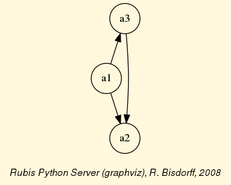
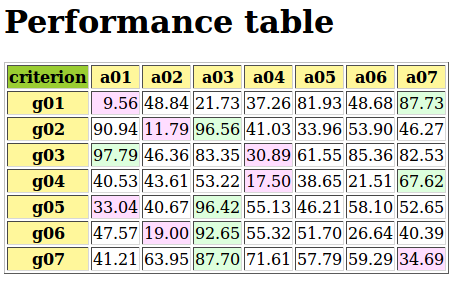
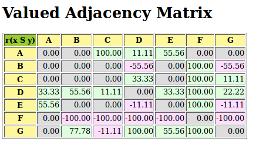
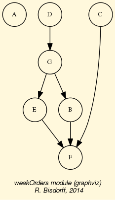

.. _Tutorial-label:

Tutorials of the Digraph3 resources
===================================
:Author: Raymond Bisdorff, University of Luxembourg FSTC/CSC
:Version: Revision: Python 3.4
:Copyright: R. Bisdorff 2014

.. contents:: Table of Contents
	:depth: 1
	:local:

.. _Digraphs-tutorial-label:

Working with the :code:`digraphs` module
----------------------------------------

.. contents:: 
	:depth: 2
	:local:

.. highlight:: python
	:linenothreshold: 5

Downloading of the Digraph3 resources
.....................................

Using the Digraph3 modules is easy. You only need to have installed on your system the `Python <https://www.python.org/doc/>`_ programming language of version 3+ (readily available under Linux and Mac OS). Notice that, from Version 3.3 on, Python implements very efficiently the decimal class in C. Now, Decimal objects are mainly used in the Digraph3 characteristic valuation functions, which makes the recent python version much faster (more than twice as fast) when extensive digraph operations are performed.

Two download options are given:

1. Either (easiest under Linux or Mac OS-X), by using a subversion client::

     ..$ svn co http://leopold-loewenheim.uni.lu/svn/repos/Digraph3

2. Or, with a browser access, download and extract the latest distribution tar.gz archive from this page::

     http://leopold-loewenheim.uni.lu/Digraph3/dist/

Purpose
.......

The basic idea of these Python3 modules is to make easy python interactive sessions or write short Python3 scripts for computing all kind of results from a bipolar valued digraph or graph. These include such features as maximal independent or irredundant choices, maximal dominant or absorbent choices, rankings, outrankins, linear ordering, etc. Most of the available computing resources are meant to illustrate the *Algorithmic Decision Theory* course given in the University of Luxembourg Master in Information and Computer Science (MICS). 

The Python development of these computing resources offers the advantage of an easy to write and maintain OOP source code as expected from a performing scripting language without loosing on efficiency in execution times compared to compiled languages such as C++ or Java.

Starting a python3 session
..........................

You may start an interactive Python3 session in the :code:`Digraph3` directory for exploring the classes and methods provided by the :code:`digraphs` module. To do so, enter the ``python3`` commands following the session prompts marked with >>>. The lines without the prompt are output from the Python interpreter::

	[\$HOME/Digraph3]\$ python3
	Python 3.4.0 (default, Apr 11 2014, 13:05:11)
	[GCC 4.8.2] on linux
	Type "help", "copyright", "credits" or "license" for more information.
	>>> from digraphs import Digraph
	>>> dg = Digraph('test/testdigraph')
	>>> dg.save('tutorialdigraph')
	>>> ...

``Digraph`` object structure
............................

All :py:class:`digraphs.Digraph` object *dg* contains at least the following sub-objects: 

1. the digraph nodes called **actions** (decision actions): a list, set or dictionary of nodes with 'name' and 'shortname' attributes,
2. the digraph **valuationdomain** , a dictionary with three decimal entries: the minimum (-1.0, means certainly false), the median (0.0, means missing information) and the maximum characteristic value (+1.0, means certainly true),
3. the graph **relation** : a double dictionary indexed by an oriented pair of actions (nodes) and carrying a characteristic value in the range of the previous valuation domain,
4. its associated **gamma function** : a dictionary containing the direct successors, respectively predecessors of each action, automatically added by the object constructor,
5. its associated **notGamma function** : a dictionary containing the actions that are not direct successors respectively predecessors of each action, automatically added by the object constructor. See the reference manual of the :ref:`digraphs-label`.

Permanent storage
.................

The :code:`dg.save('tutorialDigraph')` command stores the digraph *dg* in a file named :code:`tutorialDigraph.py` with the following content::

       # automatically generated random irreflexive digraph
       actionset = ['1','2','3','4','5',]
       valuationdomain = {'min': -1,
                          'med': 0,
                          'max': 1}
       relation = {
       '1': {'1':-1,'2':-1,'3':-1,'4':1,'5':-1},
       '2': {'1':-1,'2':-1,'3':1,'4':-1,'5':-1},
       '3': {'1':-1,'2':1,'3':-1,'4':-1,'5':1},
       '4': {'1':1,'2':-1,'3':1,'4':-1,'5':1},
       '5': {'1':1,'2':-1,'3':1,'4':-1,'5':-1}
       }

Inspecting a ``Digraph`` object
...............................

We may reload a previously saved ``Digraph`` instance from the file named :code:`tutorialDigraph.py` with the ``Digraph`` class constructor and the :py:func:`digraphs.Digraph.showAll()` method output reveals us that *dg* is a connected irreflexive digraph of order five evaluated in a valuation domain from -1 to 1.
        >>> dg = Digraph('tutorialDigraph')
       	>>> dg.showAll()
	*----- show details --------------*
	Digraph          : tutorialdigraph
	Actions          : ['1', '2', '3', '4', '5']
	Valuation domain : {'med': Decimal('0'), 
                            'max': Decimal('1'), 
                            'min': Decimal('-1')}
        * ---- Relation Table -----
          S   |  '1'	  '2'	  '3'	  '4'	  '5'	  
         -----|------------------------------------------------------------
          '1' |  -1.00	 -1.00	 -1.00	 +1.00	 -1.00	 
          '2' |  -1.00	 -1.00	 +1.00	 -1.00	 -1.00	 
          '3' |  -1.00	 +1.00	 -1.00	 -1.00	 +1.00	 
          '4' |  +1.00	 -1.00	 +1.00	 -1.00	 +1.00	 
          '5' |  +1.00	 -1.00	 +1.00	 -1.00	 -1.00	 
	*--- Connected Components ---*
	1: ['1', '2', '3', '4', '5']

The :py:func:`digraphs.Digraph.exportGraphViz()` method generates in the current working directory a :code:`tutorial.dot` file and a :code:`tutorialdigraph.png` picture of the tutorial digraph *g*, if the `graphviz <http://graphviz.org/>`_ tools are installed on your system.:
	>>> dg.exportGraphViz('tutorialDigraph')
        *---- exporting a dot file do GraphViz tools ---------*
        Exporting to tutorialDigraph.dot
        dot -Grankdir=BT -Tpng tutorialDigraph.dot -o tutorialDigraph.png

.. image:: testdigraph.png
   :width: 300 px
   :align: center

Some simple methods are easily applicable to this instantiated Digraph object *dg* , like the following :py:func:`digraphs.Digraph.showStatistics()` method:
	>>> dg.showStatistics()
	*----- general statistics -------------*
	for digraph             : <tutorialdigraph.py>
	order                   :  5 nodes
	size                    :  9 arcs
	# undetermined          :  0 arcs
	arc density             : 45.00
	# components            :  1
	                        :  [0, 1, 2, 3, 4]
	outdegrees distribution :  [0, 2, 2, 1, 0]
	indegrees distribution  :  [0, 2, 2, 1, 0]
	degrees distribution    :  [0, 4, 4, 2, 0]
	mean degree : 1.80
	                                  :  [0, 1, 2, 3, 4, 'inf']
	neighbourhood-depths distribution :  [0, 0, 2, 2, 1, 0]
	mean neighbourhood depth : 2.80
	digraph diameter :  4
	agglomeration distribution :
	1 : 50.00
	2 : 0.00
	3 : 16.67
	4 : 50.00
	5 : 50.00
	agglomeration coefficient : 33.33
	>>> ...

Special classes
...............

Some special classes of digraphs, like the :py:class:`digraphs.CompleteDigraph`, the :py:class:`digraphs.EmptyDigraph` or the oriented :py:class:`digraphs.GridDigraph` class for instance, are readily available:
        >>> from digraphs import GridDigraph
	>>> grid = GridDigraph(n=5,m=5,hasMedianSplitOrientation=True)
	>>> grid.exportGraphViz('tutorialGrid')
	*---- exporting a dot file for GraphViz tools ---------*
	Exporting to tutorialGrid.dot
	dot -Grankdir=BT -Tpng TutorialGrid.dot -o tutorialGrid.png

.. image:: tutorialGrid.png
   :width: 200 px
   :align: center

For more information about its resources, see the technical documentation of the :ref:`digraphs-label` . 

Back to :ref:`Tutorial-label`

.. _Digraph-Tools-label:

Manipulating ``Digraph`` objects
--------------------------------

.. contents:: 
	:depth: 2
	:local:

Random digraph
..............

We are starting this tutorial with generating a randomly [-1;1]-valued (*Normalized=True*) digraph of order 7, denoted *dg* and modelling a binary relation (*x S y*) defined on the set of nodes of *dg*. For this purpose, the ``Digraph3`` collection contains a ``randomDigraphs`` module providing a specific :py:class:`digraphs.RandomValuationDigraph` constructor:
    >>> from randomDigraphs import RandomValuationDigraph
    >>> dg = RandomValuationDigraph(order=7,Normalized=True)
    >>> dg.save('tutRandValDigraph')

With the ``save()`` method we may keep a backup version for future use of *dg* which will be stored in a file called *tutRandValDigraph.py* in the current working directory. The ``Digraph`` class now provides some generic methods for exploring a given ``Digraph`` object, like the ``showShort()``, ``showAll()``, ``showRelationTable()`` and the ``showNeighborhoods()`` methods:
    >>> dg.showShort()
    *----- show summary -------------*
    Digraph          : randomValuationDigraph
    *---- Actions ----*
    ['1', '2', '3', '4', '5', '6', '7']
    *---- Characteristic valuation domain ----*
    {'med': Decimal('0.0'), 'hasIntegerValuation': False, 
    'min': Decimal('-1.0'), 'max': Decimal('1.0')}
    *--- Connected Components ---*
    1: ['1', '2', '3', '4', '5', '6', '7']
    >>> dg.showRelationTable(ReflexiveTerms=False)
    * ---- Relation Table -----
    r(xSy) |  '1'    '2'   '3'  '4'   '5'    '6'  '7'	  
    -------|------------------------------------------------------------
    '1'    |   -   -0.48  0.70  0.86  0.30  0.38  0.44	 
    '2'    | -0.22   -   -0.38  0.50  0.80 -0.54  0.02	 
    '3'    | -0.42  0.08   -    0.70 -0.56  0.84 -1.00	 
    '4'    |  0.44 -0.40 -0.62   -    0.04  0.66  0.76	 
    '5'    |  0.32 -0.48 -0.46  0.64   -   -0.22 -0.52	 
    '6'    | -0.84  0.00 -0.40 -0.96 -0.18   -   -0.22	 
    '7'    |  0.88  0.72  0.82  0.52 -0.84  0.04  -	 
    >>> dg.showNeighborhoods()
    Neighborhoods osberved in digraph 'randomdomValuation' 
    Gamma     :
    '1': in => {'5', '7', '4'}, out => {'5', '7', '6', '3', '4'}
    '2': in => {'7', '3'}, out => {'5', '7', '4'}
    '3': in => {'7', '1'}, out => {'6', '2', '4'}
    '4': in => {'5', '7', '1', '2', '3'}, out => {'5', '7', '1', '6'}
    '5': in => {'1', '2', '4'}, out => {'1', '4'}
    '6': in => {'7', '1', '3', '4'}, out => set()
    '7': in => {'1', '2', '4'}, out => {'1', '2', '3', '4', '6'}
     Not Gamma :
    '1': in => {'6', '2', '3'}, out => {'2'}
    '2': in => {'5', '1', '4'}, out => {'1', '6', '3'}
    '3': in => {'5', '6', '2', '4'}, out => {'5', '7', '1'}
    '4': in => {'6'}, out => {'2', '3'}
    '5': in => {'7', '6', '3'}, out => {'7', '6', '2', '3'}
    '6': in => {'5', '2'}, out => {'5', '7', '1', '3', '4'}
    '7': in => {'5', '6', '3'}, out => {'5'}
    
.. warning::
    
    Notice that most Digraph class methods will ignore the reflexive couples by considering that the relation is indeterminate (the characteristic value :math:`r(x\,S\,x)` for all action *x* is put to the median, i.e. indeterminate, value) in this case.

Graphviz drawings
.................

We may have an even better insight into the ``Digraph`` object *dg* by looking at a `graphviz <http://graphviz.org/>`_ [1]_ drawing:
    >>> dg.exportGraphViz('tutRandValDigraph')
    *---- exporting a dot file for GraphViz tools ---------*
    Exporting to tutRandValDigraph.dot
    dot -Grankdir=BT -Tpng tutRandValDigraph.dot -o tutRandValDigraph.png

.. image:: tutRandValDigraph.png
   :width: 300 px
   :align: center

Double links are drawn in bold black with an arrowhead at each end, whereas single asymmetric links are drawn in black with an arrowhead showing the direction of the link. Notice the undetermined relational situation (:math:`r(6\,S\,2) = 0.00`) observed between nodes '6' and '2'. The corresponding link is marked in gray with an open arrowhead in the drawing. 

Asymmetric and symmetric parts
..............................

We may now extract both this symmetric as well as this asymmetric part of digraph *dg* with the help of two corresponding constructors:
    >>> from digraphs import AsymmetricPartialDigraph, SymmetricPartialDigraph
    >>> asymDg = AsymmetricPartialDigraph(dg)
    >>> asymDg.exportGraphViz()
    >>> symDG = SymmetricPartialDigraph(dg)
    >>> symDg.exportGraphViz()

.. image:: asymSymParts.png
   :width: 400 px
   :align: center

.. note::

    Notice that the partial objects *asymDg* and *symDg* put to the indeterminate characteristic value all not-asymmetric, respectively not-symmetric links between nodes. 

Here below, for illustration the source code of *relation* constructor of the :py:class:`digraphs.AsymmetricPartialDigraph` class::

	def _constructRelation(self):
	    actions = self.actions
	    Min = self.valuationdomain['min']
	    Max = self.valuationdomain['max']
	    Med = self.valuationdomain['med']
	    relationIn = self.relation
	    relationOut = {}
	    for a in actions:
		relationOut[a] = {}
		for b in actions:
		    if a != b:
			if relationIn[a][b] >= Med and relationIn[b][a] <= Med:
			    relationOut[a][b] = relationIn[a][b]
			elif relationIn[a][b] <= Med and relationIn[b][a] >= Med:
			    relationOut[a][b] = relationIn[a][b]
			else:
			    relationOut[a][b] = Med
		    else:
			relationOut[a][b] = Med
	    return relationOut

Fusion by epistemic disjunction
...............................

We may recover object *dg* from both partial objects *asymDg* and *symDg* with a **bipolar fusion** constructor, also called **epistemic disjunction**, available via the :py:class:`digraphs.FusionDigraph` class:
    >>> from digraphs import FusionDigraph
    >>> fusDg = FusionDigraph(asymDg,symDg)
    >>> fusDg.showRelationTable()
    * ---- Relation Table -----
    r(xSy) |  '1'    '2'   '3'  '4'   '5'    '6'  '7'	  
    -------|------------------------------------------------------------
    '1'    |  0.00 -0.48  0.70  0.86  0.30  0.38  0.44	 
    '2'    | -0.22  0.00 -0.38  0.50  0.80 -0.54  0.02	 
    '3'    | -0.42  0.08  0.00  0.70 -0.56  0.84 -1.00	 
    '4'    |  0.44 -0.40 -0.62  0.00  0.04  0.66  0.76	 
    '5'    |  0.32 -0.48 -0.46  0.64  0.00 -0.22 -0.52	 
    '6'    | -0.84  0.00 -0.40 -0.96 -0.18  0.00 -0.22	 
    '7'    |  0.88  0.72  0.82  0.52 -0.84  0.04  0.00	 

Dual, converse and codual
.........................

We may as readily compute the **dual**, the **converse** and the **codual** (dual and converse) of *dg*:
    >>> from digraphs import DualDigraph, ConverseDigraph, CoDualDigraph
    >>> ddg = DualDigraph(dg)
    >>> ddg.showRelationTable()
    -r(xSy) |  '1'    '2'   '3'  '4'   '5'    '6'  '7'	  
    --------|------------------------------------------
    '1 '    |  0.00  0.48 -0.70 -0.86 -0.30 -0.38 -0.44	 
    '2'     |  0.22  0.00  0.38 -0.50  0.80  0.54 -0.02	 
    '3'     |  0.42  0.08  0.00 -0.70  0.56 -0.84  1.00	 
    '4'     | -0.44  0.40  0.62  0.00 -0.04 -0.66 -0.76	 
    '5'     | -0.32  0.48  0.46 -0.64  0.00  0.22  0.52	 
    '6'     |  0.84  0.00  0.40  0.96  0.18  0.00  0.22	 
    '7'     |  0.88 -0.72 -0.82 -0.52  0.84 -0.04  0.00
    >>> cdg = ConverseDigraph(dg)
    >>> cdg.showRelationTable()
    * ---- Relation Table -----
     r(ySx) |  '1'    '2'   '3'   '4'   '5'   '6'   '7'	  
    --------|------------------------------------------
    '1'     |  0.00 -0.22 -0.42  0.44  0.32 -0.84  0.88	 
    '2'     | -0.48  0.00  0.08 -0.40 -0.48  0.00  0.72	 
    '3'     |  0.70 -0.38  0.00 -0.62 -0.46 -0.40  0.82	 
    '4'     |  0.86  0.50  0.70  0.00  0.64 -0.96  0.52	 
    '5'     |  0.30  0.80 -0.56  0.04  0.00 -0.18 -0.84	 
    '6'     |  0.38 -0.54  0.84  0.66 -0.22  0.00  0.04	 
    '7'     |  0.44  0.02 -1.00  0.76 -0.52 -0.22  0.00	 
    >>> cddg = CoDualDigraph(dg)
    >>> cddg.showRelationTable()
    * ---- Relation Table -----
    -r(ySx) |  '1'    '2'   '3'   '4'   '5'   '6'   '7'	    
    --------|------------------------------------------------------------
    '1'     |  0.00  0.22  0.42 -0.44 -0.32  0.84 -0.88	 
    '2'     |  0.48  0.00 -0.08  0.40  0.48  0.00 -0.72	 
    '3'     | -0.70  0.38  0.00  0.62  0.46  0.40 -0.82	 
    '4'     | -0.86 -0.50 -0.70  0.00 -0.64  0.96 -0.52	 
    '5'     | -0.30 -0.80  0.56 -0.04  0.00  0.18  0.84	 
    '6'     | -0.38  0.54 -0.84 -0.66  0.22  0.00 -0.04	 
    '7'     | -0.44 -0.02  1.00 -0.76  0.52  0.22  0.00	 

Computing the dual, respectively the converse, may also be done with prefixing the ``__neg__ (-)`` or the ``__invert__`` (~) operator. The codual of a Digraph object may, hence, as well be computed with a **composition** (in either order) of both operations:
    >>> ddg = -dg   # dual of dg
    >>> cdg = ~dg   # converse of dg
    >>> cddg = -(~dg) = ~(-dg)  # codual of dg
    >>> cddg.showRelationTable()
    * ---- Relation Table -----
    -r(ySx) |  '1'    '2'   '3'   '4'   '5'   '6'   '7'	    
    --------|------------------------------------------------------------
    '1'     |  0.00  0.22  0.42 -0.44 -0.32  0.84 -0.88	 
    '2'     |  0.48  0.00 -0.08  0.40  0.48  0.00 -0.72	 
    '3'     | -0.70  0.38  0.00  0.62  0.46  0.40 -0.82	 
    '4'     | -0.86 -0.50 -0.70  0.00 -0.64  0.96 -0.52	 
    '5'     | -0.30 -0.80  0.56 -0.04  0.00  0.18  0.84	 
    '6'     | -0.38  0.54 -0.84 -0.66  0.22  0.00 -0.04	 
    '7'     | -0.44 -0.02  1.00 -0.76  0.52  0.22  0.00	 

Symmetric and transitive closures
.................................

Symmetric and transtive closure in site constructors are also available, Note that it is a good idea,before going ahead with these in-site operations that irreversibly modify the original dg object, to previously make a backup version of *dg*. The simplest storage method, always provide by the generic :py:func:`diggraphs.Digraph.save()` writes out in a named file the python content in string representation:
    >>> dg.save('tutRandValDigraph')
    >>> dg.closeSymmetric()
    >>> dg.closeTransitive()
    >>> dg.exportGraphViz('strongComponents')

.. image:: strongComponents.png
   :width: 200 px
   :align: center

Strong components
.................

As the original digraph *dg* was connected (see above the result of the ``dg.showShort()`` command), both the symmetric and transitive closures operated together, will necessarily produce a single strong commponent, i.e. a complete digraph. We may sometimes wish to collapse all strong components in a given digraph and construct the so reduced digraph. Using the :py:class:`digraphs.StrongComponentsCollapsedDigraph` constructor here will render a single hyper-node gathering all the original nodes :
    >>> from digraphs import StrongComponentsCollapsedDigraph
    >>> sc = StrongComponentsCollapsedDigraph(dg)
    >>> sc.showAll()
    *----- show detail -----*
    Digraph          : tutRandValDigraph_Scc
    *---- Actions ----*
    ['_7_1_2_6_5_3_4_']
    * ---- Relation Table -----
      S     |  'Scc_1'	  
     -------|---------
    'Scc_1' |  0.00	 
    short 	 content
    Scc_1 	 _7_1_2_6_5_3_4_
    Neighborhoods:
      Gamma     :
    'frozenset({'7', '1', '2', '6', '5', '3', '4'})': in => set(), out => set()
      Not Gamma :
    'frozenset({'7', '1', '2', '6', '5', '3', '4'})': in => set(), out => set()
    >>> ...

CSV storage
...........

Sometimes it is required to exchange the graph valuation data in CSV format with a statistical package like `R <http://www.r-project.org/>`_. For this purpose it is possible to export the digraph data into a CSV file. The valuation domain is hereby normalized by default to the range [-1,1] and the diagonal put by defalut to the minimal value -1:
	>>> dg = Digraph('tutRandValDigraph')
	>>> dg.saveCSV('tutRandValDigraph')
	# content of file tutRandValDigraph.csv
	"d","1","2","3","4","5","6","7"
	"1",-1.0,0.48,-0.7,-0.86,-0.3,-0.38,-0.44
	"2",0.22,-1.0,0.38,-0.5,-0.8,0.54,-0.02
	"3",0.42,-0.08,-1.0,-0.7,0.56,-0.84,1.0
	"4",-0.44,0.4,0.62,-1.0,-0.04,-0.66,-0.76
	"5",-0.32,0.48,0.46,-0.64,-1.0,0.22,0.52
	"6",0.84,0.0,0.4,0.96,0.18,-1.0,0.22
	"7",-0.88,-0.72,-0.82,-0.52,0.84,-0.04,-1.0

It is possible to reload a Digraph instance from its previously saved CSV file content:
	>>> dgcsv = CSVDigraph('tutRandValDigraph')
	>>> dgcsv.showRelationTable(ReflexiveTerms=False)
	* ---- Relation Table -----
	r(xSy) |   '1'   '2'   '3'   '4'   '5'   '6'   '7'	  
	-------|------------------------------------------------------------
	'1'    |   -   -0.48  0.70  0.86  0.30  0.38  0.44	 
	'2'    | -0.22   -   -0.38  0.50  0.80 -0.54  0.02	 
	'3'    | -0.42  0.08   -    0.70 -0.56  0.84 -1.00	 
	'4'    |  0.44 -0.40 -0.62   -    0.04  0.66  0.76	 
	'5'    |  0.32 -0.48 -0.46  0.64   -   -0.22 -0.52	 
	'6'    | -0.84  0.00 -0.40 -0.96 -0.18   -   -0.22	 
	'7'    |  0.88  0.72  0.82  0.52 -0.84  0.04   -

It is as well possible to show a colored version of the valued relation table in a system browser window tab:
        >>> dgcsv.showHTMLRelationTable(tableTitle="Tutorial random digraph")
	>>> ...

.. image:: htmlTutorialDigraph.png
   :width: 400 px
   :align: center

Positive arcs are shown in green and negative in red. Indetermiate -zero-valued- links, like the reflexive diagonal ones or the link between node *6* and node *2*, are shown in gray.

Complete, empty and indeterminate digraphs
..........................................

Let us finally mention some special universal classes of digraphs that are readily available in the :py:mod:`digraphs` module, like the :py:class:`digraphs.CompleteDigraph`, the :py:class:`digraphs.EmptyDigraph` and the :py:class:`digraphs.IndeterminateDigraph` classes, which put all characteristic values respectively to the *maximum*, the *minimum* or the median *indeterminate* characteristic value:
	>>> from digraphs import CompleteDigraph, EmptyDigraph, IndeterminateDigraph
	>>> help(CompleteDigraph)
	Help on class CompleteDigraph in module digraphs:
	class CompleteDigraph(Digraph)
	 |  Parameters:
	 |      order > 0; valuationdomain=(Min,Max).
	 |  Specialization of the general Digraph class for generating
	 |  temporary complete graphs of order 5 in {-1,0,1} by default.
	 |  Method resolution order:
	 |      CompleteDigraph
	 |      Digraph
	 |      builtins.object
	...
        >>> e = EmptyDigraph(order=5)
	>>> e.showRelationTable()
	* ---- Relation Table -----
	  S   |  '1'	  '2'	  '3'	  '4'	  '5'	  
	---- -|---------------------------------------
	'1'   |  -1.00	 -1.00	 -1.00	 -1.00	 -1.00	 
	'2'   |  -1.00	 -1.00	 -1.00	 -1.00	 -1.00	 
	'3'   |  -1.00	 -1.00	 -1.00	 -1.00	 -1.00	 
	'4'   |  -1.00	 -1.00	 -1.00	 -1.00	 -1.00	 
	'5'   |  -1.00	 -1.00	 -1.00	 -1.00	 -1.00
	>>> e.showNeighborhoods() 
	Neighborhoods:
	  Gamma     :
	'1': in => set(), out => set()
	'2': in => set(), out => set()
	'5': in => set(), out => set()
	'3': in => set(), out => set()
	'4': in => set(), out => set()
	  Not Gamma :
	'1': in => {'2', '4', '5', '3'}, out => {'2', '4', '5', '3'}
	'2': in => {'1', '4', '5', '3'}, out => {'1', '4', '5', '3'}
	'5': in => {'1', '2', '4', '3'}, out => {'1', '2', '4', '3'}
	'3': in => {'1', '2', '4', '5'}, out => {'1', '2', '4', '5'}
	'4': in => {'1', '2', '5', '3'}, out => {'1', '2', '5', '3'}
	>>> i = IndeterminateDigraph()
	* ---- Relation Table -----
	  S   |  '1'	  '2'	  '3'	  '4'	  '5'	  
	------|--------------------------------------
	'1'   |  0.00	 0.00	 0.00	 0.00	 0.00	 
	'2'   |  0.00	 0.00	 0.00	 0.00	 0.00	 
	'3'   |  0.00	 0.00	 0.00	 0.00	 0.00	 
	'4'   |  0.00	 0.00	 0.00	 0.00	 0.00	 
	'5'   |  0.00	 0.00	 0.00	 0.00	 0.00	 
	>>> i.showNeighborhoods()
	Neighborhoods:
	  Gamma     :
	'1': in => set(), out => set()
	'2': in => set(), out => set()
	'5': in => set(), out => set()
	'3': in => set(), out => set()
	'4': in => set(), out => set()
	  Not Gamma :
	'1': in => set(), out => set()
	'2': in => set(), out => set()
	'5': in => set(), out => set()
	'3': in => set(), out => set()
	'4': in => set(), out => set()

.. note::

       Notice the subtle difference between the neighborhoods of an *empty* and the neighborhoods of an *indeterminate* digraph instance. In the first kind, the neighborhoods are known to be completely *empty* whereas, in the latter, *nothing is known* about the actual neighborhoods of the nodes. These two cases illustrate why in the case of a bipolar valuation domain, we need both a *gamma* **and** a *notGamma* function.

Back to :ref:`Tutorial-label`

.. _Graphs-Tutorial-label:

Working with the :code:`graphs` module
--------------------------------------

.. contents:: 
	:depth: 2
	:local:

See also the technical documentation of the :ref:`graphs-label`.

Structure of a ``Graph`` object
...............................

In the :py:mod:`graphs` module, the root :py:class:`graphs.Graph` class provides a generic **simple graph model**, without loops and multiple links. A given object of this class consists in:

1. the graph **vertices** : a dictionary of vertices with 'name' and 'shortname' attributes,
2. the graph **valuationDomain** , a dictionary with three entries: the minimum (-1, means certainly no link), the median (0, means missing information) and the maximum characteristic value (+1, means certainly a link),
3. the graph **edges** : a dictionary with frozensets of pairs of vertices as entries carrying a characteristic value in the range of the previous valuation domain,
4. and its associated **gamma function** : a dictionary containing the direct neighbors of each vertice, automatically added by the object constructor.

See the technical documentation of the :ref:`graphs-label`.

Example Python3 session:
    >>> from graphs import Graph
    >>> g = Graph(numberOfVertices=7,edgeProbability=0.5)
    >>> g.save(fileName='tutorialGraph')

The saved Graph instance named :code:`tutorialGraph.py` is encoded in python3 as follows::

	# Graph instance saved in Python format
	vertices = {
	'v1': {'shortName': 'v1', 'name': 'random vertex'},
	'v2': {'shortName': 'v2', 'name': 'random vertex'},
	'v3': {'shortName': 'v3', 'name': 'random vertex'},
	'v4': {'shortName': 'v4', 'name': 'random vertex'},
	'v5': {'shortName': 'v5', 'name': 'random vertex'},
	'v6': {'shortName': 'v6', 'name': 'random vertex'},
	'v7': {'shortName': 'v7', 'name': 'random vertex'},
	}
	valuationDomain = {'min':-1,'med':0,'max':1}
	edges = {
	frozenset(['v1','v2']) : -1, 
	frozenset(['v1','v3']) : -1, 
	frozenset(['v1','v4']) : -1, 
	frozenset(['v1','v5']) : 1, 
	frozenset(['v1','v6']) : -1, 
	frozenset(['v1','v7']) : -1, 
	frozenset(['v2','v3']) : 1, 
	frozenset(['v2','v4']) : 1, 
	frozenset(['v2','v5']) : -1, 
	frozenset(['v2','v6']) : 1, 
	frozenset(['v2','v7']) : -1, 
	frozenset(['v3','v4']) : -1, 
	frozenset(['v3','v5']) : -1, 
	frozenset(['v3','v6']) : -1, 
	frozenset(['v3','v7']) : -1, 
	frozenset(['v4','v5']) : 1, 
	frozenset(['v4','v6']) : -1, 
	frozenset(['v4','v7']) : 1, 
	frozenset(['v5','v6']) : 1, 
	frozenset(['v5','v7']) : -1, 
	frozenset(['v6','v7']) : -1, 
	}

The stored graph can be recalled and plotted with the generic :py:func:`graphs.Graph.exportGraphViz()` [1]_ method as follows:
	>>> g = Graph('tutorialGraph')
	>>> g.exportGraphViz()
	*---- exporting a dot file for GraphViz tools ---------*
	Exporting to tutorialGraph.dot
	fdp -Tpng tutorialGraph.dot -o tutorialGraph.png
        >>> ...

.. image:: tutorialGraph.png
   :width: 400 px
   :align: center

Properties, like the gamma function and vertex degrees and neighbourhooddepths may be shown with a `graphs.Graph.showShort()` method:
        >>> g.showShort()
        *---- short description of the graph ----*
        Name             : 'tutorialGraph'
        Vertices         :  ['v1', 'v2', 'v3', 'v4', 'v5', 'v6', 'v7']
        Valuation domain :  {'min': -1, 'med': 0, 'max': 1}
        Gamma function   : 
        v1 -> ['v5']
        v2 -> ['v6', 'v4', 'v3']
        v3 -> ['v2']
        v4 -> ['v5', 'v2', 'v7']
        v5 -> ['v1', 'v6', 'v4']
        v6 -> ['v2', 'v5']
        v7 -> ['v4']
        degrees      :  [0, 1, 2, 3, 4, 5, 6]
        distribution :  [0, 3, 1, 3, 0, 0, 0]
        nbh depths   :  [0, 1, 2, 3, 4, 5, 6, 'inf.']
        distribution :  [0, 0, 1, 4, 2, 0, 0, 0]
        >>> ...

A ``Graph`` instance corresponds bijectively to a symmetric ``Digraph`` instance and we may easily convert from one to the other with the :py:func:`graphs.Graph.graph2Digraph()`, and vice versa with the :py:func:`digraphs.Digraph.digraph2Graph()` method. Thus, all resources of the :py:class:`digraphs.Digraph` class, suitable for symmetric digraphs, become readily available, and vice versa:
	>>> dg = g.graph2Digraph()
	>>> dg.showRelationTable(ndigits=0,ReflexiveTerms=False)
	* ---- Relation Table -----
	  S  |  'v1'  'v2'  'v3'  'v4'  'v5'  'v6'  'v7'	  
	-----|------------------------------------------
	'v1' |    -    -1    -1    -1     1    -1    -1	 
	'v2' |   -1     -     1     1    -1     1    -1	 
	'v3' |   -1     1     -    -1    -1    -1    -1	 
	'v4' |   -1     1    -1     -     1    -1     1	 
	'v5' |    1    -1    -1     1     -     1    -1	 
	'v6' |   -1     1    -1    -1     1     -    -1	 
	'v7' |   -1    -1    -1     1    -1    -1     -
	>>> g1 = dg.digraph2Graph()
	>>> g1.showShort()
	*---- short description of the graph ----*
	Name             : 'tutorialGraph'
	Vertices         :  ['v1', 'v2', 'v3', 'v4', 'v5', 'v6', 'v7']
	Valuation domain :  {'med': 0, 'min': -1, 'max': 1}
	Gamma function   : 
	v1 -> ['v5']
	v2 -> ['v3', 'v6', 'v4']
	v3 -> ['v2']
	v4 -> ['v5', 'v7', 'v2']
	v5 -> ['v6', 'v1', 'v4']
	v6 -> ['v5', 'v2']
	v7 -> ['v4']
        degrees      :  [0, 1, 2, 3, 4, 5, 6]
        distribution :  [0, 3, 1, 3, 0, 0, 0]
        nbh depths   :  [0, 1, 2, 3, 4, 5, 6, 'inf.']
        distribution :  [0, 0, 1, 4, 2, 0, 0, 0]
	>>> ...

q-coloring of a graph
.....................

A 3-coloring of the tutorial graph *g* may for instance be computed and plotted with the :py:class:`graphs.Q_Coloring` class as follows:
	>>> from graphs import Q_Coloring
	>>> qc = Q_Coloring(g)
	Running a Gibbs Sampler for 42 step !
	The q-coloring with 3 colors is feasible !!
	>>> qc.showConfiguration()
	v5 lightblue
	v3 gold
	v7 gold
	v2 lightblue
	v4 lightcoral
	v1 gold
	v6 lightcoral
	>>> qc.exportGraphViz('tutorial-3-coloring')
	*---- exporting a dot file for GraphViz tools ---------*
	Exporting to tutorial-3-coloring.dot
	fdp -Tpng tutorial-3-coloring.dot -o tutorial-3-coloring.png

.. image:: tutorial-3-coloring.png
   :width: 400 px
   :align: center

Actually, with the given tutorial graph instance, a 2-coloring is already feasible:
	>>> qc = Q_Coloring(g,colors=['gold','coral'])
	Running a Gibbs Sampler for 42 step !
	The q-coloring with 2 colors is feasible !!
	>>> qc.showConfiguration()
	v5 gold
	v3 coral
	v7 gold
	v2 gold
	v4 coral
	v1 coral
	v6 coral
	>>> qc.exportGraphViz('tutorial-2-coloring')
	*---- exporting a dot file for GraphViz tools ---------*
	Exporting to tutorial-2-coloring.dot
	fdp -Tpng tutorial-2-coloring.dot -o tutorial-2-coloring.png

.. image:: tutorial-2-coloring.png
   :width: 400 px
   :align: center

MIS and Clique enumeration
..........................

2-colorings define independent sets of vertices that are maximal in cardinality; for short called a **MIS**. Computing such MISs in a given :code:`Graph` instance may be achieved by the `graphs.Graph.showMIS()` method;
	>>> g = Graph('tutorialGraph')
	>>> g.showMIS()
        *---  Maximal Independent Sets ---*
        ['v2', 'v5', 'v7']
        ['v3', 'v5', 'v7']
        ['v1', 'v2', 'v7']
        ['v1', 'v3', 'v6', 'v7']
        ['v1', 'v3', 'v4', 'v6']
        number of solutions:  5
        cardinality distribution
        card.:  [0, 1, 2, 3, 4, 5, 6, 7]
        freq.:  [0, 0, 0, 3, 2, 0, 0, 0]
        execution time: 0.00032 sec.
        Results in self.misset
        >>> g.misset
        [frozenset({'v7', 'v2', 'v5'}), 
         frozenset({'v3', 'v7', 'v5'}), 
         frozenset({'v1', 'v2', 'v7'}), 
         frozenset({'v1', 'v6', 'v7', 'v3'}), 
         frozenset({'v1', 'v6', 'v4', 'v3'})]

A MIS in the dual of a graph instance $g$ (its negation $-g$ ), corresponds to a maximal **clique**, ie a maximal complete subgraph in $g$. Maximal cliques may be directly enumerated with the `graphs.Graph.showCliques()` method:
      >>> g.showCliques()
      *---  Maximal Cliques ---*
      ['v2', 'v3']
      ['v4', 'v7']
      ['v2', 'v4']
      ['v4', 'v5']
      ['v1', 'v5']
      ['v2', 'v6']
      ['v5', 'v6']
      number of solutions:  7
      cardinality distribution
      card.:  [0, 1, 2, 3, 4, 5, 6, 7]
      freq.:  [0, 0, 7, 0, 0, 0, 0, 0]
      execution time: 0.00049 sec.
      Results in self.cliques
      >>> g.cliques
      [frozenset({'v2', 'v3'}), frozenset({'v4', 'v7'}), 
       frozenset({'v2', 'v4'}), frozenset({'v4', 'v5'}), 
       frozenset({'v1', 'v5'}), frozenset({'v6', 'v2'}), 
       frozenset({'v6', 'v5'})]
      >>> ...

Grids and the Ising model
.........................

Special classes of graphs, like *n* x *m* **rectangular** or **triangular grids** (:py:class:`graphs.GridGraph` and :py:class:`graphs.IsingModel`) are available in the :py:mod:`graphs` module. For instance, we may use a Gibbs sampler again for simulating an **Ising Model** on such a grid:
	>>> from graphs import GridGraph, IsingModel
	>>> g = GridGraph(n=15,m=15)
	>>> g.showShort()
	*----- show short --------------*
	Grid graph    :  grid-6-6
	n             :  6
	m             :  6
	order         :  36
	>>> im = IsingModel(g,beta=0.3,nSim=100000,Debug=False)
	Running a Gibbs Sampler for 100000 step !
	>>> im.exportGraphViz(colors=['lightblue','lightcoral'])
	*---- exporting a dot file for GraphViz tools ---------*
	Exporting to grid-15-15-ising.dot
	fdp -Tpng grid-15-15-ising.dot -o grid-15-15-ising.png

.. image:: grid-15-15-ising.png
   :width: 600 px
   :align: center

Simulating Metropolis random walks
..................................

Finally, we provide the :py:class:`graphs.MetropolisChain` class, a specialization of the :py:class:`graphs.Graph` class, for implementing a generic **Metropolis MCMC** (Monte Carlo Markov Chain) sampler for simulating random walks on a given graph following a given probability  :code:`probs = {‘v1’: x, ‘v2’: y, ...}` for visiting each vertice (see lines 14-22). 
        >>> from graphs import MetropolisChain
	>>> g = Graph(numberOfVertices=5,edgeProbability=0.5)
	>>> g.showShort()
	*---- short description of the graph ----*
	Name             : 'randomGraph'
	Vertices         :  ['v1', 'v2', 'v3', 'v4', 'v5']
	Valuation domain :  {'max': 1, 'med': 0, 'min': -1}
	Gamma function   :
	v1 -> ['v2', 'v3', 'v4']
	v2 -> ['v1', 'v4']
	v3 -> ['v5', 'v1']
	v4 -> ['v2', 'v5', 'v1']
	v5 -> ['v3', 'v4']
	>>> probs = {}  # initialise a potential stationary probability vector 
	>>> n = g.order # for instance: probs[v_i] = n-i/Sum(1:n) for i in 1:n
	>>> i = 0
	>>> verticesList = [x for x in g.vertices]
	>>> verticesList.sort()
	>>> for v in verticesList:
	...     probs[v] = (n - i)/(n*(n+1)/2)
	...     i += 1
	>>> met = MetropolisChain(g,probs)
	>>> frequency = met.checkSampling(verticesList[0],nSim=30000)
	>>> for v in verticesList:
	...     print(v,probs[v],frequency[v])
	v1 0.3333 0.3343
	v2 0.2666 0.2680
	v3 0.2    0.2030
	v4 0.1333 0.1311
	v5 0.0666 0.0635
	>>> met.showTransitionMatrix()
	* ---- Transition Matrix -----
	  Pij  | 'v1'    'v2'    'v3'    'v4'    'v5'
	  -----|-------------------------------------
	  'v1' |  0.23   0.33    0.30    0.13    0.00
	  'v2' |  0.42   0.42    0.00    0.17    0.00
	  'v3' |  0.50   0.00    0.33    0.00    0.17
	  'v4' |  0.33   0.33    0.00    0.08    0.25
	  'v5' |  0.00   0.00    0.50    0.50    0.00

The ``checkSampling()`` method (see line 23) generates a randomwalk of *nSim=30000* steps on the given graph and records by the way the observed relative frequency with which each vertice is passed by. In this exmaple, the stationary transition probability distribution, shown by the ``showTransitionMatrix()`` method above (see lines 31-), is quite adequately simulated.

For more technical information and more code examples, look into the technical documentation of the :ref:`graphs-label`. For the readers interested in algorithmic applications of Markov Chains we may recommend consulting O. Häggström's 2002 book: [FMCAA]_.

Who is the lier?
................
Suppose that the file ``berge.py`` contains the following :py:class:`graphs.Graph` instance data::

    vertices = {
    'A': {'name': 'Abe', 'shortName': 'A'},
    'B': {'name': 'Burt', 'shortName': 'B'},
    'C': {'name': 'Charlotte', 'shortName': 'C'},
    'D': {'name': 'Desmond', 'shortName': 'D'},
    'E': {'name': 'Eddie', 'shortName': 'E'},
    'I': {'name': 'Ida', 'shortName': 'I'},
    }
    valuationDomain = {'min':-1,'med':0,'max':1}
    edges = {
    frozenset(['A','B']) : 1, 
    frozenset(['A','C']) : -1, 
    frozenset(['A','D']) : 1, 
    frozenset(['A','E']) : 1, 
    frozenset(['A','I']) : -1, 
    frozenset(['B','C']) : -1, 
    frozenset(['B','D']) : -1, 
    frozenset(['B','E']) : 1, 
    frozenset(['B','I']) : 1, 
    frozenset(['C','D']) : 1, 
    frozenset(['C','E']) : 1, 
    frozenset(['C','I']) : 1, 
    frozenset(['D','E']) : -1, 
    frozenset(['D','I']) : 1, 
    frozenset(['E','I']) : 1, 
    }

This data concerns the famous *Berge mystery story* (see Golumbic, M. C. Algorithmic Graph Theory and Perfect Graphs, *Annals of Discrete Mathematics* 57 p. 20) Six professors (labelled *A*, *B*, *C*, *D*, *E* and *I*) had been to the library on the day that a rare tractate was stolen. Each entered once, stayed for some time, and then left. If two professors were in the lbrary at the same time, then at least one of them saw the other. Detectives questioned the professors and gathered the testimonies that *A* saw *B* and *E*; *B* saw *A* and *I*; *C* saw *D* and *I*; *D* saw *A* and *I*; *E* saw *B* and *I*; and *I* saw *C* and *E*. This data is gathered in the previous file, where each positive edge :math:`\{x,y\}` models the testimony that, either *x* saw *y*, or, *y* saw *x*.

Example Python3 session:
    >>> from graphs import Graph
    >>> g = Graph('berge')
    >>> g.showShort()
    *---- short description of the graph ----*
    Name             : 'berge'
    Vertices         :  ['A', 'B', 'C', 'D', 'E', 'I']
    Valuation domain :  {'min': -1, 'med': 0, 'max': 1}
    Gamma function   : 
    A -> ['D', 'B', 'E']
    B -> ['E', 'I', 'A']
    C -> ['E', 'D', 'I']
    D -> ['C', 'I', 'A']
    E -> ['C', 'B', 'I', 'A']
    I -> ['C', 'E', 'B', 'D']

 The graph data can be plotted as follows:
	>>> g.exportGraphViz('berge1')
	*---- exporting a dot file for GraphViz tools ---------*
	Exporting to berge1.dot
	fdp -Tpng berge1.dot -o berge1.png

.. image:: berge1.png
   :width: 400 px
   :align: center

From graph theory we know that time interval intersection graphs must in fact be triangulated. The testimonies graph should therefore not contain any chordless cycles of four and more vertices. Now, the presence or not of chordless cycles may be checked as follows:
	>>> g.computeChordlessCycles()
	Chordless cycle certificate -->>>  ['D', 'C', 'E', 'A', 'D']
	Chordless cycle certificate -->>>  ['D', 'I', 'E', 'A', 'D']
	Chordless cycle certificate -->>>  ['D', 'I', 'B', 'A', 'D']
	[(['D', 'C', 'E', 'A', 'D'], frozenset({'C', 'D', 'E', 'A'})),
        (['D', 'I', 'E', 'A', 'D'], frozenset({'D', 'E', 'I', 'A'})), 
        (['D', 'I', 'B', 'A', 'D'], frozenset({'D', 'B', 'I', 'A'}))]

We see three intersection cycles of length 4, which is impossible to occurr on the linear time line. Obviously one professor lied! And it is *D* ; if we put to doubt the testimony that he indeed saw *A*, we obtain a correctly triangulated graph:
	>>> g.setEdgeValue( ('D','A'), 0)
	>>> g.showShort()
	*---- short description of the graph ----*
	Name             : 'berge'
	Vertices         :  ['A', 'B', 'C', 'D', 'E', 'I']
	Valuation domain :  {'med': 0, 'min': -1, 'max': 1}
	Gamma function   : 
	A -> ['B', 'E']
	B -> ['A', 'I', 'E']
	C -> ['I', 'E', 'D']
	D -> ['I', 'C']
	E -> ['A', 'I', 'B', 'C']
	I -> ['B', 'E', 'D', 'C']
	>>> g.computeChordlessCycles()
	[]
	>>> g.exportGraphViz('berge2')
	*---- exporting a dot file for GraphViz tools ---------*
	Exporting to berge2.dot
	fdp -Tpng berge2.dot -o berge2.png

.. image:: berge2.png
   :width: 400 px
   :align: center

Back to :ref:`Tutorial-label`

.. _LinearVoting-label:

Computing the winner of an election
-----------------------------------

.. contents:: 
	:depth: 2
	:local:

Linear voting profiles
......................

The :ref:`votingDigraphs-label` provides resources for handling election results [ADT-L2]_, like the :py:class:`votingDigraphs.LinearVotingProfile` class. We consider an election involving a finite set of candidates and finite set of weighted voters, who express their voting preferences in a complete linear ranking (without ties) of the candidates. The data is internally stored in two Python dictionaries, one for the candidates and another one for the linear ballots::

    candidates = {'a': ,'b':  ,'c', ..., ...}
    voters = {'1':{'weight':1.0},'2':{'weight':1.0}, ...}
    ## each voter specifies a linearly ranked list of candidates
    ## from the best to the worst (without ties
    linearBallot = {
    '1' : ['b','c','a', ...],
    '2' : ['a','b','c', ...],
    ...
    }

The module provides a :py:class:`votingDigraphs.RandomLinearVotingProfile` class for generating random instances of the :py:class:`votingDigraphs.LinearVotingProfile` class. In an interactive Python session we may obtain for the election of 3 candidates by 5 voters the following result:
    >>> from votingDigraphs import RandomLinearVotingProfile
    >>> v = RandomLinearVotingProfile(numberOfVoters=5,numberOfCandidates=3)
    >>> v.candidates
    {'a2': {'name': 'a2'}, 'a3': {'name': 'a3'}, 'a1': {'name': 'a1'}}
    >>> v.voters
    {'v4': {'weight': 1.0}, 'v3': {'weight': 1.0}, 
     'v1': {'weight': 1.0}, 'v5': {'weight': 1.0}, 
     'v2': {'weight': 1.0}}
    >>> v.linearBallot
    {'v4': ['a1', 'a3', 'a2'], 'v3': ['a1', 'a3', 'a2'], 'v1': ['a1', 'a2', 'a3'],
     'v5': ['a2', 'a3', 'a1'], 'v2': ['a3', 'a2', 'a1']}
     >>> ...

Notice that in this example, all voters are considered to be equi-significant. Their linear ballots can be viewd with the ``showLinearBallots`` method:
    >>> v.showLinearBallots()
    voters(weight)	 candidates rankings
    v4(1.0): 	 ['a1', 'a2', 'a3']
    v3(1.0): 	 ['a1', 'a3', 'a2']
    v1(1.0): 	 ['a2', 'a1', 'a3']
    v5(1.0): 	 ['a3', 'a1', 'a2']
    v2(1.0): 	 ['a3', 'a1', 'a2']
    >>> ...

Editing of the linear voting profile may be acheived by storing the data in a file, edit it, and reload it again:
    >>> v.save('tutorialLinearVotingProfile')
    *--- Saving linear profile in file: <tutorialLinearVotingProfile.py> ---*
    >>> v = LinearVotingProfile('tutorialLinearVotingProfile')

Computing the winner
....................

We may easily compute **uninominal votes**, i.e. how many times a candidate was ranked first, and see who is consequently the **simple majority** winner(s) in this election. 
    >>> v.computeUninominalVotes()
    {'a2': 1.0, 'a1': 2.0, 'a3': 2.0}
    >>> v.computeSimpleMajorityWinner()
    ['a1','a3']
    >>> ...

As we observe no absolute majority (3/5) of votes for any of the three candidate, we may look for the **instant runoff** winner instead (see [ADT-L2]_):
    >>> v.computeInstantRunoffWinner()
    ['a1']
    >>> ...

We may also follow the Chevalier de Borda's advice and, after a **rank analysis** of the linear ballots, compute the **Borda score** of each candidate and hence determine the **Borda winner(s)**:
    >>> v.computeRankAnalysis()
    {'a2': [1.0, 1.0, 3.0], 'a1': [2.0, 3.0, 0], 'a3': [2.0, 1.0, 2.0]}
    >>> v.computeBordaScores()
    {'a2': 12.0, 'a1': 8.0, 'a3': 10.0}
    >>> v.computeBordaWinners()
    ['a1']

The Borda **rank analysis table** my be printed out with a corresponding ``show`` command:
    >>> v.showRankAnalysisTable()
    *----  Rank analysis tableau -----*
      ranks |  1    2    3    | Borda score
     -------|------------------------------
       'a1' |  2    3    0    |   8
       'a3' |  2    1    2    |   10
       'a2' |  1    1    3    |   12
    >>> ...

The Condorcet winner
....................

In our randomly generated election results, we are lucky: The instant runoff winner and the Borda winner both are candidate *a1*. However, we could also follow the Marquis de Condorcet's advice, and compute the **majority margins** obtained by voting for each individual pair of candidates. For instance, candidate *a1* is ranked four times before and once behind candidate *a2*. Hence the majority margin *M(a1,a2)* is 4 - 1 = +3. These majority margins define on the set of candidates what we call the **Condorcet digraph**. The :py:class:`votongDigraphs.CondorcetDigraph` class (a specialization of the :py:class:`digraphs.Digraph` class) is available for handling such pairwise majority margins:
    >>> from votingDigraphs import CondorcetDigraph
    >>> cdg = CondorcetDigraph(v,hasIntegerValuation=True)
    >>> cdg.showAll()
    *----- show detail -------------*
    Digraph          : rel_randLinearProfile
    *---- Actions ----*
    ['a1', 'a2', 'a3']
    *---- Characteristic valuation domain ----*
    {'hasIntegerValuation': True, 
    'max': Decimal('5.0'), 
    'min': Decimal('-5.0'), 
    'med': Decimal('0')}
    * ---- Relation Table ----
     M(x,y) |  'a1' 'a2' 'a3'	  
     -------|-----------------
       'a1' |   -    3	  1	 
       'a2' |  -3    -	 -1	 
       'a3' |  -1    1	  -	 

A candidate *x*, showing a positive majority margin *M(x,y)*, is beating candidate *y*  with an absolute majority in a pairwise voting. Hence, a candidate showing only positive terms in her row in the Condorcet digraph relation table, beats all other candidates with absolute majority of votes. Condorcet recommends to declare this candidate (is always unique, why?) the winner of the election. Here we are lucky, it is again candidate *a1* who is hence the **Condorcet winner**:
    >>> cdg.computeCondorcetWinner()
    ['a1']  
    
By seeing the majority margins like a bipolarly-valued characteristic function for a global preference relation defined on the set of canditates, we may use all operational resources of the generic ``Digraph`` class (see :ref:`Digraphs-Tutorial-label`), and especially its ``exportGraphViz`` method [1]_, for visualizing an election result:
   >>> cdg.exportGraphViz('tutorialLinearBallots')
   *---- exporting a dot file for GraphViz tools ---------*
   Exporting to tutorialLinearBallots.dot
   dot -Grankdir=BT -Tpng tutorialLinearBallots.dot -o tutorialLinearBallots.png

Cyclic social preferences
.........................

Usually, when aggregating linear ballots, there appear cyclic social preferences. Let us consider for instance the following linear voting profile and construct the corresponding Condorcet digraph:
    >>> v.showLinearBallots()
    voters(weight)	 candidates rankings
    v1(1.0): 	 ['a1', 'a3', 'a5', 'a2', 'a4']
    v2(1.0): 	 ['a1', 'a2', 'a4', 'a3', 'a5']
    v3(1.0): 	 ['a5', 'a2', 'a4', 'a3', 'a1']
    v4(1.0): 	 ['a3', 'a4', 'a1', 'a5', 'a2']
    v5(1.0): 	 ['a4', 'a2', 'a3', 'a5', 'a1']
    v6(1.0): 	 ['a2', 'a4', 'a5', 'a1', 'a3']
    v7(1.0): 	 ['a5', 'a4', 'a3', 'a1', 'a2']
    v8(1.0): 	 ['a2', 'a4', 'a5', 'a1', 'a3']
    v9(1.0): 	 ['a5', 'a3', 'a4', 'a1', 'a2']
    >>> cdg = CondorcetDigraph(v)
    >>> cdg.showRelationTable()
    * ---- Relation Table -----
      S   |  'a1'   'a2'   'a3'	  'a4'	  'a5'	  
    ------|----------------------------------------
    'a1'  |   -     0.11  -0.11	 -0.56	 -0.33	 
    'a2'  | -0.11    -	   0.11	  0.11	 -0.11	 
    'a3'  |  0.11  -0.11    -	 -0.33	 -0.11	 
    'a4'  |  0.56  -0.11   0.33	   -	  0.11	 
    'a5'  |  0.33   0.11   0.11	 -0.11	   -	 
    
Now, we cannot find any completely positive row in the relation table. No one of the five candidates is beating all the others with an absolute majority of votes. There is no Condorcet winner anymore. In fact, when looking at a graphviz drawing of this Condorcet digraph, we may observe cyclic preferences, like (*a1* > *a2* > *a3* > *a1*) for instance. 
    >>> cdg.exportGraphViz('cycles')
    *---- exporting a dot file dor GraphViz tools ---------*
    Exporting to cycles.dot
    dot -Grankdir=BT -Tpng cycles.dot -o cycles.png

.. image:: cycles.png
   :width: 200 px
   :align: center

But, there may be many cycles appearing in a digraph, and, we may detect and enumerate all minimal chordless circuits in a Digraph instance with the ``computeChordlessCircuits()`` method:
    >>> cdg.computeChordlessCircuits()
    [(['a2', 'a3', 'a1'], frozenset({'a2', 'a3', 'a1'})), 
     (['a2', 'a4', 'a5'], frozenset({'a2', 'a5', 'a4'})), 
     (['a2', 'a4', 'a1'], frozenset({'a2', 'a1', 'a4'}))]

Condorcet's approach for determining the winner of an election is hence not decisive in all circomstances and we need to exploit more sophisticated approaches for finding the winner of the election on the basis of the majority margins of the given linear ballots (see [BIS-2008]_). 

Many more tools for exploiting voting results are available, see the thechnical documentation of the :ref:`votingDiGraphs-label`.

Back to :ref:`Tutorial-label`

.. _OutrankingDigraphs-Tutorial-label:

Working with the ``outrankingDigraphs`` module
----------------------------------------------

.. contents:: 
	:depth: 2
	:local:

See also the technical documentation of the :ref:`outrankingDigraphs-label`.

Outranking digraph
..................

In this *Digraph3* module, the root :py:class:`outrankingDigraphs.OutrankingDigraph` class provides a generic **outranking digraph model**. A given object of this class consists in:

1. a potential set of decision **actions** : a dictionary describing the potential decision actions or alternatives with 'name' and 'comment' attributes,
2. a coherent family of **criteria**: a dictionary of criteria functions used for measuring the performance of each potential decision action with respect to the preference dimension captured by each criterion,
3. the **evaluations**: a dictionary of performance evaluations for each decision action or alternative on each criterion function. 
4. the digraph **valuationdomain**, a dictionary with three entries: the *minimum* (-100, means certainly no link), the *median* (0, means missing information) and the *maximum* characteristic value (+100, means certainly a link),
5. the **outranking relation** : a double dictionary defined on the Cartesian product of the set of decision alternatives capturing the credibility of the pairwise *outranking situation* computed on the basis of the performance differences observed between couples of decision alternatives on the given family if criteria functions.   

With the help of the :py:class:`outrankingDigraphs.RandomBipolarOutrankingDigraph` class (of type :py:class:`outrankingDigraphs.BipolarOutrankingDigraph`) , let us generate for illustration a random bipolar outranking digraph consisting of 7 decision actions denoted *a01*, *a02*, ..., *a07*:
       >>> from outrankingDigraphs import RandomBipolarOutrankingDigraph
       >>> odg = RandomBipolarOutrankingDigraph()
       >>> odg.showActions()
       *----- show digraphs actions --------------*
       key:  a01
       name:       random decision action
       comment:    RandomPerformanceTableau() generated.
       key:  a02
       name:       random decision action
       comment:    RandomPerformanceTableau() generated.
       ...
       ...
       key:  a07
       name:       random decision action
       comment:    RandomPerformanceTableau() generated.
       >>> ...

In this example we consider furthermore a family of seven equisignificant cardinal criteria functions *g01*, *g02*, ..., *g07*, measuring the performance of each alternative on a rational scale form 0.0 to 100.00. In order to capture the evaluation's uncertainty and imprecision, each criterion function *g1* to *g7* admits three performance discrimination thresholds of 10, 20 and 80 pts for warranting respectively any indifference, preference and veto situations: 
        >>> odg.showCriteria()
	*----  criteria -----*
	g01 'digraphs.RandomPerformanceTableau() instance'
	  Scale = [0.0, 100.0]
	  Weight = 3.0
	  Threshold pref : 20.00 + 0.00x ; percentile:  0.28
	  Threshold ind : 10.00 + 0.00x ; percentile:  0.095
	  Threshold veto : 80.00 + 0.00x ; percentile:  1.0
	g02 'digraphs.RandomPerformanceTableau() instance'
	  Scale = [0.0, 100.0]
	  Weight = 3.0
	  Threshold pref : 20.00 + 0.00x ; percentile:  0.33
	  Threshold ind : 10.00 + 0.00x ; percentile:  0.19
	  Threshold veto : 80.00 + 0.00x ; percentile:  0.95
	...
	...
	g07 'digraphs.RandomPerformanceTableau() instance'
	  Scale = [0.0, 100.0]
	  Weight = 10.0
	  Threshold pref : 20.00 + 0.00x ; percentile:  0.476
	  Threshold ind : 10.00 + 0.00x ; percentile:  0.238
	  Threshold veto : 80.00 + 0.00x ; percentile:  1.0

The performance evaluations of each decision alternative on each criterion are gathered in a *performance tableau*:
	>>> odg.showPerformanceTableau()
	*----  performance tableau -----*
	criteria |  'a01'   'a02'   'a03'   'a04'   'a05'   'a06'   'a07'   
	---------|------------------------------------------------------
	  'g01'  |   9.6    48.8    21.7    37.3    81.9    48.7    87.7  
	  'g02'  |  90.9    11.8    96.6    41.0    34.0    53.9    46.3  
	  'g03'  |  97.8    46.4    83.3    30.9    61.5    85.4    82.5  
	  'g04'  |  40.5    43.6    53.2    17.5    38.6    21.5    67.6  
	  'g05'  |  33.0    40.7    96.4    55.1    46.2    58.1    52.6  
	  'g06'  |  47.6    19.0    92.7    55.3    51.7    26.6    40.4  
	  'g07'  |  41.2    64.0    87.7    71.6    57.8    59.3    34.7
	>>> ...

Browsing the performances
.........................

We may visualize the same performance tableau in a two-colors setting in the default system browser with the command:
        >>> odg.showHTMLPerformanceTableau()
        >>> ...

It is worthwhile noticing that *green* and *red* marked evaluations indicate *best*, respectively *worst*, performances of an alternative on a criterion. In this example, we may hence notice that alternative *a03* is in fact best performing on *four* out of *seven* criteria.

We may, furthermore, rank the alternatives on the basis of the weighted marginal quintiles and visualize the same performance tableau in an even more colorful and sorted setting:
        >>> from weakOrders import QSRbcWeakOrdering
        >>> qsrbc = QsRbcWeakOrdering(odg,10)
        >>> ordering = qsrbc.computeQsRbcRanking()
        >>> odg.showHTMLPerformanceHeatmap(ordering,colorLevels=5)
        >>> ...

.. image:: tutorialHeatmap.png
   :width: 400 px
   :align: center

There is no doubt that action *a03*, with a performance in the highest quintile in five out of seven criteria, appears definitely to be best performing. Action *a05* shows a more or less average performance on most criteria, wheras action *a02* appears to be the weakest alternative.

Valuation semantics
...................

Considering the given performance tableau, the :py:class:`outrankingDigraphs.BipolarOutrankingDigraph` class constructor computes the characteristic value :math:`r(x\,S\,y)` of a pairwise outranking relation ":math:`x\,S\,y`" (see [BIS-2013]_, [ADT-L7]_) in a default valuation domain [-100.0,+100.0] with the median value 0.0 acting as indeterminate characteristic value. The semantics of r(x S y) are the following:
    1. If :math:`r(x\,S\,y) > 0.0` it is more *True* than *False* that *x outranks y*, i.e. alternative x is at least as well performing than alternative y **and** there is no considerable negative performance difference observed in disfavour of x,
    2. If :math:`r(x\,S\,y) < 0.0` it is more *False* than *True* that *x outranks y*, i.e. alternative x is **not** at least as well performing than alternative y **and** there is no considerable positive performance difference observed in favour of x,
    3. If :math:`r(x\,S\,y) = 0.0` it is *indeterminate* whether *x outranks y or not*.

The resulting bipolarly valued outranking relation may be inspected with the following command:
	>>> odg.showRelationTable()
	* ---- Relation Table -----
	r(x S y)|   'a01'   'a02'   'a03'   'a04'   'a05'   'a06'   'a07'   
	--------|--------------------------------------------------------------
	 'a01'  |   +0.00  +29.73  -29.73  +13.51  +48.65  +40.54  +48.65  
	 'a02'  |  +13.51   +0.00 -100.00  +37.84  +13.51  +43.24  -37.84  
	 'a03'  |  +83.78 +100.00   +0.00  +91.89  +83.78  +83.78  +70.27  
	 'a04'  |  +24.32  +48.65  -56.76   +0.00  +24.32  +51.35  +24.32  
	 'a05'  |  +51.35 +100.00  -70.27  +72.97   +0.00  +51.35  +32.43  
	 'a06'  |  +16.22  +72.97  -51.35  +35.14  +32.43   +0.00  +37.84  
	 'a07'  |  +67.57  +45.95  -24.32  +27.03  +27.03  +45.95   +0.00  
	>>> odg.valuationdomain
	{'min': Decimal('-100.0'), 'max': Decimal('100.0'), 'med': Decimal('0.0')}

Pairwise comparisons
....................

From above given semantics, we may consider that *a01* outranks *a02* (:math:`r(a_{01}\,S\,a_{02}) > 0.0`), but not *a03* (:math:`r(a_{01}\,S\,a_{03}) < 0.0`). In order to comprehend the characteristic values shown in the relation table above, we may furthermore have a look at the pairwise multiple criteria comparison between alternatives *a01* and *a02*:
	>>> odg.showPairwiseComparison('a01','a02')
	*------------  pairwise comparison ----*
	Comparing actions : (a01, a02)
	crit. wght.   g(x)  g(y)    diff  	| ind     p    concord 	|
	------------------------------- ---------------------------------
	g01    3.00   9.56  48.84  -39.28 	| 10.00  20.00   -3.00 	| 
	g02    3.00  90.94  11.79  +79.15 	| 10.00  20.00   +3.00 	| 
	g03    6.00  97.79  46.36  +51.43 	| 10.00  20.00   +6.00 	| 
	g04    5.00  40.53  43.61   -3.08 	| 10.00  20.00   +5.00 	| 
	g05    3.00  33.04  40.67   -7.63 	| 10.00  20.00   +3.00 	| 
	g06    7.00  47.57  19.00  +28.57 	| 10.00  20.00   +7.00 	| 
	g07   10.00  41.21  63.95  -22.74 	| 10.00  20.00  -10.00  | 
	-----------------------------------------------------------------
	Valuation in range: -37.00 to +37.00; global concordance: +11.00

The outranking valuation characteristic appears as **majority margin** resulting from the difference of the weights of the criteria in favor of the statement that alternative *a01* is at least well performing as alternative *a02*. No considerable performance difference being observed, no veto or counter-veto situation is triggered in this pairwise comparison. Such a case is, however, observed for instance when we pairwise compare the performances of alternatives *a03* and *a02*:
	>>> odg.showPairwiseComparison('a03','a02')
	*------------  pairwise comparison ----*
	Comparing actions : (a03, a02)
	crit.  wght.  g(x)  g(y)    diff  	| ind     p    concord 	|  v  veto/counter-
	-----------------------------------------------------------------------------------
	g01    3.00  21.73  48.84  -27.11 	| 10.00  20.00   -3.00 	| 
	g02    3.00  96.56  11.79  +84.77 	| 10.00  20.00   +3.00 	|  80.00  +1.00
	g03    6.00  83.35  46.36  +36.99 	| 10.00  20.00   +6.00 	| 
	g04    5.00  53.22  43.61   +9.61 	| 10.00  20.00   +5.00 	| 
	g05    3.00  96.42  40.67  +55.75 	| 10.00  20.00   +3.00 	| 
	g06    7.00  92.65  19.00  +73.65 	| 10.00  20.00   +7.00 	| 
	g07   10.00  87.70  63.95  +23.75 	| 10.00  20.00  +10.00	| 
	-----------------------------------------------------------------------------------
	 Valuation in range: -37.00 to +37.00; global concordance: +31.00
	>>> ...

This time, we observe a considerable out-performance of *a03* against *a02* on criterion g02 (see second row in the relation table above). We therefore notice a positively polarised *certainly confirmed* outranking situation in this case [BIS-2013]_. 

Recoding the valuation
......................

All outranking digraphs, being of root type :py:class:`digraphs.Digraph`, inherit the methods available under this class. The characteristic valuation domain of an outranking digraph may be recoded with the :py:func:`digraphs.Digraph.recodeValutaion()` method below to the integer range [-37,+37], i.e. plus or minus the global significance of the family of criteria considered in this example instance:
	>>> odg.recodeValuation(-37,+37)
	>>> odg.valuationdomain['hasIntegerValuation'] = True
	>>> Digraph.showRelationTable(odg)
	* ---- Relation Table -----
	* ---- Relation Table -----
	  S   | 'a01'   'a02'	'a03'  'a04'   'a05'   'a06'   'a07'	  
	-----|------------------------------------------------------------
	'a01' |    0	 +11	 -11	 +5	+17	+14	+17	 
	'a02' |   +5	   0	 -37	+13	 +5	+15	-14	 
	'a03' |  +31	 +37	   0	+34     +31	+31	+26	 
	'a04' |   +9	 +18	 -21	  0	 +9	+19	 +9	 
	'a05' |  +19	 +37	 -26	+27	  0	+19	+12	 
	'a06' |   +6	 +27	 -19	+13	+12	  0	+14	 
	'a07' |  +25	 +17	  -9	 +9	 +9	+17	  0	 
	Valuation domain:  {'hasIntegerValuation': True, 'min': Decimal('-37'), 
			    'max': Decimal('37'), 'med': Decimal('0.000')}
        >>> ...

.. note::

 Notice that the reflexive self comparison characteristic :math:`r(x S x)` is set by default to the median indeterminate valuation value 0; the reflexive terms of binary relation being generally ignored in most of the ``Digraph3`` resources. 

Codual digraph
..............

From the theory (see [BIS-2013]_, [ADT-L7]_ )  we know that the bipolarly outranking relation is **weakly complete**, i.e. if :math:`r(x\,S\,y) < 0.0` then :math:`r(y\,S\,x) >= 0.0` . From this property follows that the bipolarly valued outranking relation verifies the coduality principle: the dual (-) of the converse (~) of the outranking relation corresponds to its strict outranking part. We may visualize the codual (strict) outranking digraph with a graphviz drawing [1]_: 
	>>> cdodg = -(~odg)
	>>> cdodg.exportGraphViz('codualOdg')
	*---- exporting a dot file for GraphViz tools ---------*
	Exporting to codualOdg.dot
	dot -Grankdir=BT -Tpng codualOdg.dot -o codualOdg.png
	>>> ...

.. image:: codualOdg.png
   :width: 300 px
   :align: center

It becomes readily clear now from the picture above that alternative *a03* strictly outranks in fact all the other alternatives. Hence, *a03* appears as **Condorcet winner** and may be recommended as *best decision action* in this illustrative preference modelling exercise. 

XMCDA 2.0
.........

As with all Digraph instances, it is possible to store permanently a copy of the outranking digraph *odg*. As its outranking relation is automatically generated by the :py:class:`outrankingDigraphs.BipolarOutrankingDigraph` class constructor on the basis of a given performance tableau, it is sufficient to save only the latter. For this purpose we are using the `XMCDA 2.00 <http://www.decision-deck.org/xmcda/>`_ XML encoding scheme of MCDA data, as provided by the Decision Deck Project (see http://www.decision-deck.org/):
	>>> PerformanceTableau.saveXMCDA2(odg,'tutorialPerfTab')
	*----- saving performance tableau in XMCDA 2.0 format  -------------*
	File: tutorialPerfTab.xml saved !
	>>> ...

The resulting XML file my be visualized in a browser window (other than Chrome or Chromium)  with a corresponding XMCDA style sheet (`see here <_static/tutorialPerfTab.xml>`_). Hitting ``Ctrl U`` in Firefox will open a browser window showing the underlying xml encoded raw text. It is thus possible to easily edit and update as needed a given performance tableau instance. Reinstantiating again a corresponding updated *odg* object goes like follow:
        >>> pt = XMCDA2PerformanceTableau('tutorialPerfTab') 
        >>> odg = BipolarOutrankingDigraph(pt)
	>>> odg.showRelationTable()
	* ---- Relation Table -----
	  S   |  'a01'     'a02'   'a03'   'a04'   'a05'   'a06'   'a07'   
	------|------------------------------------------------------------
	'a01' |   +0.00   +29.73  -29.73  +13.51  +48.65  +40.54  +48.65  
	'a02' |   +13.51  +0.00  -100.00  +37.84  +13.51  +43.24  -37.84  
	'a03' |   +83.78  +100.00  +0.00  +91.89  +83.78  +83.78  +70.27  
	'a04' |   +24.32  +48.65  -56.76   +0.00  +24.32  +51.35  +24.32  
	'a05' |   +51.35  +100.00  -70.27  +72.97  +0.00  +51.35  +32.43  
	'a06' |   +16.22  +72.97  -51.35  +35.14  +32.43   +0.00  +37.84  
	'a07' |   +67.57  +45.95  -24.32  +27.03  +27.03  +45.95   +0.00  
	>>> ...

We recover the original bipolarly valued outranking characteristics, and we may restart again the preference modelling process. 

Many more tools for exploiting bipolarly valued outranking digraphs are available in the Digraph3 resources (see the thechnical documentation of the :ref:`outrankingDiGraphs-label` and the :ref:`perfTabs-label`).

Back to :ref:`Tutorial-label`

.. _Rubis-Tutorial-label:

Computing a best choice recommendation
--------------------------------------

.. contents:: 
	:depth: 2
	:local:

See also the lecture 7 notes from the MICS Algorithmic Decision Theory course: [ADT-L7]_.

What site to choose ?
...................................

A SME, specialized in printing and copy services, has to move into new offices, and its CEO has gathered seven **potential office sites**:

  ====================== ==== ==================================================
   address                ID   Comment
  ====================== ==== ==================================================
   Avenue de la liberté   A    High standing city center
   Bonnevoie              B    Industrial environment
   Cessange               C    Residential suburb location
   Dommeldange            D    Industrial suburb environment
   Esch-Belval            E    New and ambitious urbanization far from the city
   Fentange               F    Out in the countryside
   Avenue de la Gare      G    Main town shopping street
  ====================== ==== ==================================================

Three **decision objectives** are guiding the CEO's choice:
      1. *minimize* the yearly costs induced by the moving,
      2. *maximize* the future turnover of the SME,
      3. *maximize* the new working conditions.

The decision consequences to take into account for evaluating the potential new office sites with respect to each of the three objectives are modelled by the following **family of criteria**:

   ==================== ==== ============ =========================================
    Objective            ID   Name         Comment
   ==================== ==== ============ =========================================
    Yearly costs         C    Costs        Annual rent, charges, and cleaning
    \                    \    \            \
    Future turnover      St   Standing     Image and presentation
    Future turnover      V    Visibility   Circulation of potential customers 
    Future turnover      Pr   Proximity    Distance from town center
    \                    \    \            \
    Working conditions   W    Space        Working space
    Working conditions   Cf   Comfort      Quality of office equipment
    Working conditions   P    Parking      Available parking facilities
   ==================== ==== ============ =========================================

The evaluation of the seven potential sites on each criterion are gathered in the following **performance tableau**:
   ============= ======== ======== ======== ======== ======== ======== ======== ======== 
    Criterion     weight   A        B        C        D        E         F         G
   ============= ======== ======== ======== ======== ======== ======== ======== ========
    Costs         3.0     35.0K€   17.8K€   6.7K€    14.1K€   34.8K€   18.6K€   12.0K€
    \             \       \        \        \        \        \        \        \
    Stan          1.0     100      10       0        30       90       70       20
    Visi          1.0     60       80       70       50       60       0        100 
    Prox          1.0     100      20       80       70       40       0        60
    \             \       \        \        \        \        \        \        \
    Wksp          1.0     75       30       0        55       100      0        50
    Wkcf          1.0     0        100      10       30       60       80       50
    Park          1.0     90       30       100      90       70       0        80
   ============= ======== ======== ======== ======== ======== ======== ======== ========

Except the *Costs* criterion, all other criteria admit for grading a qualitative satisfaction scale from 0% (worst) to 100% (best). We may thus notice that site *A* is the most expensive, but also 100% satisfying the *Proximity* as well as the  *Standing* criterion. Whereas the site *C* is the cheapest one; providing however no satisfaction at all on both the *Standing* and the *Working Space* criteria.

All qualitative criteria, supporting their respective objective, are considered to be *equi-significant* (weights = 1.0). As a consequence, the three objectives are considered *equally important* (total weight = 3.0 each).

Concerning annual costs, we notice that the CEO is indifferent up to a performance difference of 1000€, and he actually prefers a site if there is at least a positive difference of 2500€. The grades observed on the six qualitative criteria (measured in percentages of satisfaction) are very subjective and rather imprecise. The CEO is hence indifferent up to a satisfaction difference of 10%, and he claims a significant preference when the satisfaction difference is at least of 20%.  Furthermore, a satisfaction difference of 80% represents for him a *considerably large* performance difference, triggering a *veto* situation the case given (see [BIS-2013]_). 

In view of this performance tableau, what is now the office site we may recommend to the CEO as **best choice** ?

Performance tableau
...................

The XMCDA 2.0 encoded version of this performance tableau is available for downloading here `officeChoice.xml`_.

   .. _officeChoice.xml: _static/officeChoice.xml

We may inspect the performance tableau data with the computing resources provided by the :ref:`perfTabs-label` module.
    >>> from perfTabs import *
    >>> t = XMCDA2PerformanceTableau('officeChoice')
    >>> help(t) # for discovering all the methods available
    >>> t.showPerformanceTableau()
    *----  performance tableau -----*
    criteria |   weights |     'A'      'B'      'C'       'D'       'E'       'F'       'G'   
    ---------|---------------------------------------------------------------------------------
    'C'      |    3.00   | -35000.00 -17800.00 -6700.00 -14100.00 -34800.00 -18600.00 -12000.00  
    'Cf'     |    1.00   |      0.00    100.00    10.00     30.00     60.00     80.00     50.00  
    'P'      |    1.00   |     90.00     30.00   100.00     90.00     70.00      0.00     80.00  
    'Pr'     |    1.00   |    100.00     20.00    80.00     70.00     40.00      0.00     60.00  
    'St'     |    1.00   |    100.00     10.00     0.00     30.00     90.00     70.00     20.00  
    'V'      |    1.00   |     60.00     80.00    70.00     50.00     60.00      0.00    100.00  
    'W'      |    1.00   |     75.00     30.00     0.00     55.00    100.00      0.00     50.00  

We thus recover all the input data. To measure the actual preference discrimination we observe on each criterion, we may use the ``showCriteria`` method:
    >>> t.showCriteria()
    *----  criteria -----*
    C 'Costs'
    Scale = (Decimal('0.00'), Decimal('50000.00'))
    Weight = 0.333 
    Threshold ind : 1000.00 + 0.00x ; percentile:  0.095
    Threshold pref : 2500.00 + 0.00x ; percentile:  0.143
    Cf 'Comfort'
    Scale = (Decimal('0.00'), Decimal('100.00'))
    Weight = 0.111 
    Threshold ind : 10.00 + 0.00x ; percentile:  0.095
    Threshold pref : 20.00 + 0.00x ; percentile:  0.286
    Threshold veto : 80.00 + 0.00x ; percentile:  0.905
    ...

On the *Costs* criterion, 9.5% of the performance differences are considered insignificant and 14.3% below the preference discrimination threshold (lines 6-7). On the qualitative *Comfort* criterion, we observe again 9.5% of insignificant performance differences (line 11). Due to the imprecision in the subjective grading, we notice here 28.6% of performance differences below the preference discrimination threshold (line 12). Furthermore, 100.0 - 90.5 = 9.5% of the performance differences are judged *considerably large* (line 13); 80% and more of satisfaction differences triggering in fact a veto situation. Same information is available for all the other criteria. 
 
A colorful comparison of all the performances is shown by the **heatmap** statistics, illustrating the respective quantile class of each performance. As the set of potential alternatives is tiny, we choose here a classification into performance quintiles:
    >>> t.showHTMLPerformanceHeatmap(colorLevels=5)

.. image:: officeChoiceHeatmap.png
   :width: 600 px
   :align: center

Site *A* shows extreme and contradictory performances: highest *Costs* and no *Working Comfort* on one hand, and total satisfaction with respect to *Standing*, *Proximity* and *Parking facilities* on the other hand. Similar, but opposite, situation is given for site *C*: unsatisfactory *Working Space*, no *Standing* and no *Working Comfort* on the one hand, and lowest *Costs*, best *Proximity* and *Parking facilities* on the other hand. Contrary to these contradictory alternatives, we observe two appealing compromise decision alternatives: sites *D* and *G*. Finally, site *F* is clearly the less satisfactory alternative of all.

Outranking digraph
..................

To help now the CEO choosing the best site, we are going to compute pairwise outrankings (see [BIS-2013]_) on the set of potential sites. For two sites *x* and *y*, the situation "*x* outranks *y*", denoted (*x* S *y*), is given if there is:
     1. a **significant majority** of criteria concordantly supporting that site *x* is *at least as satisfactory as* site *y*, and
     2. **no considerable** counter-performance observed on any discordant criterion.

The credibility of each pairwise outranking situation (see [BIS-2013]_), denoted r(*x* S *y*), is measured in a bipolar significance valuation [-100.00, 100.00], where **positive** terms r(*x* S *y*) > 0.0 indicate a **validated**, and **negative** terms r(*x* S *y*) < 0.0 indicate a **non-validated** outrankings; whereas the **median** value r(*x* S *y*) = 0.0 represents an **indeterminate** situation.   

For computing such a bipolar valued outranking digraph from the given performance tableau *t*, we use the ``BipolarOutrankingDigraph`` constructor from the :ref:`outrankingDigraphs-label` module. The ``Digraph.showHTMLRelationTable`` method shows here the resulting bipolar-valued adjacency matrix in a system browser window:
    >>> from outrankingDigraphs import BipolarOutrankingDigraph
    >>> g = BipolarOutrankingDigraph(t)
    >>> g.showHTMLRelationTable()

We may notice that Alternative *D* is **positively outranking** all other potential office sites (a *Condorcet winner*). Yet, alternatives *A* (the most expensive) and *C* (the cheapest) are *not* outranked by any other site; they are in fact **weak** *Condorcet winners*.  
    >>> g.condorcetWinners()
    ['D']
    >>> g.weakCondorcetWinners()
    ['A', 'C', 'D']

We may get even more insight in the apparent outranking situations when looking at the Condorcet digraph:
    >>> g.exportGraphViz('officeChoice')
    *---- exporting a dot file for GraphViz tools ---------*
    Exporting to officeChoice.dot
    dot -Grankdir=BT -Tpng officeChoice.dot -o officeChoice.png

.. image:: officeChoice.png
   :width: 300 px
   :align: center

One may check that the outranking digraph *g* does not admit in fact a cyclic strict preference situation:
    >>> g.computeChordlessCircuits()
    []
    >>> g.showChordlessCircuits()
    No circuits observed in this digraph.
    *---- Chordless circuits ----*
    0 circuits.

Rubis best choice
.................

Following the Rubis outranking method (see [BIS-2008]_), potential best choice recommendations are determined by the outranking pre-kernels (weakly independent and strictly outranking choices) of the chordless odd circuits augmented outranking digraph. As we observe no circuits here, we may directly compute the pre-kernels of *g*:
    >>> g.showPreKernels()
    *--- Computing preKernels ---*
    Dominant preKernels :
    ['D']
       independence :  100.0
       dominance    :  11.111
       absorbency   :  -100.0
       covering     :  1.000
    ['B', 'E', 'C']
       independence :  0.00
       dominance    :  11.111
       absorbency   :  -100.0
       covering     :  0.500
    ['A', 'G']
       independence :  0.00
       dominance    :  55.556
       absorbency   :  0.00
       covering     :  0.700
    Absorbent preKernels :
    ['F', 'A']
       independence :  0.00
       dominance    :  0.00
       absorbency   :  100.0
       covering     :  0.700
    *----- statistics -----
    graph name:  rel_officeChoice.xml
    number of solutions
     dominant kernels :  3
     absorbent kernels:  1
    cardinality frequency distributions
    cardinality     :  [0, 1, 2, 3, 4, 5, 6, 7]
    dominant kernel :  [0, 1, 1, 1, 0, 0, 0, 0]
    absorbent kernel:  [0, 0, 1, 0, 0, 0, 0, 0]
    Execution time  : 0.00018 sec.
    Results in sets: dompreKernels and abspreKernels.

We notice three potential best choice recommendations: the Condorcet winner *D* (line 4), the triplet *B*, *C* and *E* (line 9), and finally the pair *A* and *G* (line 14). The Rubis best choice recommendation is given by the **most determined** pre-kernel; the one supported by the most significant criteria coalition. This result is shown with the following command:
    >>> g.showRubisBestChoiceRecommendation()
    ***********************
    * --- Rubis best choice recommendation(s) (BCR) ---*
      (in decreasing order of determinateness)   
    Credibility domain:  {'min': -100.0, 'med': 0.0, 'max': 100.0}
     === >> potential BCR 
    * choice              : ['D']
      +-irredundancy      : 100.00
      independence        : 100.00
      dominance           : 11.11
      absorbency          : -100.00
      covering (%)        : 100.00
      determinateness (%) : 56,0
      characteristic vector = { 'D': 11.11, 'A': -11.11, 'B': -11.11, 
             'C': -11.11, 'E': -11.11, 'F': -11.11, 'G': -11.11 }
     === >> potential BCR 
    * choice              : ['B', 'E', 'C']
      +-irredundancy      : 0.00
      independence        : 0.00
      dominance           : 11.11
      absorbency          : -100.00
      covering (%)        : 50.00
      determinateness (%) : 50.0
      - characteristic vector = { 'B': 0.00, 'E': 0.00, 'F': 0.00, 
              'D': 0.00, 'A': 0.00, 'G': 0.00, 'C': 0.00 }
     === >> potential BCR 
    * choice              : ['A', 'G']
      +-irredundancy      : 0.00
      independence        : 0.00
      dominance           : 55.56
      absorbency          : 0.00
      covering (%)        : 70.00
      determinateness (%) : 50.0
      - characteristic vector = { 'B': 0.00, 'E': 0.00, 'F': 0.00, 
               'D': 0.00, 'A': 0.00, 'G': 0.00, 'C': 0.00 }
     === >> potential worst choice 
    * choice              : ['A', 'F']
      +-irredundancy      : 0.00
      independence        : 0.00
      dominance           : 0.00
      absorbency          : 100.00
      covering (%)        : 30.00
      determinateness (%) : 50.0
      characteristic vector = { 'B': 0.00, 'E': 0.00, 'F': 0.00, 
                 'D': 0.00, 'A': 0.00, 'G': 0.00, 'C': 0.00 }

We notice in line 7 above that the most significantly supported best choice recommendation is indeed the Condorcet winner *D* with a majority of 56% of the criteria significance (see line 13). Both other recommandation candidates, as well as the worst choice candidate are not positively validated as best choices. They may or may not be considered so. Alternative *A*, with extreme contradictory performances, appears both, in a best and a worst choice recommendation (see lines 27 and 37) and seams hence not actually comparable to its competitors.
 
The same Rubis best choice recommendation, encoded in XMCDA 2.0, is as well provided by the Rubis XMCDA 2.0 Web services available at the Leopold-Loewenheim Apache Server of the University of Luxembourg:
    >>> from outrankingDigraphs import RubisRestServer
    >>> solver = RubisRestServer()
    >>> solver.ping()
    *************************************************
    * This is the Leopold-Loewenheim Apache Server  *
    * of the University of Luxembourg.              *
    * Welcome to the Rubis XMCDA 2.0 Web service    *
    * R. Bisdorff (c) 2009-2013                     *
    * November 2013, version REST/D4 1.1            *
    *************************************************

We may submit the given performance tableau:
    >>> solver.submitProblem(t)
    The problem submission was successful !
    Server ticket: 1BYyGVwV866hSNZo

With the given ticket, saved in a text file in the working directory, we may request from the Rubis solver the corresponding best choice recommendation:
    >>> solver.showSolution()

and, in a system browser window, browse the `solution file`_.

   .. _solution file: _static/officeChoice.xml1BYyGVwV866hSNZoSolution.html

Here, we find confirmed again that alternative *D*, indeed, appears to be the most significant best choice candidate. 

Yet, what about alternative *G*, the other good compromise best choice we have noticed from the performance heatmap shown above?

Strictly best choice
....................

When comparing the performances of alternatives *D* and *G* on a pairwise perspective, we notice that, with the given preference discrimination thresholds, alternative *G* is actually **certainly** *at least as good as* alternative *D* ( r(*G* outranks *D*) = 100.0). 
    >>> g.showPairwiseComparison('G','D')
    *------------  pairwise comparison ----*
    Comparing actions : (G, D)
    crit. wght.  g(x)      g(y)    diff.  |   ind     pref    concord 	|
    --------------------------------------------------------------------- 	 
    C   3.00 -12000.00 -14100.00 +2100.00 | 1000.00 2500.00   +3.00 	| 
    Cf  1.00     50.00     30.00   +20.00 |   10.00   20.00   +1.00 	| 
    P   1.00     80.00     90.00   -10.00 |   10.00   20.00   +1.00 	| 
    Pr  1.00     60.00     70.00   -10.00 |   10.00   20.00   +1.00 	| 
    St  1.00     20.00     30.00   -10.00 |   10.00   20.00   +1.00 	| 
    V   1.00    100.00     50.00   +50.00 |   10.00   20.00   +1.00 	| 
    W   1.00     50.00     55.00    -5.00 |   10.00   20.00   +1.00 	| 
    ---------------------------------------------------------------------
    Valuation in range: -9.00 to +9.00; global concordance: +9.00

However, we must as well notice that the cheapest alternative *C* is in fact **strictly outranking** alternative *G*:
    >>> g.showPairwiseComparison('C','G')
    *------------  pairwise comparison ----*
    Comparing actions : (C, G)/(G, C)
    crit. wght.   g(x)     g(y)      diff.  |   ind.   pref.   	(C,G)/(G,C) |
    -------------------------------------------------------------------------
    C     3.00 -6700.00 -12000.00  +5300.00 | 1000.00 2500.00   +3.00/-3.00 | 
    Cf    1.00    10.00     50.00    -40.00 |   10.00   20.00   -1.00/+1.00 | 
    P     1.00   100.00     80.00    +20.00 |   10.00   20.00   +1.00/-1.00 | 
    Pr    1.00    80.00     60.00    +20.00 |   10.00   20.00   +1.00/-1.00 | 
    St    1.00     0.00     20.00    -20.00 |   10.00   20.00   -1.00/+1.00 | 
    V     1.00    70.00    100.00    -30.00 |   10.00   20.00   -1.00/+1.00 | 
    W     1.00     0.00     50.00    -50.00 |   10.00   20.00   -1.00/+1.00 | 
    -------------------------------------------------------------------------
    Valuation in range: -9.00 to +9.00; global concordance: +1.00/-1.00

To model these *strict outranking* situations, we may compute the **codual**, the converse (~) of the dual (-), of the outranking digraph instance *g* (see [BIS-2013]_). On this digraph, the Rubis best choice recommendation may be computed as follows: 
    >>> gcd = ~(-g)          ## g = BipolarOutrankingDigraph(t)
    >>> gcd.showRubisBestChoiceRecommendation()
    * --- Rubis best choice recommendation(s) ---*
    (in decreasing order of determinateness)   
    Credibility domain:  {'min':-100.0, 'max': 100.0', 'med':0.0'}
    === >> potential BCR 
    * choice                : ['A', 'C', 'D']
      +-irredundancy        : 0.00
      independence          : 0.00
      dominance             : 11.11
      absorbency            : 0.00
      covering (%)          : 41.67
      determinateness (%)   : 0.53
      characteristic vector :  
         { 'D': 11.11, 'A': 0.00, 'C': 0.00, 'G': 0.00, 
           'B': -11.11, 'E': -11.11, 'F': -11.11 }
    === >> potential worst choice 
    * choice                : ['A', 'F']
      +-irredundancy        : 0.00
      independence          : 0.00
      dominance             : -55.56
      absorbency            : 100.00
      covering (%)          : 0.00
      determinateness (%)   : 0.50
      characteristic vector : 
         {'A': 0.00, 'B': 0.00, 'C': 0.00, 'D': 0.00, 
          'E': 0.00, 'F': 0.00, 'G': 0.00, }

It is interesting to notice that the **strict best choice recommendation** consists in the set of weak Condorcet winners: 'A', 'C' and 'D' (see line 7). In the corresponding characteristic vector (see line 15-16), representing the bipolar credibility degree with which each alternative may indeed be considered a best choice (see [BIS-2006]_), we find confirmed that alternative *D* is the only positively validated one, whereas both extreme alternatives - *A* (the most expensive) and *C* (the cheapest) - stay in an indeterminate situation. They may be potential best choice candidates besides *D*. Notice furthermore that compromise alternative *G*, while not actually included in the strict best choice recommendation, shows as well an indeterminate situation with respect to being or not a potential best choice candidate. 

We may also notice that both alternatives *A* and *F* are reported as certainly outranked, hence a **worst choice recommendation**. This confirms the global incomparability status of alternative *A*.

Weakly ordering
...............

To get a more complete insight in the overall strict outranking situations, we may use the :py:class:`weakOrders.RankingByChoosingDigraph` constructor imported from the :ref:`weakOrders-label` module, for computing a **ranking-by-choosing** result from the strict outranking digraph instance *gcd*:
    >>> from weakOrders import RankingByChoosingDigraph
    >>> rbc = RankingByChoosingDigraph(gcd)
    Threading ...  ## multiprocessing if 2 cores are available
    Exiting computing threads
    >>> rbc.showRankingByChoosing()
    Ranking by Choosing and Rejecting
    1st ranked ['D'] (0.28)
       2nd ranked ['C', 'G'] (0.17)
       2nd last ranked ['B', 'C', 'E'] (0.22)
    1st last ranked ['A', 'F'] (0.50)
    >>> rbc.exportGraphViz('officeChoiceRanking')
    *---- exporting a dot file for GraphViz tools ---------*
    Exporting to officeChoiceRanking.dot
    0 { rank = same; A; C; D; }
    1 { rank = same; G; } 
    2 { rank = same; E; B; }
    3 { rank = same; F; }
    dot -Grankdir=TB -Tpng officeChoiceRanking.dot -o officeChoiceRanking.png

In this **ranking-by-choosing** method, where we operate the epistemic fusion of iterated (strict) best and worst choices, compromise alternative *D* is indeed ranked before compromise alternative *G*. If the computing node supports multiple processor cores, best and worst choosing iterations are run in parallel. The overall partial ordering result shows again the important fact that the most expensive site *A*, and the cheapest site *C*, both appear incomparable with most of the other alternatives, as is apparent from the Hasse diagram (see above) of the ranking-by-choosing relation. 

The best choice recommendation appears hence depending on the very importance the CEO is attaching to each of the three objectives he is considering. In the setting here, where he considers all three objectives to be **equally important** (minimize costs = 3.0, maximize turnover = 3.0, and maximize working conditions = 3.0), site *D* represents actually the best compromise. However, if *Costs* do not play much role, it would be perhaps better to decide to move to the most advantageous site *A*; or if, on the contrary, *Costs* do matter a lot, moving to the cheapest alternative *C* could definitely represent a more convincing recommendation. 

It might be worth, as an **exercise**, to modify on the one hand this importance balance in the XMCDA data file by lowering the significance of the *Costs* criterion; all criteria are considered **equi-significant** (weight = 1.0) for instance. It may as well be opportune, on the other hand, to **rank** the importance of the three objectives as follows:  *minimize costs* (weight = 9.0) **>** *maximize turnover* (weight = 3 x 2.0) **>** *maximize working conditions* (weight = 3 x 1.0). What will become the best choice recommendation under both working hypotheses?  

Back to :ref:`Tutorial-label`

.. _RandomPerformaceTableau-Tutorial-label:

Generating random performance tableaux
--------------------------------------

.. contents:: 
	:depth: 2
	:local:

..
   See also the lecture 7 notes from the MICS Algorithmic Decision Theory course: [ADT-L7]_.

The `randomPerfTabs <techDoc.html#randomPerfTabs>`_ module
..........................................................

This module provides several random performance tableaux generators, i.e. PerformanceTableau class instances (see the `perfTabs <techDoc.html#perftabs-label>`_ module), mainly for the purpose of testing implemented versions of methods and tools presented and discussed in the Algorithmic Decision Theory course at the University of Luxembourg. This tuorial concerns the four most useful generators:

    1. The simplest model, called **`RandomPerformaceTableau`**, generates
       a set of *n* decision actions, a set of *m* real-valued
       performance criteria, ranging by default from 0.0 to 100.0,
       associated with default discrimination thresholds: 10.0 (ind.), 20.0 (pref.) and 80.0 (veto). The generated performances are uniformly distributed on each measurement scale. 
    2. In order to study aggregation of linear orders, we provide a model called **`RandomRankPerformanceTableau`** which provides lineraly ordered performances without ties on multple criteria for a given number of decision actions.
    3. One of the most useful random generator, called
       **`RandomCBPerformanceTableau`**, proposes two decision objectives,
       named *Costs* (to be mimized) respectively *Benefits* (to be
       maximized) model; its purpose being to generate more or less
       contradictory performances on these two, usually opposed,
       objectives. *Low costs* will randomly be coupled with *low
       benefits*, whereas *high costs* will randomly be coupled with high benefits. 
    4. Many multiple criteria decision problems concern three decision
       objectives which take into account *economical*, *societal* as
       well as *environmental* aspects. For this type of performance
       tableau mdel, we provide a specific generator, called **`Random3ObjectivesPerformanceTableau`**.
 

The `RandomPerformanceTableau <techDoc.html#randomPerfTabs.RandomPerformanceTableau>`_ generator
................................................................................................
    
The ``RandomPerformanceTableau generator``, the simplest of the kind, specializes the ``PerformanceTableau`` class and takes the following parameters:
    * numberOfActions := nbr of decision actions.
    * numberOfCriteria := number performance criteria.
    * weightDistribution := 'random' (default) | 'fixed' | 'equisignificant'.
         | If 'random', weights are uniformly selected randomly
         | form the given weight scale;
         | If 'fixed', the weightScale must provided a corresponding weights
         | distribution;
         | If 'equisignificant', all criterion weights are put to unity.
    * weightScale := [Min,Max] (default =(1,numberOfCriteria).
    * IntegerWeights := True (default) | False (normalized to proportions of 1.0).
    * commonScale := [Min;Max]; common performance measuring scales (default = [0;100])
    * commonThresholds := [(q0,q1),(p0,p1),(v0,v1)]; common indifference(q), preference (p) and considerable performance difference discrimination thresholds. For each threshold type *x* in *{q,p,v}*, the float x0 value represents a constant and the float x1 value a proportional value. Default values are [(10.0,0.0),(20.0,0.0),(80.0,0,0)]. 
    * commonMode := common random distribution of random performance measurements:
         | ('uniform',Min,Max), uniformly distributed float values on the given common scales' range. 
         | ('normal',mu,sigma), truncated Gaussion distribution. 
         | ('triangular',mode,repartition), generalized triangular distribution with a probility repartition parameter specifying the probability mass accumulated until the mode value.
         | ('beta',alpha,beta), a beta genarator with standard alpha and beta parameters.
    * valueDigits := <integer>, precision of performance measurements (2 decimal digits by default).
        
Code example:
        >>> from randomPerfTabs import RandomPerformanceTableau
        >>> t = RandomPerformanceTableau(numberOfActions=3,numberOfCriteria=1,seed=100)
        >>> t.actions
            {'a1': {'comment': 'RandomPerformanceTableau() generated.', 'name': 'random decision action'},
             'a2': {'comment': 'RandomPerformanceTableau() generated.', 'name': 'random decision action'},
             'a3': {'comment': 'RandomPerformanceTableau() generated.', 'name': 'random decision action'}}
        >>> t.criteria
            {'g1': {'thresholds': {'ind' : (Decimal('10.0'), Decimal('0.0')),
                                   'veto': (Decimal('80.0'), Decimal('0.0')),
                                   'pref': (Decimal('20.0'), Decimal('0.0'))},
                    'scale': [0.0, 100.0],
                    'weight': Decimal('1'),
                    'name': 'digraphs.RandomPerformanceTableau() instance',
                    'comment': 'Arguments: ; weightDistribution=random;
                        weightScale=(1, 1); commonMode=None'}}
        >>> t.evaluation
            {'g01': {'a01': Decimal('45.95'),
                     'a02': Decimal('95.17'),
                     'a03': Decimal('17.47')
                    }
            }

The `RandomRankPerformanceTableau <techDoc.html#randomPerfTabs.RandomRankPerformanceTableau>`_ generator
........................................................................................................

Random generator for multiple criteria ranked (without ties) performances of a
given number of decision actions. On each criterion,
all decision actions are hence lineraly ordered. The ``RandomRankPerformanceTableau`` class is
matching the ``RandomLinearVotingProfile`` class provided by  the `votingDigraphs <techDoc.html#votingDigraphs-label>`_ module.  
        
*Parameters*:
    * number of actions,
    * number of performance criteria,
    * weightDistribution := equisignificant | random (default, see `above <tutorial.html#the-randomperformancetableau-generator>`_ above)
    * weightScale := (1, 1 | numberOfCriteria (default when random))
    * integerWeights := Boolean (True = default) 
    * commonThresholds (default) := {
        | 'ind':(0,0),
        | 'pref':(1,0),
        | 'veto':(numberOfActions,0)
        | } (default)

The `RandomCBPerformanceTableau <techDoc.html#randomPerfTabs.RandomCBPerformanceTableau>`_ generator
....................................................................................................

Random generation of *Cost* versus *Benefit* oriented performance tableaux follows the directives below:

    * We distinguish three types of decision actions: *cheap*, *neutral* and *expensive* ones with an equal proportion of 1/3. We also distinguish two types of weighted criteria: *cost* criteria to be *minimized*, and *benefit* criteria to be *maximized*; in the proportions 1/3 respectively 2/3. 
    * Random performances on each type of criteria  are drawn, either from an ordinal scale [0;10], or from a cardinal scale [0.0;100.0], following a parametric triangular law of mode: 30\% performance for cheap, 50\% for neutral, and$70\% performance for expensive decision actions, with constant probability repartition 0.5 on each side of the respective mode. 
    * Cost criteria use mostly cardinal scales (3/4), whereas benefit criteria use mostly ordinal scales (2/3). 
    * The sum of weights of the cost criteria by default equals the sum weights of the benefit criteria: weighDistribution = 'equiobjectives'. 
    * On cardinal criteria, both of cost or of benefit type, we observe following constant preference discrimination quantiles: 5\% indifferent situations, 90\% strict preference situations, and 5\% veto situation. 

*Parameters*:
    * If *numberOfActions* == None, a uniform random number between 10 and 31 of cheap, neutral or advantageous actions (equal 1/3 probability each type) actions is instantiated
    * If *numberOfCriteria* == None, a uniform random number between 5 and 21 of cost or benefit criteria (1/3 respectively 2/3 probability) is instantiated
    * *weightDistribution* = {'equiobjectives'|'fixed'|'random'|'equisignificant' (default = 'equisignificant')}
    * default *weightScale* for 'random' weightDistribution is 1 - numberOfCriteria
    * All cardinal criteria are evaluated with decimals between 0.0 and 100.0 wheras all ordinal criteria are evaluated with integers between 0 and 10.
    * commonThresholds is obsolete. Preference discrimination is specified as percentiles of concerned performance differences (see below).
    * commonPercentiles = {'ind':5, 'pref':10, ['weakveto':90,] 'veto':95} are expressed in percents (reversed for vetoes) and only concern cardinal criteria.

.. warning::

    Minimal number of decision actions required is 3 ! 

**Example Python session**:
    >>> from randomPerfTabs import RandomCBPerformanceTableau
    >>> t = RandomCBPerformanceTableau(
    ...          numberOfActions=7,
    ...          numberOfCriteria=5,
    ...          weightDistribution='equiobjectives',
    ...          commonPercentiles={'ind':5,'pref':10,'veto':95},
    ...          seed=100)
    >>> t.showActions()
    *----- show decision action --------------*
    key:  a1
      short name: a1
      name:       random cheap decision action
    key:  a2
      short name: a2
      name:       random neutral decision action
    ...
    key:  a7
      short name: a7
      name:       random advantageous decision action
    >>> t.showCriteria()
    *----  criteria -----*
    g1 'random ordinal benefit criterion'
      Scale = (0, 10)
      Weight = 0.167 
    g2 'random cardinal cost criterion'
      Scale = (0.0, 100.0)
      Weight = 0.250 
      Threshold ind  :  1.76 + 0.00x ; percentile:  0.095
      Threshold pref :  2.16 + 0.00x ; percentile:  0.143
      Threshold veto : 73.19 + 0.00x ; percentile:  0.952
    ...

In this example we notice the three types of decision actions, as well as two types of criteria with either an ordinal or a cardinal performance measuring scale. In the latter case, by default about 5% of the random performance differences will be below the *indifference* and 10% below the *preference* discrimanting threshold. About 5% will be considered as *considerably large*. More statistics about the generated performances is available as follows:

    >>> t.showStatistics()
    *-------- Performance tableau summary statistics -------*
    Instance name      : randomCBperftab
    #Actions           : 7
    #Criteria          : 5
    *Statistics per Criterion*
    Criterion name       : g1
      Criterion weight     : 2
      criterion scale    : 0.00 - 10.00
      mean evaluation    : 5.14
      standard deviation : 2.64
      maximal evaluation : 8.00
      quantile Q3 (x_75) : 8.00
      median evaluation  : 6.50
      quantile Q1 (x_25) : 3.50
      minimal evaluation : 1.00
      mean absolute difference      : 2.94
      standard difference deviation : 3.74
    Criterion name       : g2
      Criterion weight     : 3
      criterion scale    : -100.00 - 0.00
      mean evaluation    : -49.32
      standard deviation : 27.59
      maximal evaluation : 0.00
      quantile Q3 (x_75) : -27.51
      median evaluation  : -35.98
      quantile Q1 (x_25) : -54.02
      minimal evaluation : -91.87
      mean absolute difference      : 28.72
      standard difference deviation : 39.02
    ...

A (potentially ranked) colored heatmap with 5 color levels is also provided:
    
    >>> t.showHTMLPerformanceHeatmap(colorLevels=5,Ranked=False)

.. image:: randomCBHeatmap.png
   :width: 500 px
   :align: center

Such a performance tableau may be stored and reaccessed in the XMCDA2 encoded format:
    >>> t.saveXMCDA2('temp')
    *----- saving performance tableau in XMCDA 2.0 format  -------------*
    File: temp.xml saved !
    >>> from perfTabs import XMCDA2PerformanceTableau
    >>> t = XMCDA2PerformanceTableau('temp')
    >>> ...

If needed for instance in an R session, a CSV version of the performance tableau may be created as follows:
    >>> t.saveCSV('temp')
    * --- Storing performance tableau in CSV format in file temp.csv
    ...$ less temp.csv
    "actions","g1","g2","g3","g4","g5"
    "a1",1.00,-17.92,-33.99,26.68,3.00
    "a2",8.00,-30.71,-77.77,66.35,6.00
    "a3",8.00,-41.65,-69.84,53.43,8.00
    "a4",2.00,-39.49,-16.99,18.62,2.00
    "a5",6.00,-91.87,-74.85,83.09,7.00
    "a6",7.00,-32.47,-24.91,79.24,9.00
    "a7",4.00,-91.11,-7.44,48.22,7.00

Back to :ref:`Tutorial-label`

The `Random3ObjectivesPerformanceTableau <techDoc.html#randomPerfTabs.Random3ObjectivesPerformanceTableau>`_ generator
......................................................................................................................

The class provides a generator of random performace tableaux concerning three preferential decision objectives which take into account *economical*, *societal* as well as *environmental* aspects.

Each decision action is qualified randomly as performing *weak* (-), *fair* (~) or *good* (+) on each of the three objectives. 

Generator directives are the following:
    * numberOfActions = 20 (default),
    * numberOfCriteria = 13 (default),
    * weightDistribution = 'equiobjectives' (default) | 'random' | 'equisignificant', 
    * weightScale = (1,numberOfCriteria): only used when random criterion weights are requested,
    * integerWeights = True (default): False gives normlized rational weights, 
    * commonScale = (0.0,100.0),
    * commonThresholds = [(5.0,0.0),(10.0,0.0),(60.0,0.0)]: Performance discrimination thresholds may be set for 'ind', 'pref' and 'veto',  
    * commonMode = ['triangular','variable',0.5]: random number generators of various other types ('uniform','beta') are available,
    * valueDigits = 2 (default): evaluations are encoded as Decimals,
    * missingProbability = 0.05 (default): random insertion of missing values with given probability,  
    * seed= None. 

.. note::

    If the mode of the *triangular* distribution is set to '*variable*',
    three modes at 0.3 (-), 0.5 (~), respectively 0.7 (+) of the common scale span are set at random for each coalition and action.
    
.. warning::

    Minimal number of decision actions required is 3 ! 

**Example Python session**:
    >>> from randomPerfTabs import Random3ObjectivesPerformanceTableau
    >>> t = Random3ObjectivesPerformanceTableau(
              numberOfActions=31,
              numberOfCriteria=13,
              weightDistribution='equiobjectives',
              seed=120)
    >>> t.showObjectives()
    *------ show objectives -------"
    Eco: Economical aspect
       g04 criterion of objective Eco 20
       g05 criterion of objective Eco 20
       g08 criterion of objective Eco 20
       g11 criterion of objective Eco 20
      Total weight: 80.00 (4 criteria)
    Soc: Societal aspect
       g06 criterion of objective Soc 16
       g07 criterion of objective Soc 16
       g09 criterion of objective Soc 16
       g10 criterion of objective Soc 16
       g13 criterion of objective Soc 16
      Total weight: 80.00 (5 criteria)
    Env: Environmental aspect
       g01 criterion of objective Env 20
       g02 criterion of objective Env 20
       g03 criterion of objective Env 20
       g12 criterion of objective Env 20
      Total weight: 80.00 (4 criteria)

In this example we notice that 5 equisignificant criteria (g06, g07, g09, g10, g13) evaluate for instance the performance of the decision actions from the societal point of view. 4 equisignificant criteria do the same from the economical, respectively the environmental point of view. The 'equiobjectives' directive results hence in a balanced total weight (80.00) for each decision objective. 

    >>> t.showActions()
    key:  a01
      name:       random decision action Eco+ Soc- Env+
      profile:    {'Eco': 'good', 'Soc': 'weak', 'Env': 'good'}
    key:  a02
    ...
    key:  a26
      name:       random decision action Eco+ Soc+ Env-
      profile:    {'Eco': 'good', 'Soc': 'good', 'Env': 'weak'}
    ...
    key:  a30
      name:       random decision action Eco- Soc- Env-
      profile:    {'Eco': 'weak', 'Soc': 'weak', 'Env': 'weak'}
    ...

Variable triangular modes (0.3, 0.5 or 0.7 of the span of the measure scale) for each objective result in different performance status for each decision action with respect to the three objectives. For instance, action *a01* will probably show *good* performances wrt the *economical*  and environmental aspects, and *weak* performances wrt the *societal* aspect.

For testing purposes a special constructor is provided for extracting partial performance tableaux from a given tableau instance. In this example we may construct the partial performance tableaux corresponding to each objective:

    >>> from perfTabs import PartialPerformanceTableau
    >>> teco = PartialPerformanceTableau(t,criteriaSubset=\
                              t.objectives['Eco']['criteria'])
    >>> tsoc = PartialPerformanceTableau(t,criteriaSubset=\
                              t.objectives['Soc']['criteria'])
    >>> tenv = PartialPerformanceTableau(t,criteriaSubset=\
                              t.objectives['Env']['criteria'])

For each objective, one way this compute a partial bipolar outranking digraph:

    >>> from outrankingDigraphs import BipolarOutrankingDigraph
    >>> geco = BipolarOutrankingDigraph(teco)
    >>> gsoc = BipolarOutrankingDigraph(tsoc)
    >>> genv = BipolarOutrankingDigraph(tenv)

Thes three partial digraphs model the preferences represented in each of the partial performance tableaux. One may aggregate these three preferential with an epitemic fusion operator:
    >>> from digraphs import FusionLDigraph
    >>> gfus = FusionLDigraph([geco,gsoc,genv])
    >>> gfus.strongComponents()
    {frozenset({'a30'}), 
     frozenset({'a10', 'a03', 'a19', 'a08', 'a07', 'a04', 'a21', 'a20', 
                'a13', 'a23', 'a16', 'a12', 'a24', 'a02', 'a31', 'a29', 
                'a05', 'a09', 'a28', 'a25', 'a17', 'a14', 'a15', 'a06', 
                'a01', 'a27', 'a11', 'a18', 'a22'}), 
     frozenset({'a26'})}
    >>> from digraphs import StrongComponentsCollapsedDigraph
    >>> scc = StrongComponentsCollapsedDigraph(gfus)
    >>> scc.showActions()
    *----- show digraphs actions --------------*
    key:  frozenset({'a30'})
      short name: Scc_1
      name:       _a30_
      comment:    collapsed strong component
    key:  frozenset({'a10', 'a03', 'a19', 'a08', 'a07', 'a04', 'a21', 'a20', 'a13', 
                     'a23', 'a16', 'a12', 'a24', 'a02', 'a31', 'a29', 'a05', 'a09', 'a28', 'a25', 
                     'a17', 'a14', 'a15', 'a06', 'a01', 'a27', 'a11', 'a18', 'a22'})
      short name: Scc_2
      name:       _a10_a03_a19_a08_a07_a04_a21_a20_a13_a23_a16_a12_a24_a02_a31_\
                   a29_a05_a09_a28_a25_a17_a14_a15_a06_a01_a27_a11_a18_a22_
      comment:    collapsed strong component
    key:  frozenset({'a26'})
      short name: Scc_3
      name:       _a26_
      comment:    collapsed strong component

A graphviz drawing illustrates the apprent preferential links between the strong components:
    >>> scc.exportGraphViz('scFusionObjectives')
    *---- exporting a dot file dor GraphViz tools ---------*
    Exporting to scFusionObjectives.dot
    dot -Grankdir=BT -Tpng scFusionObjectives.dot -o scFusionObjectives.png

.. image:: sccFusionObjectives.png
   :width: 300 px
   :align: center

Decision action *a26* (Eco+ Soc+ Env-) appears dominating the other decision alternatives, whereas decision action *a30* (Eco- Soc- Env-) appears to be dominated by all the others.

Back to :ref:`Tutorial-label`

Links and appendices
--------------------

Documents
.........

* `Introduction <index.html>`_
* `Reference manual <techDoc.html>`_
* `Tutorial <tutorial.html>`_

Indices and tables
..................

* :ref:`genindex`
* :ref:`modindex`
* :ref:`search`

References
..........

.. [FMCAA] O. Häggström (2002) *Finite Markov Chains and Algorithmic Applications*. Cambridge University Press.

.. [ADT-L2] R. Bisdorff (2014)  *Who wins the election*? MICS Algorithmic Decision Theory course, Lecture 2. FSTC/ILIAS University of Luxembourg, Summer Semester 2014 ( `downloadable here <_static/adtVoting-2x2.pdf>`_ )

.. [ADT-L7] R. Bisdorff (2014)  *Best multiple criteria choice: the Rubis outranking method*. MICS Algorithmic Decision Theory course, Lecture 7. FSTC/ILIAS University of Luxembourg, Summer Semester 2014 ( `downloadable here <_static/adtOutranking-2x2.pdf>`_ )

.. [BIS-2013] R. Bisdorff (2013) "On Polarizing Outranking Relations with Large Performance Differences" *Journal of Multi-Criteria Decision Analysis* (Wiley) **20**:3-12 (downloadable preprint `PDF file <http://charles-sanders-peirce.uni.lu/bisdorff/documents/MCDA-10-0059-PrePeerReview.pdf>`_ 403.5 Kb).

.. [BIS-2008] R. Bisdorff, P. Meyer and M. Roubens (2008) "RUBIS: a bipolar-valued outranking method for the choice problem". 4OR, *A Quarterly Journal of Operations Research* Springer-Verlag Volume 6 Number 2 pp. 143-165. (Online) Electronic version: DOI: 10.1007/s10288-007-0045-5 (downloadable preliminary version `PDF file 271.5Kb <http://leopold-loewenheim.uni.lu/bisdorff/documents/HyperKernels.pdf>`_)

.. [BIS-2006]  R. Bisdorff, M. Pirlot and M. Roubens (2006). Choices and kernels from bipolar valued digraphs. *European Journal of Operational Research*, 175 (2006) 155-170. (Online) Electronic version: DOI:10.1016/j.ejor.2005.05.004 (downloadable preliminary version `PDF file 257.3Kb <http://sma.uni.lu/bisdorff/documents/BisdorffPirlotRoubens05.pdf>`_)

Footnotes
.........

.. [1] The ``exportGraphViz`` method is depending on drawing tools from `graphviz <http://graphviz.org/>`_. On Linux Ubuntu or Debian you may try ``sudo apt-get install graphviz`` to install them. There are ready ``dmg`` installers for Mac OS. 

