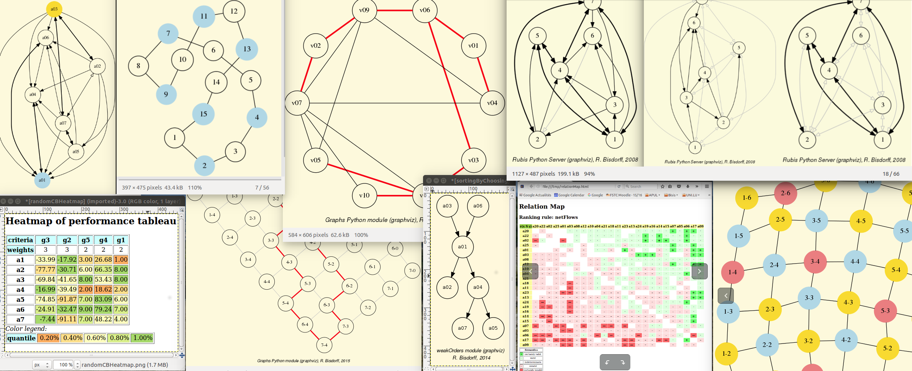

Documentation of the Digraph3 resources
=======================================
:Author: Raymond Bisdorff, Emeritus Professor, University of Luxembourg
:Version: Revision: Python 3.7
:Copyright: `R. Bisdorff <author.html>`_ Copyright 2013-2020

.. _Documents:

Contents
--------

1. `Tutorials <tutorial.html>`_
2. `Reference manual <techDoc.html>`_
3. `Pearls of bipolar-valued epistemic logic <pearls.html>`_
4. `Archives <digraph3Archives.html>`_
5. `About the author <author.html>`_

* :ref:`genindex`
* :ref:`modindex`
* :ref:`search`

.. _Introduction-label:

Introduction
````````````

This documentation, also available on the `Read The Docs <https://readthedocs.org/>`_ site: |location_link1|, describes the Python3 resources for implementing decision aid algorithms in the context of a *bipolar-valued outranking* approach ([1]_, [2]_). These computing resources are useful in the field of `Algorithmic Decision Theory <https://www.lamsade.dauphine.fr/~projet_cost/ALGORITHMIC_DECISION_THEORY/ALGORITHMIC_DECISION_THEORY.html>`_ and more specifically in **outranking** based *Multiple Criteria Decision Aid* (MCDA). They provide the practical tools for a Master Course |location_link4| at the University of Luxembourg.



**Parts of the documentation:**

The documentation contains, first, a set of tutorials introducing the
main objects like digraphs, outranking digraphs and performance
tableaux. There is also a tutorial provided on undirected graphs. Some
tutorials are problem oriented and show how to compute the winner of
an election, how to build a best choice recommendation, or how to
linearly rank or rate with multiple incommensurable performance
criteria. Other tutorials concern more specifically operational
aspects of computing maximal independent sets (MISs) and kernels in
graphs and digraphs. The tutorial about split, interval and permutation graphs is inspired by Martin Golumbic's book on *Algorithmic Graph Theory and Perfect Graphs* ([3]_). We also provide a tutorial on
tree graphs and spanning forests.

.. toctree:: tutorial
   :maxdepth: 2

The second section concerns the extensive reference manual of the collection of provided Python3 modules, classes and methods. The main classes in this collection are the :py:class:`digraphs.Digraph` overall root class, the :py:class:`perfTabs.PerformanceTableau` class and the :py:class:`outrankingDigraphs.BipolarOutrankingDigraph` class. The technical documentation also provides insight into the complete source code of all modules, classes and methods.

.. toctree:: techDoc
   :maxdepth: 2

The third section exhibits some *pearls of bipolar epistemic logic*. These short texts illustrate well the very computational benefit one may get when working in a bipolar-valued logical framework. And, more specifically, the essential part the logically neutral *undeterminate* value is judiciously playing therein.  

.. toctree:: pearls
   :maxdepth: 2

The fourth section gathers historical case studies and example digraphs compiled before 2006 and concerning the active development of the Digraph3 collection of python3 modules for implementing tools and methods of the *Rubis decision aiding* approach. 

.. toctree:: digraph3Archives
   :maxdepth: 2	     

And, a last section

.. toctree:: author
   :maxdepth: 2
	      
References
``````````

.. [1] R. Bisdorff, L.C. Dias, P. Meyer, V. Mousseau and M. Pirlot (Eds.) (2015). *Evaluation and decision models with multiple criteria: Case studies*. Springer-Verlag Berlin Heidelberg, International Handbooks on Information Systems, `ISBN 978-3-662-46815-9 <https://link.springer.com/book/10.1007/978-3-662-46816-6>`_, 643 pages (see http://hdl.handle.net/10993/23698).

.. [2] R. Bisdorff (2000). "Logical foundation of fuzzy preferential systems with application to the Electre decision aid methods", *Computers and Operations Research*, 27: 673-687 (downloadable `PDF file 159.1kB <http://hdl.handle.net/10993/23724>`_)

.. [3] M. Ch. Golumbic (2004), *Agorithmic Graph Theory and Perfect Graphs* 2nd Ed., Annals of Discrete Mathematics 57, Elsevier.
       

|location_link3|

.. |location_link1| raw:: html

   <a href="https://digraph3.readthedocs.io/en/latest/" target="_blank">https://digraph3.readthedocs.io/en/latest/</a>

.. |location_link3| raw:: html

   <a href="_static/digraph3_copyright.html" target="_blank">Copyright</a>

.. |location_link4| raw:: html

   <a href="http://hdl.handle.net/10993/37933" target="_blank">on Algorithmic Decision Theory</a>


