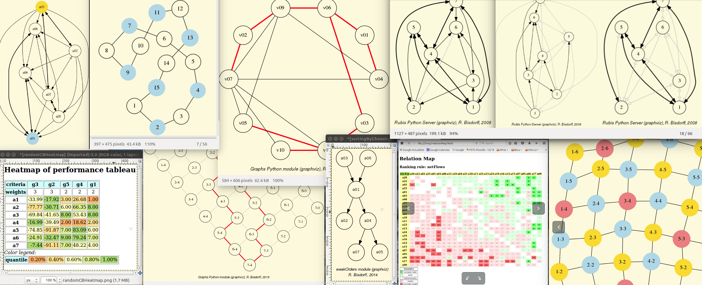

Documentation of the Digraph3 resources
=======================================
:Author: Raymond Bisdorff, Emeritus Professor, University of Luxembourg FSTC - CSC/ILIAS
:Version: Revision: Python 3.6
:Copyright: `R. Bisdorff <https://leopold-loewenheim.uni.lu/bisdorff/>`_ 2013-2018

.. _Documents:

Contents
--------

* `Introduction <index.html>`_
* `Tutorials <tutorial.html>`_
* `Reference manual <techDoc.html>`_
* :ref:`genindex`
* :ref:`modindex`
* :ref:`search`

.. _Introduction-label:

Introduction
------------

This documentation, also available on the `Read The Docs <https://readthedocs.org/>`_ site: |location_link1|, describes the Python3 resources for implementing decision aid algorithms in the context of a bipolarly-valued outranking approach ([1]_, [2]_). These computing resources are useful in the field of *Algorithmic Decision Theory* (https://www.algodec.org/) and more specifically in outranking based *Multiple Criteria Decision Aid* (MCDA).

**Parts of the documentation:**

The documentation contains, first, a set of tutorials introducing the main objects like digraphs, outranking digraphs and performance tableaux. There is also a tutorial provided on undirected graphs. Some tutorials are problem oriented and show how to compute the winner of an election, how to build a best choice recommendation, or how to linearly rank or rate with multiple incommensurable performance criteria. The last tutorials concern more specifically operational aspects for computating maximal independent sets (MISs) and kernels in graphs and digraphs.

.. toctree:: tutorial
   :maxdepth: 2

The second part concerns the reference manual of the collection of provided Python3 modules, classes and methods. The main classes in this collection are the :py:class:`digraphs.Digraph` overall root class, the :py:class:`perfTabs.PerformanceTableau` class and the :py:class:`outrankingDigraphs.BipolarOutrankingDigraph` class. The technical documentation also provides direkt insight into the complete source code of all public modules, classes and methods.

.. toctree:: techDoc
   :maxdepth: 2

References
..........
.. [1] R. Bisdorff, L.C. Dias, P. Meyer, V. Mousseau and M. Pirlot (Eds.) (2015). *Evaluation and decision models with multiple criteria: Case studies*. Springer-Verlag Berlin Heidelberg, International Handbooks on Information Systems, `ISBN 978-3-662-46815-9 <https://link.springer.com/book/10.1007/978-3-662-46816-6>`_, 643 pages (downloadable content extract `PDF file 401.4 kB <https://leopold-loewenheim.uni.lu/bisdorff/documents/MCDAApplicationsContent.pdf>`_).

.. [2] R. Bisdorff (2013) "On Polarizing Outranking Relations with Large Performance Differences" *Journal of Multi-Criteria Decision Analysis* (Wiley) **20**:3-12 (Preprint `PDF file 403.5kB <https://leopold-loewenheim.uni.lu/bisdorff/documents/MCDA-10-0059-PrePeerReview.pdf>`_)

For further scientific documentation of the Digraph3 resources, see |location_link2|.

|location_link3|

.. |location_link1| raw:: html

   <a href="https://digraph3.readthedocs.io/en/latest/" target="_blank">https://digraph3.readthedocs.io/en/latest/</a>

.. |location_link2| raw:: html

   <a href="https://sma.uni.lu/bisdorff/publications.html" target="_blank">https://sma.uni.lu/bisdorff/publications.html</a>

.. |location_link3| raw:: html

   <a href="https://leopold-loewenheim.uni.lu/Digraph3/digraph3_copyright.html" target="_blank">Copyright</a>

