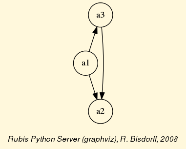

Tutorial of the Digraph3 resources!
===================================
:Author: Raymond Bisdorff, University of Luxembourg FSTC/CSC
:Version: $Revision: Python 3.3+$
:Copyright: R. Bisdorff 2014

.. _Tutorial-label:

Content
........

* :ref:`Download-Using-label`
* :ref:`Digraphs-Tutorial-label`
* :ref:`Graphs-Tutorial-label`
* :ref:`LinearVoting-label`

.. _Download-Using-label:

Downloading and using the Digraph3 modules
..........................................

Using the Digraph3 modules is easy. You only need to have installed on your system the `Python <https://www.python.org/doc/>` programming language installed of version 3+ (readily available under Linux and Mac OS). Notice that, from Version 3.3 on, Python implements very efficiently the decimal class in C. Now, Decimal objects are mainly used in the Digraph3 characteristic valuation functions, which makes the recent python version much faster (more than twice as fast) when extensive digraph operations are performed.

Two downlaod options are given:

1. Either (easiest under Linux or Mac OS-X), by using a subversion client::

     ..$ svn co http://leopold-loewenheim.uni.lu/svn/repos/Digraph3

2. Or, with a browser access, download and extract the latest distribution tar.gz archive from this page::

     http://leopold-loewenheim.uni.lu/Digraph3/dist/

The basic idea of these Python3 modules is to make easy python interactive sessions or write short Python3 scripts for computing all kind of results from a bipolar valued digraph or graph. These include such features as maximal independent or irredundant choices, maximal dominant or absorbent choices, rankings, outrankins, linear ordering, etc. Most of the available computing ressources are meant to illustrate the *Algorithmic Decision Theory* course given in the University of Luxembourg Master in Information and Computer Science (MICS). 

The Python development of these computing ressources offers the advantage of an easy to write and maintain OOP source code as expected from a performing scripting language without loosing on efficiency in execution times compared to compiled languages such as C++ or Java.

Back to :ref:`Tutorial-label`

.. _Digraphs-Tutorial-label:

Working with the :code:`digraphs` module
........................................

You may start an interactive Python3 session in the :code:`Digraph3` directory for exploring the classes and methods provided by the :code:`digraphs` module. To do so, enter the Python3 commands following the session prompts marqued with >>>. The lines without the prompt are output from the Python interpreter::

	[\$HOME/Digraph3]\$ python
	Python 3.4.0 (default, Apr 11 2014, 13:05:11)
	[GCC 4.8.2] on linux
	Type "help", "copyright", "credits" or "license" for more information.
	>>> from digraphs import Digraph
	>>> g = Digraph('test/testdigraph')
	>>> g.save('tutorialdigraph')
	>>> ...

All :code:`Digraph` object *g* contains at least the following subobjects: 

1. the digraph nodes called **actions** (decision actions): a list, set or dictionary of nodes with 'name' and 'shortname' attributes,
2. the digraph **valuationdomain** , a dictionary with three decimal entries: the minimum (-1.0, means certainly false), the median (0.0, means missing information) and the maximum characteristic value (+1.0, means certainly true),
3. the graph **relation** : a double dictionary indexed by an oriented pair of actions (nodes) and carrying a characteristic value in the range of the previous valuation domain,
4. its associated **gamma function** : a dictionary containing the direct successors, respectively predecessors of each action, automatically added by the object constructor,
5. its associated **notGamma function** : a dictionary containing the actions that are not direct successors respectively predecessors of each action, automatically added by the object constructor. See the refrence manual of the :ref:`digraphs-label`.

The :code:`g.save('tutorialDigraph')` command stores the digraph *g* in a file named :code:`tutorialDigraph.py` with the following content::

       # automatically generated random irreflexive digraph
       actionset = ['1','2','3','4','5',]
       valuationdomain = {'min': -1,
                          'med': 0,
                          'max': 1}
       relation = {
       '1': {'1':-1,'2':-1,'3':-1,'4':1,'5':-1},
       '2': {'1':-1,'2':-1,'3':1,'4':-1,'5':-1},
       '3': {'1':-1,'2':1,'3':-1,'4':-1,'5':1},
       '4': {'1':1,'2':-1,'3':1,'4':-1,'5':1},
       '5': {'1':1,'2':-1,'3':1,'4':-1,'5':-1}
       }

The :code:`Digraph.showAll()` method output reveals us that the digraph object loaded from file :code:`tutorialDigraph.py` is a connected irreflexive digraph of order five evaluated in a valuation domain from -1 to 1.
        >>> g = Digraph('tutorialDigraph')
       	>>> g.showAll()
	*----- show details --------------*
	Digraph          : tutorialdigraph
	Actions          : ['1', '2', '3', '4', '5']
	Valuation domain : {'med': Decimal('0'), 
                            'max': Decimal('1'), 
                            'min': Decimal('-1')}
        * ---- Relation Table -----
          S   |  '1'	  '2'	  '3'	  '4'	  '5'	  
         -----|------------------------------------------------------------
          '1' |  -1.00	 -1.00	 -1.00	 +1.00	 -1.00	 
          '2' |  -1.00	 -1.00	 +1.00	 -1.00	 -1.00	 
          '3' |  -1.00	 +1.00	 -1.00	 -1.00	 +1.00	 
          '4' |  +1.00	 -1.00	 +1.00	 -1.00	 +1.00	 
          '5' |  +1.00	 -1.00	 +1.00	 -1.00	 -1.00	 
	*--- Connected Components ---*
	1: ['1', '2', '3', '4', '5']

And the :code:`Digraph.exportGraphViz()` method generates in the current working directory a :code:`tutorial.dot` file and a :code:`tutorialdigraph.png` picture of the tutorial digraph *g*, if the `graphviz <http://graphviz.org/>`_ tools are installed on your system.:
	>>> g.exportGraphViz('tutorialDigraph')
        *---- exporting a dot file dor GraphViz tools ---------*
        Exporting to tutorialDigraph.dot
        dot -Grankdir=BT -Tpng tutorialDigraph.dot -o tutorialDigraph.png

.. image:: testdigraph.png
   :width: 300 px
   :align: center

Some simple methods are easily applicable to this instantiated Digraph object *g* , like the following :code:`Digraph.showStatistics()` method:
	>>> g.showStatistics()
	*----- general statistics -------------*
	for digraph             : <testdigraph.py>
	order                   :  5 nodes
	size                    :  9 arcs
	# undetermined          :  0 arcs
	arc density             : 45.00
	# components            :  1
	                        :  [0, 1, 2, 3, 4]
	outdegrees distribution :  [0, 2, 2, 1, 0]
	indegrees distribution  :  [0, 2, 2, 1, 0]
	degrees distribution    :  [0, 4, 4, 2, 0]
	mean degree : 1.80
	                                  :  [0, 1, 2, 3, 4, 'inf']
	neighbourhood-depths distribution :  [0, 0, 2, 2, 1, 0]
	mean neighbourhood depth : 2.80
	digraph diameter :  4
	agglomeration distribution :
	1 : 50.00
	2 : 0.00
	3 : 16.67
	4 : 50.00
	5 : 50.00
	agglomeration coefficient : 33.33
	>>> ...

Some special classes of digraphs, like the :code:`CompleteDigraph`, the :code:`EmptyDigraph` or the oriented :code:`GridDigraph` class for instance, are readily available:
        >>> from digraphs import GridDigraph
	>>> grid = GridDigraph(n=5,m=5,hasMedianSplitOrientation=True)
	>>> grid.exportGraphViz('tutorialGrid')
	*---- exporting a dot file dor GraphViz tools ---------*
	Exporting to tutorialGrid.dot
	dot -Grankdir=BT -Tpng TutorialGrid.dot -o tutorialGrid.png

.. image:: tutorialGrid.png
   :width: 200 px
   :align: center

For more information about its resources, see the technical documentation of the :ref:`digraphs-label` . 

Back to :ref:`Tutorial-label`

.. _Graphs-Tutorial-label:

Working with the :code:`graphs` module
......................................

In this Digraph3 module, the main :code:`Graph` class provides a generic **simple graph model**, without loops and multiple links. A given object of this root class consists in:

1. the graph **vertices** : a dictionary of vertices with 'name' and 'shortname' attributes,
2. the graph **valuationDomain** , a dictionary with three entries: the minimum (-1, means certainly no link), the median (0, means missing information) and the maximum characteristic value (+1, means certainly a link),
3. the graph **edges** : a dictionary with frozensets of pairs of vertices as entries carrying a characteristic value in the range of the previous valuation domain,
4. and its associated **gamma function** : a dictionary containing the direct neighbors of each vertice, automatically added by the object constructor.

See the technical documentation of the :ref:`graphs-label`.

Example Python3 session:
    >>> from graphs import Graph
    >>> g = Graph(numberOfVertices=7,edgeProbability=0.5)
    >>> g.showShort()
    *----- show short --------------*
    Name             : 'randomGraph'
    Vertices         :  ['v1', 'v2', 'v3', 'v4', 'v5', 'v6', 'v7']
    Valuation domain :  {'med': 0, 'max': 1, 'min': -1}
    Gamma function   : 
    v1 -> ['v5']
    v2 -> ['v4', 'v6', 'v3']
    v3 -> ['v2']
    v4 -> ['v5', 'v2', 'v7']
    v5 -> ['v4', 'v6', 'v1']
    v6 -> ['v5', 'v2']
    v7 -> ['v4']
    >>> g.save(fileName='tutorialGraph')

The saved Graph instance named :code:`tutorialGraph.py` is encoded in python3 as follows::

	# Graph instance saved in Python format
	vertices = {
	'v1': {'shortName': 'v1', 'name': 'random vertex'},
	'v2': {'shortName': 'v2', 'name': 'random vertex'},
	'v3': {'shortName': 'v3', 'name': 'random vertex'},
	'v4': {'shortName': 'v4', 'name': 'random vertex'},
	'v5': {'shortName': 'v5', 'name': 'random vertex'},
	'v6': {'shortName': 'v6', 'name': 'random vertex'},
	'v7': {'shortName': 'v7', 'name': 'random vertex'},
	}
	valuationDomain = {'min':-1,'med':0,'max':1}
	edges = {
	frozenset(['v1','v2']) : -1, 
	frozenset(['v1','v3']) : -1, 
	frozenset(['v1','v4']) : -1, 
	frozenset(['v1','v5']) : 1, 
	frozenset(['v1','v6']) : -1, 
	frozenset(['v1','v7']) : -1, 
	frozenset(['v2','v3']) : 1, 
	frozenset(['v2','v4']) : 1, 
	frozenset(['v2','v5']) : -1, 
	frozenset(['v2','v6']) : 1, 
	frozenset(['v2','v7']) : -1, 
	frozenset(['v3','v4']) : -1, 
	frozenset(['v3','v5']) : -1, 
	frozenset(['v3','v6']) : -1, 
	frozenset(['v3','v7']) : -1, 
	frozenset(['v4','v5']) : 1, 
	frozenset(['v4','v6']) : -1, 
	frozenset(['v4','v7']) : 1, 
	frozenset(['v5','v6']) : 1, 
	frozenset(['v5','v7']) : -1, 
	frozenset(['v6','v7']) : -1, 
	}

The stored graph can be recalled and plotted with the generic :code:`exportGraphViz` [1]_ method as follows:
	>>> g = Graph('tutorialGraph')
	>>> g.exportGraphViz()
	*---- exporting a dot file dor GraphViz tools ---------*
	Exporting to tutorialGraph.dot
	fdp -Tpng tutorialGraph.dot -o tutorialGraph.png

.. image:: tutorialGraph.png
   :width: 400 px
   :align: center
 
Chordless cycles may be enumerated in the given graph like follows:
	>>> g = Graph('tutorialGraph')
	>>> g.computeChordlessCycles()
	Chordless cycle certificate -->>>  ['v5', 'v4', 'v2', 'v6', 'v5']
	[(['v5', 'v4', 'v2', 'v6', 'v5'], frozenset({'v5', 'v4', 'v2', 'v6'}))]

And, a 3-coloring of the tutorial graph may be computed and plotted as follows:
	>>> g = Graph('tutorialGrah')
	>>> qc = Q_Coloring(g)
	Running a Gibbs Sampler for 42 step !
	The q-coloring with 3 colors is feasible !!
	>>> qc.showConfiguration()
	v5 lightblue
	v3 gold
	v7 gold
	v2 lightblue
	v4 lightcoral
	v1 gold
	v6 lightcoral
	>>> qc.exportGraphViz('tutorial-3-coloring')
	*---- exporting a dot file for GraphViz tools ---------*
	Exporting to tutorial-3-coloring.dot
	fdp -Tpng tutorial-3-coloring.dot -o tutorial-3-coloring.png

.. image:: tutorial-3-coloring.png
   :width: 400 px
   :align: center

Actually, with the given tutorial graph instance, a 2-coloring is already feasible:
	>>> qc = Q_Coloring(g,colors=['gold','coral'])
	Running a Gibbs Sampler for 42 step !
	The q-coloring with 2 colors is feasible !!
	>>> qc.showConfiguration()
	v5 gold
	v3 coral
	v7 gold
	v2 gold
	v4 coral
	v1 coral
	v6 coral
	>>> qc.exportGraphViz('tutorial-2-coloring')
	*---- exporting a dot file for GraphViz tools ---------*
	Exporting to tutorial-2-coloring.dot
	fdp -Tpng tutorial-2-coloring.dot -o tutorial-2-coloring.png

.. image:: tutorial-2-coloring.png
   :width: 400 px
   :align: center

2-colorings define independent sets of vertices that are maximal in cardinality; for short called a **MIS**. Computing such MISs in a given :code:`Graph` instance may be achieved by converting the :code:`Graph` instance into a :code:`Digraph` instance. Here a :code:`self.showMIS()` method is proposed:
	>>> g = Graph('tutorialGrah')
	>>> dg = g.graph2Digraph()
	>>> dg.showMIS()
	*---  Maximal independent choices ---*
	['v5', 'v3', 'v7']
	['v5', 'v7', 'v2']
	['v6', 'v3', 'v4', 'v1']
	['v6', 'v3', 'v7', 'v1']
	['v7', 'v2', 'v1']
	number of solutions:  5
	cardinality distribution
	card.:  [0, 1, 2, 3, 4, 5, 6, 7]
	freq.:  [0, 0, 0, 3, 2, 0, 0, 0]
	execution time: 0.00050 sec.
	Results in self.misset
	>>> dg.misset
	{frozenset({'v6', 'v3', 'v7', 'v1'}), 
	 frozenset({'v5', 'v7', 'v2'}), 
	 frozenset({'v6', 'v3', 'v4', 'v1'}), 
	 frozenset({'v7', 'v2', 'v1'}), 
	 frozenset({'v5', 'v3', 'v7'})}

Special classes of graphs, like *n* x *m* **rectangular** or **triangular grids** are available in the :code:`graphs` module. For instance, we may use a Gibbs sampler again for simulating an Ising Model on such a grid:
        >>> from graphs import GridGraph
	>>> g = GridGraph(n=15,m=15)
	>>> g.showShort()
	*----- show short --------------*
	Grid graph    :  grid-6-6
	n             :  6
	m             :  6
	order         :  36
	>>> im = IsingModel(g,beta=0.3,nSim=100000,Debug=False)
	Running a Gibbs Sampler for 100000 step !
	>>> im.exportGraphViz(colors=['lightblue','lightcoral'])
	*---- exporting a dot file for GraphViz tools ---------*
	Exporting to grid-15-15-ising.dot
	fdp -Tpng grid-15-15-ising.dot -o grid-15-15-ising.png

.. image:: grid-15-15-ising.png
   :width: 600 px
   :align: center

Finally, we provide a specialisation of the :code:`Graph` class for implementing a generic **Metropolis** *Markov Chain Monte Carlo* chain sampler for simulating a random walk on the graph with given probability  :code:`probs = {‘v1’: x, ‘v2’: y, ...}` for visiting each vertice. 
	>>> g = Graph(numberOfVertices=5,edgeProbability=0.5)
	>>> g.showShort()
	*---- short description of the graph ----*
	Name             : 'randomGraph'
	Vertices         :  ['v1', 'v2', 'v3', 'v4', 'v5']
	Valuation domain :  {'max': 1, 'med': 0, 'min': -1}
	Gamma function   : 
	v1 -> ['v2', 'v3', 'v4']
	v2 -> ['v1', 'v4']
	v3 -> ['v5', 'v1']
	v4 -> ['v2', 'v5', 'v1']
	v5 -> ['v3', 'v4']        
	>>> probs = {}
	>>> n = g.order
	>>> i = 0
	>>> verticesList = [x for x in g.vertices]
	>>> verticesList.sort()
	>>> for v in verticesList:
	...     probs[v] = (n - i)/(n*(n+1)/2)
	...     i += 1
	>>> met = MetropolisChain(g,probs)
	>>> frequency = met.checkSampling(verticesList[0],nSim=30000)
	>>> for v in verticesList:
	...     print(v,probs[v],frequency[v])
	v1 0.3333 0.3343
	v2 0.2666 0.2680
	v3 0.2    0.2030 
	v4 0.1333 0.1311
	v5 0.0666 0.0635
	>>> met.showTransitionMatrix()
	* ---- Transition Matrix -----
	  Pij  | 'v1'    'v2'    'v3'    'v4'    'v5'     
	  -----|-------------------------------------
	  'v1' |  0.23   0.33    0.30    0.13    0.00    
	  'v2' |  0.42   0.42    0.00    0.17    0.00    
	  'v3' |  0.50   0.00    0.33    0.00    0.17    
	  'v4' |  0.33   0.33    0.00    0.08    0.25    
	  'v5' |  0.00   0.00    0.50    0.50    0.00    

For more technical information and more code examples, look into the technical documentation of the :ref:`graphs-label`. Those interested in algorithmic applications of Markov Chains may consult O. Häggström's book: [FMCAA]_.

Back to :ref:`Tutorial-label`

.. _LinearVoting-label:

Computing the winner of an election
...................................

The :ref:`votingDigraphs-label` provides resources for handling election results, like the ``LinearVotingProfile`` class. We consider an election involving a finite set of candidates and finite set of weighted voters, who express their voting preferences in a complete linear ranking (without ties) of the candidates. The data is internally stored as two Python dicttionaries, one for the candidates and another one for the linear ballots::
    
    candidates = {'a': ,'b':  ,'c', ..., ...}
    voters = {'1':{'weight':1.0},'2':{'weight':1.0}, ...}
    ## each voter specifies a linearly ranked list of candidates
    ## from the best to the worst (without ties
    linearBallot = {
    '1' : ['b','c','a', ...],
    '2' : ['a','b','c', ...],
    ...
    }

The module provides a class for generating random instances of the the ``LinearVotingProfile`` class. In an interactive Python session we may obtain for the election of 3 candidates by 5 voters the following result:
    >>> from votingDigraphs import *
    >>> v = RandomLinearVotingProfile(numberOfVoters=5,numberOfCandidates=3)
    >>> v.candidates
    {'a2': {'name': 'a2'}, 'a3': {'name': 'a3'}, 'a1': {'name': 'a1'}}
    >>> v.voters
    {'v4': {'weight': 1.0}, 'v3': {'weight': 1.0}, 
     'v1': {'weight': 1.0}, 'v5': {'weight': 1.0}, 
     'v2': {'weight': 1.0}}
    >>> v.linearBallot
    {'v4': ['a1', 'a3', 'a2'], 'v3': ['a1', 'a3', 'a2'], 'v1': ['a1', 'a2', 'a3'],
     'v5': ['a2', 'a3', 'a1'], 'v2': ['a3', 'a2', 'a1']}
     >>> ...

Notice that the voters are all equi-significant in this example. Their linear ballots can be viewd with the ``showLinearBallots`` method:
    >>> v.showLinearBallots()
    voters(weight)	 candidates rankings
    v4(1.0): 	 ['a1', 'a2', 'a3']
    v3(1.0): 	 ['a1', 'a3', 'a2']
    v1(1.0): 	 ['a2', 'a1', 'a3']
    v5(1.0): 	 ['a3', 'a1', 'a2']
    v2(1.0): 	 ['a3', 'a1', 'a2']
    >>> ...

Editing of the linear voting profile may be acheived by storing the data in a file, edit it, and reload it again:
    >>> v.save('tutorialLinearVotingProfile')
    *--- Saving linear profile in file: <tutorialLinearVotingProfile.py> ---*
    >>> v = LinearVotingProfile('tutorialLinearVotingProfile')

We may easily compute **uninominal votes**, ie how many times a candidate was ranked first, and who is consequently the **simple majority** winner(s) in this election. 
    >>> v.computeUninominalVotes()
    {'a2': 1.0, 'a1': 2.0, 'a3': 2.0}
    >>> v.computeSimpleMajorityWinner()
    ['a1','a3']
    >>> ...

As we observe no absolute majority (3/5) for one of the candidate, we may compute, for instance the **instant runoff** winner instead:
    >>> v.computeInstantRunoffWinner()
    ['a1']
    >>> ...

We may also follow the Chevalier Borda's advice and, after a **rank analysis** of the linear ballots, compute the **Borda score** of each candidate and hence determine the **Borda winner(s)**:
    >>> v.computeRankAnalysis()
    {'a2': [1.0, 1.0, 3.0], 'a1': [2.0, 3.0, 0], 'a3': [2.0, 1.0, 2.0]}
    >>> v.computeBordaScores()
    {'a2': 12.0, 'a1': 8.0, 'a3': 10.0}
    >>> v.computeBordaWinners()
    ['a1']
    >>> ... 

In our randomly generated election results, we are lucky. The instant runoff winner and the Borda winner determine, both, candidate *a*. However, we could also follow the Marquis de Condorcet's advice, and compute the **majority margins** obtained by voting for each individual pair of candidates. For instance, candidate *a* is ranked four times before and once behind candidate *b*. Hence the majority margin *M(a,b)* is 4 - 1 = +3. These majority margins define on the set of candidates what we call the **Condorcet digraph**, a specialization of the ``Digraph`` class for handing such pairwise majority margins:
    >>> cdg = CondorcetDigraph(v,hasIntegerValuation=True)
    >>> cdg.showAll()
    *----- show detail -------------*
    Digraph          : rel_randLinearProfile
    *---- Actions ----*
    ['a1', 'a2', 'a3']
    *---- Characteristic valuation domain ----*
    {'hasIntegerValuation': True, 
    'max': Decimal('5.0'), 
    'min': Decimal('-5.0'), 
    'med': Decimal('0')}
    * ---- Relation Table ----
     M(x,y) |  'a1' 'a2' 'a3'	  
     -------|-----------------
       'a1' |   -    3	  1	 
       'a2' |  -3    -	 -1	 
       'a3' |  -1    1	  -	 

A candidate *x*, showing a positive majority margin *M(x,y)*, is beating candidate *y*  with an absolute majority in a pairwise voting. Hence, a candidate showing only positive terms in his row in the Condorcet digraph relation table, beats all other candidates with absolute majority of votes. Condorcet recommended to declare this candidate (she is always unique, why?) the winner of the election. Here we are lucky, it is again candidate 'a1' who is the **Condorcet winner**:
    >>> cdg.computeCondorcetWinner()
    ['a1']  
    
By seeing the majority margins like a bipolarly-valued characteristic function for a global preference relation defined on the set of canditates, we may use all operational resources of the generic ``Digraph`` class (see :ref:`Digraphs-Tutorial-label`), and especially its ``exportGraphViz`` method [1]_, for visualizing an election result:
   >>> cdg.exportGraphViz('tutorialLinearBallots')
   *---- exporting a dot file dor GraphViz tools ---------*
   Exporting to tutorialLinearBallots.dot
   dot -Grankdir=BT -Tpng tutorialLinearBallots.dot -o tutorialLinearBallots.png

 
Many more tools for exploiting voting results are available, see the thechnical documentation of the :ref:`votingDiGraphs-label`.

..
   Using the Digraph3 modules
   --------------------------

   Simple execution will show a list of results concerning a randomly generated digraph. To make directly executable the code source, you will have to adapt, the case given, the first line of the source code accordingly to your Python3 installation directory. 

   See the http://www.python.org/doc in case of troubles. 

   Example::

	   [$Home/Digraph3]...$python3 digraphs.py
	   ****************************************************
	   * Python digraphs module                           *
	   * $Revision: 1.18 $                               *
	   * Copyright (C) 2006-2007 University of Luxembourg *
	   * The module comes with ABSOLUTELY NO WARRANTY     *
	   * to the extent permitted by the applicable law.   *
	   * This is free software, and you are welcome to    *
	   * redistribute it if it remains free software.     *
	   ****************************************************
	   *-------- Testing classes and methods -------
	   ==>> Testing RandomDigraph() class instantiation 
	   *----- show detail -------------*
	   Digraph          : randomDigraph
	   *---- Actions ----*
	   ['1', '2', '3', '4', '5']
	   *---- Characteristic valuation domain ----*
	   {'med': Decimal("0.5"), 'min': Decimal("0"), 'max': Decimal("1.0")}
	   * ---- Relation Table -----
	    S   |  '1',  '2',  '3',  '4',  '5',  
	   -----|------------------------------------------------------------
	    '1' |  0.00  0.00  0.00  1.00  0.00 
	    '2' |  0.00  0.00  1.00  1.00  1.00 
	    '3' |  1.00  1.00  0.00  1.00  1.00 
	    '4' |  0.00  1.00  1.00  0.00  1.00 
	    '5' |  0.00  1.00  0.00  0.00  0.00 
	   *--- Connected Components ---*
	   1: ['1', '2', '3', '4', '5']
	   Neighborhoods:
	   Neighborhoods:
	     Gamma     :
	   '1': in => set(['3']), out => set(['4'])
	   '2': in => set(['3', '4', '5']), out => set(['3', '4', '5'])
	   '3': in => set(['2', '4']), out => set(['1', '2', '4', '5'])
	   '4': in => set(['1', '2', '3']), out => set(['2', '3', '5'])
	   '5': in => set(['2', '3', '4']), out => set(['2'])
	     Not Gamma :
	   '1': in => set(['2', '4', '5']), out => set(['2', '3', '5'])
	   '2': in => set(['1']), out => set(['1'])
	   '3': in => set(['1', '5']), out => set([])
	   '4': in => set(['5']), out => set(['1'])
	   '5': in => set(['1']), out => set(['1', '3', '4'])
	   *------------------*
	   If you see this line all tests were passed successfully :-)
	   Enjoy !
	   *************************************
	   * R.B. May 2014               *
	   * $Revision: 1.600+$                *
	   *************************************

   Back to the :ref:`Tutorial-label`

Documents, indices and tables
.............................

* `Introduction <index.html>`_
* `Reference manual <techDoc.html>`_
* `Tutorial <tutorial.html>`_
* :ref:`genindex`
* :ref:`modindex`
* :ref:`search`

References
..........

.. [FMCAA] Olle Häggström. Finite Markov Chians and Algorithmic Applications. Cambridge University Press 2002.

Footnotes
.........

.. [1] The ``exportGraphViz`` method is depending on drawing tools from `graphviz <http://graphviz.org/>`_. On Linux Ubuntu or Debian you may try ``sudo apt-get install graphviz`` to install them. There are ready ``dmg`` installers for Mac OS. 
